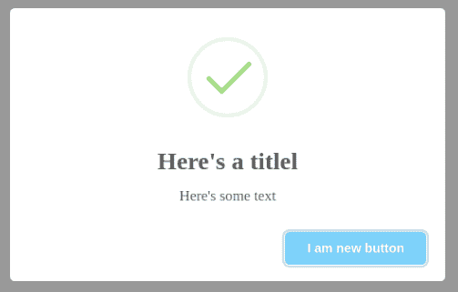
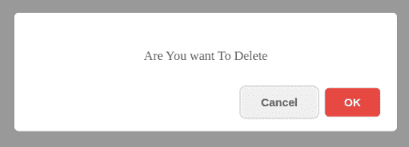
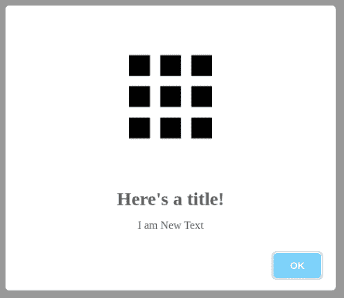
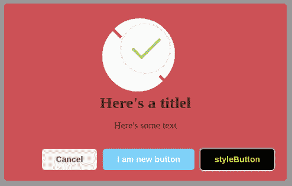
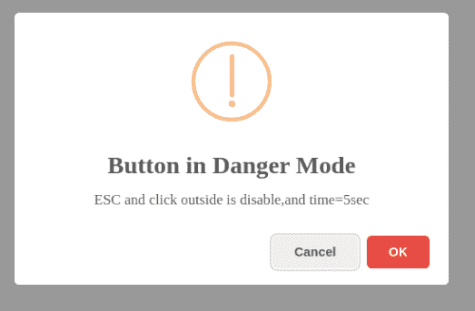
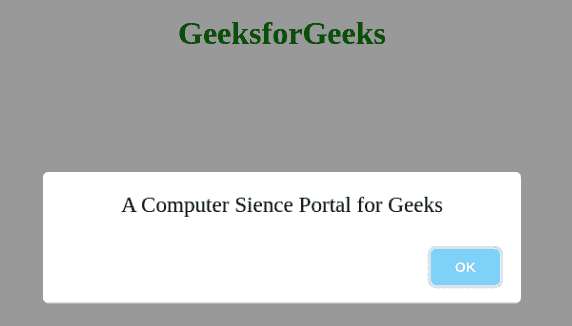

# SweetAlert 库介绍及安装示例

> 原文:[https://www . geesforgeks . org/sweet alert-library-introduction-and-installation-with-the-example/](https://www.geeksforgeeks.org/sweetalert-library-introduction-and-installation-with-the-example/)

当构建 JavaScript 驱动的网站时，我们经常需要向用户提供反馈，让他们知道他们执行的操作是否成功。在 web 的早期，开发人员使用 window.alert()函数创建消息。虽然 alert()在实践中是可行的，并且在不同的浏览器中也是一致的，但是它不是很灵活，老实说，它的外观和感觉都很糟糕。今天有几种方法被采用，从模式到内嵌消息。在本文中，我将向您介绍 sweetAlert，这是一个替代 JavaScript alert()函数的库。

**SweetAlert CDN 库:**sweet alert 是 JavaScript 的 window.alert()函数的替代品，它显示了非常漂亮的模态窗口。它是一个没有依赖关系的独立库，由一个 JavaScript 文件和一个 CSS 文件组成。

Sweet Alert 用于使警报框更具吸引力，更易于设计。sweet JS 通过调用 sweet alert 的函数(简称 SWAL())提供了简单的方法来设计网站的提醒框，并为其添加了很多功能。

JavaScript 的漂亮替代品证实了这一信息！它将用一个美丽的可定制的和功能齐全的模式来代替丑陋的确认消息。

甜蜜提醒是一种在游戏和网站中自定义提醒的方式。它允许你从一个标准的 JavaScript 按钮改变。我们可以添加按钮、更改颜色文本，甚至添加根据用户点击而变化的附加提醒。我们还可以在我们的提醒中放上图标。我们还可以使用 JavaScript setTimeout 函数来设置告警显示的时间

**安装:**

*   **使用 NPM:**

```htmlhtml
npm install sweetalert --save
```

**CDN 链接:**

> https://cdnjs.cloudflare.com/ajax/libs/sweetalert/2.1.0/sweetalert.min.js

**语法:**

```htmlhtml
swal("add title Text","Add simple text","add icon",
       {Json Format To add other swal function})
```

**注意:**swal()接受标题文本(字体大小比简单文本更粗更大)、简单文本和图标作为默认参数您可以使用 JSON 来使用 Sweetalert 的任何其他功能。如果 swal()中只给出一个文本，那么它将是简单文本。如果有两个文本，那么第一个将是标题文本，第二个将是简单文本

下面的例子说明了 SweetAlert 的工作原理。

**例 1:**

## 超文本标记语言

```htmlhtml
<!DOCTYPE html>
<html>
<head>
  <title>GeeksForGeeks Sweet alert</title>
  <script src=
"https://cdnjs.cloudflare.com/ajax/libs/sweetalert/2.1.0/sweetalert.min.js">
  </script>

</head>
<body>
  <script>
    swal("Here's a titlel", "Here's some text", "success", {
      button: "I am new button",

    });
  </script>
</body>
</html>
```

**输出:**



**例 2:**

## 超文本标记语言

```htmlhtml
<!DOCTYPE html>
<html>
<head>
  <title>GeeksForGeeks Sweet alert</title>
  <script src=
"https://cdnjs.cloudflare.com/ajax/libs/sweetalert/2.1.0/sweetalert.min.js">
  </script>

</head>
<body>
  <script>
    swal("Are You want To Delete", {
      dangerMode: true,
      buttons: true,
    }    );
  </script>
</body>
</html>
```

**输出:**



#### 甜蜜警报的 JSON 属性列表:

1.  **标题:**用于在警告框内写入标题如果标题在 Swal()中作为第一个参数给出，那么 JSON 属性标题将覆盖该目标值
2.  **文本:**该属性用于在警告框中写入文本。如果 Swal()包含 JSON 属性之外的简单文本，那么它将覆盖这些文本。
3.  **图标:**用于显示图标。SweetAlert 带有 4 个内置图标，您可以使用:
    *   警告
    *   错误
    *   成功
    *   信息

**示例 3:** 但是您可以通过将图像地址放在引号内来添加图标图像，如下所示:

## 超文本标记语言

```htmlhtml
<!DOCTYPE html>
<html>
<head>
  <title>GeeksForGeeks Sweet alert</title>
  <script src=
"https://cdnjs.cloudflare.com/ajax/libs/sweetalert/2.1.0/sweetalert.min.js">
  </script>

</head>
<body>
  <script>
  swal("Here's a title!", "Here's some text","success",{
        title:"i am New title",
        text:"I am New Text",
        icon:'https://dl.dropbox.com/s/qe98k2xvmqivxwz/google_apps.png',
  });
  </script>
</body>
</html>
```

**输出:**



*   **按钮和按钮:**按钮用于创建单个按钮，而按钮用于创建多个按钮。默认情况下，在默认配置下，按钮有两个按钮“取消”和“确定”。

**例 4:** 可以给按钮和 swal 都添加 className 属性，改变按钮和对话框的样式，如下图所示:

## 超文本标记语言

```htmlhtml
<!DOCTYPE html>
<html>
    <head>
        <title>GeeksForGeeks Sweet alert</title>
        <script src=
"https://cdnjs.cloudflare.com/ajax/libs/sweetalert/2.1.0/sweetalert.min.js">
        </script>
        <style>
            .buttonstyle {
                color: Yellow;
                background-color: black;
            }

            .boxstyle {
                background: rgba(256, 10, 20, 0.5);
            }
        </style>
    </head>

    <body>
        <script>
            swal("Here's a titlel", "Here's some text", "success", {
                className: "boxstyle",

                buttons: {
                    cancel: true,

                    New: {
                        text: "I am new button",

                        value: "new button data",

                        visibile: true,
                    },

                    New2: {
                        text: " styleButton",

                        value: "new button data",

                        visibile: true,

                        className: "buttonstyle",
                    },
                },
            });
        </script>
    </body>
</html>
```

**输出:**



**例 5:**

## 超文本标记语言

```htmlhtml
<!DOCTYPE html>
<html>
    <head>
        <title>GeeksFor Geeks Sweet alert</title>
        <script src=
"https://cdnjs.cloudflare.com/ajax/libs/sweetalert/2.1.0/sweetalert.min.js">
        </script>
        <style>
            .p {
                background-color: red;
                width: 190px;
                margin: auto;
                text-align: center;
                font-size: 22px;
            }
        </style>
    </head>

    <body>
        <script>
            swal("Button in Danger Mode",
                 "ESC and click outside is disable,and time=5sec",
                 "warning", {
                dangerMode: true,
                buttons: true,
                closeOnClickOutside: false,
                timer: 5000,
            });
        </script>
    </body>
</html>
```

**输出:**



*   **内容:**用于添加 P 元素、H1 元素、按钮、文本区、输入、Div 等任意元素。内容属性包含两件事元素名称及其属性，属性表示元素的内部属性，如内联样式、宽度、高度、占位符、类名等。

```htmlhtml
swal({
  content: {
    element: "input",
    attributes: {
      placeholder: "Enter any Number",
      // Type can be range,can be 
      // password and can be text
      type: "number", 
     },
  },
});
```

创建段落元素:

```htmlhtml
swal({
  content: {
    element: "p",
    attributes: {
     innerText:"hello",
     style:"color:blue;",
     className:"p",

    },
  },
});
```

**示例 6:** 创建段落元素。

## 超文本标记语言

```htmlhtml
<!DOCTYPE html>
<html>
    <head>
        <title>GeeksFor Geeks Sweet alert</title>
        <script src=
"https://cdnjs.cloudflare.com/ajax/libs/sweetalert/2.1.0/sweetalert.min.js">
        </script>
        <style>
             h1{
                 color: green;
                 text-align: center;
             }
            .p {
                width: 100%;
                margin: auto;
                text-align: center;
                font-size: 22px;
            }
        </style>
    </head>

    <body>
        <h1>GeeksforGeeks</h1>
        <script>
            swal({
                content: {
                    element: "p",
                    attributes: {
                        innerText: "A Computer Science Portal for Geeks",
                        style: "color: black;",
                        className: "p",
                    },
                },
            });
        </script>
    </body>
</html>
```

**输出:**



**参考:**T2**https://sweetalert.js.org/**T5】