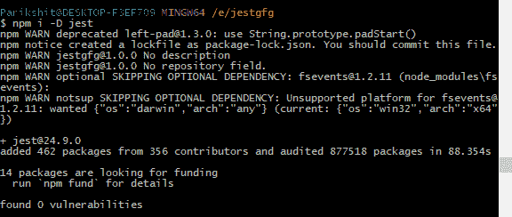
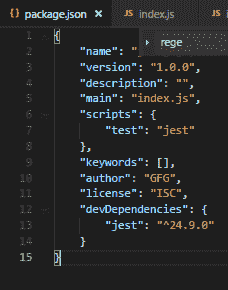
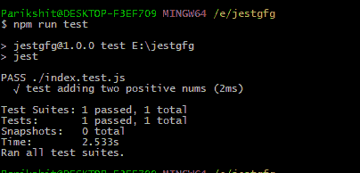
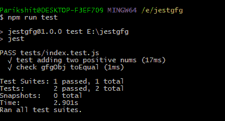
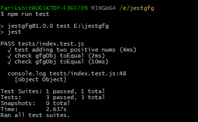
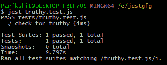
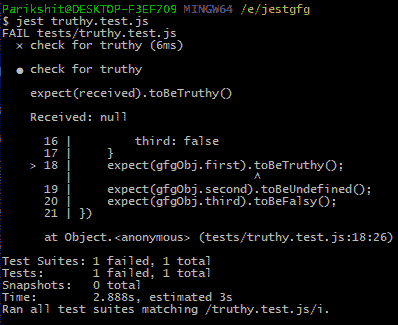
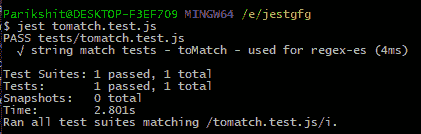
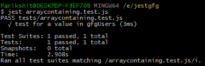
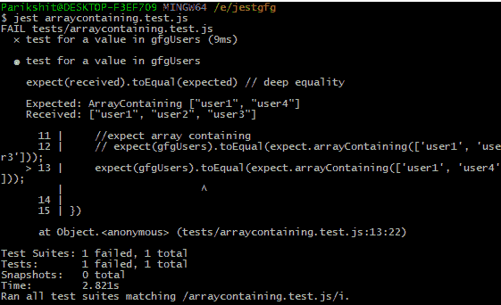

# 用笑话测试

> 原文:[https://www.geeksforgeeks.org/testing-with-jest/](https://www.geeksforgeeks.org/testing-with-jest/)


Jest 是脸书的一个 Javascript 测试框架。最常用于*单元测试*。单元测试是向代码单元(通常是一个函数)提供输入，并将输出与预期输出相匹配。

**笑话特色:**

*   **零配置:**正如我们将在本文后面看到的，开始编写测试和部署测试几乎不需要任何配置。但是，也可以向测试套件提供配置文件。
*   **快照:** Jest 也有启用快照测试的能力。本质上，快照与保存的快照相匹配，并检查匹配功能。
*   **隔离测试:** Jest 测试是并行运行的，以提高运行时间。

**建立一个笑话项目**

*   **Install jest using NPM:**
    

    NPM install jest. -D keyword installs jest as a development dependency

*   **项目结构:**
    在项目根目录下，制作一个**测试**文件夹。该文件夹将存储所有测试文件。
    注意 js 文件(待测试)是通过名字映射的。
    例如 **index.js** 映射到 **index.test.js** 。这个 index.test.js 文件放在“tests”文件夹中。这是常规的项目结构。

**开始测试:**

*   首先，让我们看看一个基本的测试工作流程。
    

    测试–添加两个位置编号

*   To run the test, use the script

    ```html
    npm run test
    ```

    这将查找项目的 package.json 中提到的测试脚本。

    

    测试脚本。请参见脚本中的测试

我们将使用**‘expect’**方法来测试我们的功能。也可以使用**【描述】****【it】**测试功能。

**一个基本测试:**加两个阳性 num，检查结果。

```html
//index.js
testForAdd: (a, b) => { return (a + b) },

//index.test.js
test('test adding two positive nums', function() {
    expect(testFns.testForAdd(4, 5)).toBe(9);
});

```

当*“NPM 运行测试”*运行时， **index.test.js** 文件通过。然后运行测试添加功能，该功能位于*“测试功能”对象中。toBe 用于*“匹配”*测试返回的响应与预期相符。这种“结果匹配”要么导致**“失败”**要么导致**“通过”**。*



测试添加两个位置编号

**由于*‘T0(8)’*，以下测试将失败。**

```html
//example of a failing test
 test('test adding two positive nums - failing test', function() {
     expect(testFns.testForAdd(4, 5)).toBe(8);
 });

```

**toBe 的反义词:***not . toBe()*
toBe 的反义词是通过在它前面加上“not”而产生的
例如:

```html
//test successful - test for opposite of a matcher.
//The following test will 'Pass' if the returned value is not equal to 8.
test('test adding two positive nums - failing test', function() {
    expect(testFns.testForAdd(4, 5)).not.toBe(8);
});

```

**将“toBe”用于 JS 对象:**
让我们考虑一个 JS 对象的每个字段都要被测试的情况。Jest 为我们提供了一种使用*【to qual】*来做到这一点的方法。*“to qual”*是一个深度匹配器(检查每个可能的字段和子字段)。

```html
//expect toEqual example - check every field's value
// testFns.test_toEqual(gfgObj)
test('check gfgObj toEqual', () => {
    let gfgObj = { name: "GFG" };
    gfgObj['type'] = "company";
    expect(gfgObj).toEqual({ name: "GFG", type: "company" });
});

```

运行上述测试将“通过”。



gfgobj toEqual

另一种方法是使用*“to qual”*匹配两个对象。
是这样做的:

```html
test('check gfgObj toEqual', () => {
    let gfgObj = {
        name: "GFG",
        type: "company",
        members: {
            employees: 100,
            contributors: 500
        }
    };

    let testObj = {
        name: "GFG",
        type: "company",
        members: {
            employees: 100,
            contributors: 500
        }
    };
    expect(gfgObj).toEqual(testObj);
});

```

这个测试展示了 toEqual 的深度匹配特性。
以上测试通过，因为 gfgObj 中的每个密钥对都与 testObj 匹配。



gfgobj-testobj-toequal

**to cloneto–用于浮点数和其他近似匹配**

```html
//see here that a+b != c even though simple addition is taking place.
> var a = 1.32
> undefined
> var b = 2.31
> undefined
> c = a+b;
> 3.63
> var res = false;
> if(c==(a+b)) {c=true;}
> undefined
> c
> false

```

在这种情况下，使用 Jest 库中的*【to closeo】*匹配器就好了。

```html
test('floating point number - use toBeCloseTo instead', function() {
    // const num1 = 0.3;
    // const num2 = 0.2;
    const result = 9.31 + 9.2;

    expect(result).toBeCloseTo(18.51);
})

```

以上测试也通过了。

**匹配真假:**
https://jestjs.io/docs/en/using-matchers#truthiness
很多时候，编写测试是为了检查‘expect’返回的真假值。
JS 中的 **[Falsy](https://developer.mozilla.org/en-US/docs/Glossary/Falsy)** 值。JS 中
**[Truthy](https://developer.mozilla.org/en-US/docs/Glossary/Truthy)** 值。

```html
//checking for truthy values - All the tests will return truthy.
test('check for truthy', function() {
    const gfgObj = {
        first: null,
        second: undefined,
        third: false
    }
    expect(gfgObj.first).not.toBeTruthy(); // True - Pass
    expect(gfgObj.second).toBeUndefined(); // True - Pass
    expect(gfgObj.third).toBeFalsy();      // True - Pass
})

```

以上测试通过。



所有测试通过

但是，如果上面的任何“**期望”**失败，Jest 将返回如下所示的**有意义的错误消息**。

**注意**在上述情况下，如果任何“预期”失败，测试也完全失败。



truthy-test-js-one-expect-failed-so-test-failed

**匹配号码:**

```html
//tests for Number matches
test('test for numbers', function() {
    const result = 3 + 9;
    // expect(result).toBe(12); //the plain old matcher
    expect(result).not.toBeLessThan(10); // result > 10
    expect(result).toBeLessThan(15);  // result < 15
    expect(result).not.toBeGreaterThan(15); // result  10
    expect(result).toBeGreaterThanOrEqual(12);  //result >= 12
    // expect(result).not.toBeGreaterThanOrEqual(12); // result == 12, this Fails
    // expect(result).toBeLessThanOrEqual(10); // result >= 10, this Fails
})

```



使用 jest 进行号码匹配

**测试数组中包含的值:**
我们还可以测试数组中是否包含特定的值。请注意，如果数组中不存在至少一个值，此测试将“失败”。例如，

```html
//testing arrays
const gfgUsers = [
    'user1',
    'user2',
    'user3'
];
test('test for a value in gfgUsers', function() {
    // expect(gfgUsers).toContain('user2');
    // expect(gfgUsers).not.toContain('user2');
    //expect array containing
     expect(gfgUsers).toEqual(expect.arrayContaining(['user1', 'user3']));
})

```

上述测试通过，因为用户 1 和用户 3 出现在 gfgUsers 中。



用户 1 和用户 3 合一交换机

但是，以下测试将失败，因为 gfgUsers 中不存在*“user 4”*。

```html
//testing arrays
const gfgUsers = [
    'user1',
    'user2',
    'user3'
];
test('test for a value in gfgUsers', function() {
    //expect array containing
     expect(gfgUsers).toEqual(expect.arrayContaining(['user1', 'user4']));
})

```



array containing-因用户而失败 4-缺勤

**使用 Regex 进行测试:**

```html
test('string match tests - toMatch - used for regex-es', function() {
    const str = 'GeeksforGeeks';
    // expect(str).toMatch(/f/);
    // expect(str).toMatch(/Z/);
    //you can create more complex Regexes
    const str1 = 'This is a test paragraph. I wrote it.'
    expect(str1).toMatch(/[pP][hH][\.]/);  //matches 'ph.' in the word 'paragraph'
})

```


匹配段落中的 ph

**扩展匹配器**
Jest 也提供了扩展其**【匹配器】**功能的条款，这是使用**【expect . extend()】**关键字完成的。**。extend()** 函数作为对象传递给匹配器。
**语法:** expect.extend({matcher1，matcher 2 })；
例如，如果我们想要构建一个匹配器来检查字符串中短语的存在:

```html
expect.extend({
stringPresent(receivedString, phraseString) {
bool phrasePresent = true;
var re = new RegExp(phraseString);
if (re.test(receivedString)) {
    phrasePresent = true;
} else {
    phrasePresent = false;
}
if (phrasePresent === true) {
      return {
        message: () =>
          `string present`,
        pass: true,
      };
    } else {
      return {
        message: () =>
          `string absent`,
        pass: false,
      };
    }
},
});

```

**处理异常**
我们还可以检查一个代码单元抛出的错误类型。我们可以通过名称、消息、对象等来检查抛出的错误。

**语法** :expect( fnName())。toThrow(错误)；
错误参数/参数在这里是可选的。

假设我们想通过抛出的错误消息来测试一个函数。

```html
function testGFGMessage() {
  throw new Error('this is testGFGMessage function error');
}
test('testing testGFGMessage', function(){
  expect(testGFGMessage).toThrow('this is testGFGMessage function error');
})

```

还有许多其他方法可以抛出错误并检查它们。详细参考可以在[这里](https://jestjs.io/docs/en/expect#tothrowerror)找到。

**跳过/运行测试子集**
https://jestjs.io/docs/en/api#testskipname-fn
Jest 也有在运行测试套件时跳过特定测试的规定。
要实现它，只需使用**‘跳过’**关键字。例如，

```html
function addFn(num1, num2){
  return num1 + num2;
}

test.skip('skip test example - skipping the addition test', () => {
  expect(addFn(2, 3)).toBe(5);
});

```

与此相反的是只实现测试的子集，这是通过使用**‘only’**关键字来实现的。例如，

```html
function addFn(num1, num2){
  return num1 + num2;
}

test.only('skip test example - skipping the addition test', () => {
  expect(addFn(2, 3)).toBe(5);
});

```