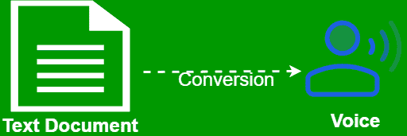

# 使用谷歌 Chrome 的 Web 语音 API 进行文本到语音的转换

> 原文:[https://www . geesforgeks . org/text-to-voice-conversion-use-web-speech-API-of-Google-chrome/](https://www.geeksforgeeks.org/text-to-voice-conversion-using-web-speech-api-of-google-chrome/)



创建一个将文本转换为语音的网络应用程序听起来很酷，如果所有这些设施都可以在没有任何第三方库干扰的情况下使用，那么实现起来就更容易了。网络语音应用编程接口提供了基本工具，可用于创建启用语音数据的交互式网络应用程序。我们已经创建了一个基本界面，其中有一个简单的框，包含我们的文本输入部分，我们将在那里写文本，以及两个滑块，操纵语音的速率以及音高。然后，我们有一个下拉菜单，其中包含所有支持的语言以及提到的地区。

**index.html**这个 HTML 文件包含了网页的布局。

```html
<!DOCTYPE html>
<html lang="en">

<head>
    <meta charset="UTF-8">

    <title>Text to speech!</title>

    <!-- CSS Links -->
    <link rel="stylesheet" href=
"https://stackpath.bootstrapcdn.com/bootstrap/4.3.1/css/bootstrap.min.css"
    crossorigin="anonymous">

    <!-- Giving links to jquery and bootstraps js libraries -->
    <script src="https://code.jquery.com/jquery-3.3.1.slim.min.js"
    crossorigin="anonymous"></script>

    <script src=
"https://stackpath.bootstrapcdn.com/bootstrap/4.3.1/js/bootstrap.min.js"
    crossorigin="anonymous"></script>

    <!-- Custom JS that contains all the main functions -->
    <script src="main.js"></script>

    <link rel="stylesheet" href="style.css">
</head>

<body>
    <form class="container text-center">
        <div class="row">
            <div class="col-sm-6 mx-auto">
                <div class="form-group">
                    <div id="front-text" class="text-success">
                        GeeksforGeeks Text-to-Speech Conversion
                    </div>

                    <!-- Input box text area -->
                    <textarea id="maintext" class="form-control form-control-lg"
                        style="max-lines: 2" placeholder="Enter the text...">
                    </textarea>
                </div>
            </div>
        </div>

        <!-- Rate of voice which we will be updated by user -->
        <div class="row">
            <div class="col-sm-6 mx-auto">
                <div class="form-group">
                    <label for="rate">Rate</label>
                    <div id="rate-value" class="badge badge-primary" >5</div>
                    <input class="custom-range" type="range" id="rate" max="1"
                        min="0.2" value="0.5" step="0.1">
                </div>
            </div>
        </div>

        <!-- Pitch of voice which we will be updated by user -->
        <div class="row">
            <div class="col-sm-6 mx-auto">
                <div class="form-group">
                    <label for="pitch">Pitch</label>
                    <div id="pitch-value" class="badge badge-primary" >5</div>
                    <input class="custom-range" type="range" id="pitch" max="1"
                        min="0.2" value="0.5" step="0.1">
                </div>
            </div>
        </div>

        <!-- The different types of voice along with country and language -->
        <div class="row">
            <div class="col-sm-6 mx-auto">
                <div class="form-group">

                    <!-- This section will be dynamically loaded from
                        the API so we left it blank for now-->
                    <select class="form-control form-control-lg" 
                            id="voice-select" ></select>                
                </div>

                <!-- Button to enable the speech from the 
                    text given in the input box -->
                <button id="submit" class="btn btn-success btn-lg">
                    Speak it
                </button>
            </div>
        </div>
    </form>
</body>

</html>
```

**style.css** 这个文件用来给 HTML 文件添加一些 css 样式。

```html
body {
    background: url('images/background.jpg');
    background-size: cover;
    background-repeat: no-repeat;
    height: 100vh;
    background-attachment: fixed;
}

#front-text {
    font-size: 35px;
    color: white;
    font-weight: bolder;
    text-shadow: 1px 1px 1px black;
    display: block;
    position: relative;
    margin-bottom: 5%;
    margin-top: 15%;
}

#rate-value {
    float: right;
}

#pitch-value {
    float: right;
}

#foot {
    font-size: 20px;
    color: white;
    font-weight: bolder;
    display: block;
    position: relative;
    margin-top: 1%;
}
```

**main . js**JavaScript 文件用于将文本文件转换为语音。

```html
// Initialising the speech API
const synth = window.speechSynthesis;

// Element initialization section
const form = document.querySelector('form');
const textarea = document.getElementById('maintext');
const voice_select = document.getElementById('voice-select');
const rate = document.getElementById('rate');
const pitch = document.getElementById('pitch');
const rateval = document.getElementById('rate-value');
const pitchval = document.getElementById('pitch-value');

// Retrieving the different voices and putting them as 
// options in our speech selection section
let voices = [];
const getVoice = () => {

    // This method retrieves voices and is asynchronously loaded
    voices = synth.getVoices();
    var option_string = "";
    voices.forEach(value => {
        var option = value.name + ' (' + value.lang + ') ';
        var newOption = "<option data-name='" + value.name +
                "' data-lang='" + value.lang + "'>" + option
                + "</option>\n";
        option_string += newOption;
    });

    voice_select.innerHTML = option_string;
}

// Since synth.getVoices() is loaded asynchronously, this
// event gets fired when the return object of that 
// function has changed
synth.onvoiceschanged = function() {
    getVoice();
};

const speak = () => {

    // If the speech mode is on we dont want to load 
    // another speech
    if(synth.speaking) {
        alert('Already speaking....');
        return;
    }

    // If the text area is not empty that is if the input
    // is not empty
    if(textarea.value !== '') {

        // Creating an object of SpeechSynthesisUtterance with
        // the input value that represents a speech request
        const speakText = new SpeechSynthesisUtterance(textarea.value);

        // When the speaking is ended this method is fired
        speakText.onend = e => {
            console.log('Speaking is done!');
        };

        // When any error occurs this method is fired
        speakText.error = e=> {
            console.error('Error occured...');
        };

        // Selecting the voice for the speech from the selection DOM
        const id = voice_select.selectedIndex;
        const selectedVoice = 
            voice_select.selectedOptions[0].getAttribute('data-name');

        // Checking which voices has been chosen from the selection
        // and setting the voice to the chosen voice
        voices.forEach(voice => {
            if(voice.name === selectedVoice) {
                speakText.voice = voice;
            }
        });

        // Setting the rate and pitch of the voice
        speakText.rate = rate.value;
        speakText.pitch = pitch.value;

        // Finally calling the speech function that enables speech
        synth.speak(speakText);
    }
};

// This function updates the rate and pitch value to the
// value to display
rate.addEventListener('change', evt => rateval.innerHTML 
        = (Number.parseFloat(rate.value) * 10) + "");

pitch.addEventListener('change', evt => pitchval.innerHTML 
        = (Number.parseFloat(pitch.value) * 10) + "");

// This is the section when we assign the speak button, the
// speech function
form.addEventListener('submit', evt => {
    evt.preventDefault();
    speak();
    textarea.blur();
});
```

**输出:**

<video class="wp-video-shortcode" id="video-319926-1" width="665" height="446" preload="metadata" controls=""><source type="video/mp4" src="https://media.geeksforgeeks.org/wp-content/uploads/20190705165710/texttospeech.mp4?_=1">[https://media.geeksforgeeks.org/wp-content/uploads/20190705165710/texttospeech.mp4](https://media.geeksforgeeks.org/wp-content/uploads/20190705165710/texttospeech.mp4)</video>