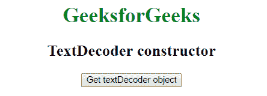
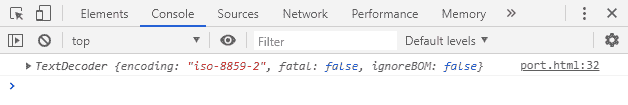
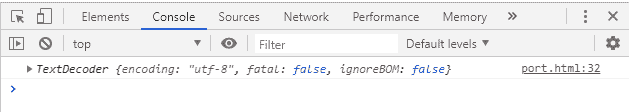

# 文字解码器网页 API |文字解码器建构器

> 原文:[https://www . geesforgeks . org/text decoder-web-API-text decoder-constructor/](https://www.geeksforgeeks.org/textdecoder-web-api-textdecoder-constructor/)

在 HTML 中有一个**文本解码器**接口，我们可以为参数中指定的编码创建一个文本解码器对象。

**语法:**

```htmlhtml
decoder = new TextDecoder( *utf-Label*, *option* );
```

**参数:**该构造函数接受两个参数，上面提到了，下面描述:

*   **utf-Label:** 字符串格式的编码器标签。默认为“utf-8”。
*   **选项:** TextDecoderOptions 字典，它有一个致命的属性(这是一个布尔标志，指示 TextDecoder.decode()方法是否应该抛出一个异常。它的默认值是假的。)

**示例 1:** 本示例创建一个以“iso-8859-2”为参数的文本解码器对象。

```htmlhtml
<!DOCTYPE html>
<html>

<head>
    <title> 
        TextDecoder Web API | TextDecoder constructor
    </title> 
</head>

<body>
    <center>
        <h1 style="color:green;"> 
            GeeksforGeeks 
        </h1>

        <h2>TextDecoder constructor</h2>

        <button onclick="gettextDecoder ();">
            Get textDecoder object
        </button>

        <p id='textDecoder'></p>

        <script type="text/javascript">
            function gettextDecoder() {
                var textDecoder1 = new TextDecoder("iso-8859-2");

                console.log(textDecoder1);
            }
        </script>
    </center>
</body>

</html>
```

**输出:**

*   **之前点击按钮:**
    
*   **点击按钮后:**
    

**示例:**创建一个没有参数的注释对象。所以将采用默认参数“utf-8”。

```htmlhtml
<!DOCTYPE html>
<html>

<head>
    <title> 
        TextDecoder Web API | TextDecoder constructor
    </title> 
</head>

<body>
    <center>
        <h1 style="color:green;"> 
            GeeksforGeeks 
        </h1>

        <h2>TextDecoder constructor</h2>

        <button onclick="gettextDecoder ();">
            Get textDecoder object
        </button>

        <p id='textDecoder'></p>

        <script type="text/javascript">
            function gettextDecoder() {
                var textDecoder1 = new TextDecoder();

                console.log(textDecoder1);
            }
        </script>
    </center>
</body>

</html>
```

**输出:**

*   **之前点击按钮:**
    
*   **点击按钮后:**
    

**支持的浏览器:***文本解码器构造器*支持的浏览器如下:

*   谷歌 Chrome 38
*   Firefox 19
*   歌剧 25
*   Safari 10.1