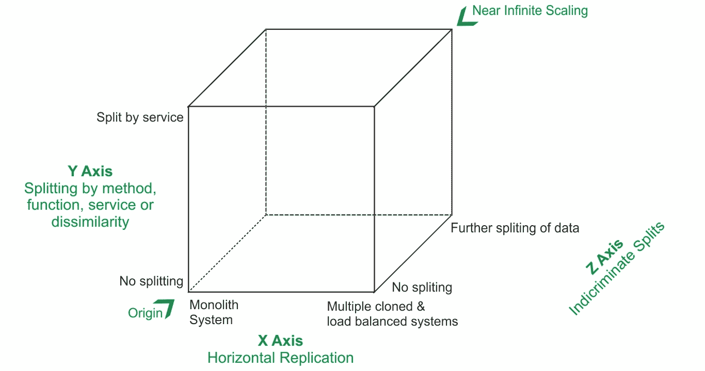

# 刻度立方体

> 原文:[https://www.geeksforgeeks.org/the-scale-cube/](https://www.geeksforgeeks.org/the-scale-cube/)

一般来说，应用程序一开始都是单片构建的。当用户数量较少，流量很低时，单片应用程序是很好的。但是，当流量增加时，系统会过载并变慢，从而导致性能下降、延迟和系统崩溃。

根据 AKF 尺度立方体模型，为了实现可伸缩性，应用程序需要在 3 个维度上进行缩放。即 X、Y 和 z。这种方法可用于无限扩展应用程序。

比例立方体

**X 轴缩放–复制和克隆**

它是复制和克隆的应用。它包括运行许多执行相同任务的应用程序或克隆存储相同数据的数据库。这些副本在负载平衡器后面运行。负载平衡器在所有克隆系统之间平均分配负载。这是一种非常常见且易于理解的扩展应用程序的方法。

X 轴缩放的优势–

*   这在智力上非常容易
*   它体面地处理事务的伸缩
*   实施速度非常快

X 轴缩放的缺点–

*   由于使用了多个数据库克隆，安装成本很高
*   它也不支持高效缓存。缓存需要更多内存。
*   它不支持组织扩展
*   它不支持应用程序复杂性和不断增长的开发

**Y 轴缩放-拆分不同的东西**

它将应用程序分成许多独立的服务。一个服务只负责一个功能。当这些服务进一步分散时，它还可以进一步细粒度和松散耦合。微服务架构主要是 Y-Scaling 的一个应用。有许多方法可以分解应用程序。广义地说，有两种:基于动词的(一个服务负责实现一个用例)和基于名词的(一个服务负责处理所有操作，并且属于一个单独的实体)。一个好的方法是两者结合使用。

Y 轴缩放的优势–

*   它允许组织扩展
*   故障隔离、测试和调试很容易
*   高速缓存命中率显著增加
*   交易规模很大

Y 轴缩放的缺点–

*   找到适合应用的完美分解需要大量的分析和智慧
*   实施起来需要时间

**Z 轴缩放-拆分相似事物**

它与 X- Scaling 非常相似，因此混淆了很多。这里，每个副本运行相同的代码副本。但是每个复制品做的事情并不完全一样。工作量在他们之间分配。一个副本仅适用于数据子集。应用程序的一部分将每个请求路由到适当的服务器。可以在地理基础上进行，以提高响应速度。也是在客户的基础上做的。例如，应用程序的特权客户将被路由到一组更快的服务器。就像有很多下载服务器限制非付费客户的下载速度一样。

Z 缩放的优势–

*   它在智能上易于实现，减少了服务器处理的内存使用量和流量
*   它还显著提高了缓存命中率
*   随着请求的分布，它改进了事务性扩展
*   它还提高了故障隔离，因为服务器故障不会使数据的所有部分都无法访问

Z 缩放的缺点–

*   实施起来需要时间
*   它没有谈到组织的扩展
*   它需要自动化来减少跳跃