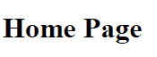
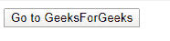
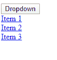

# 使编码网站变得可访问的提示

> 原文:[https://www . geesforgeks . org/tips-for-making-coding-网站-可访问/](https://www.geeksforgeeks.org/tips-for-making-coding-websites-accessible/)

保持你的网站可访问性并不像看起来那样是一项艰巨的任务！这里有几个简单的技巧，你在编码时应该牢记在心:

**备选文本:**备选文本有两个主要目的:

*   向有视觉障碍的用户描述该图像所代表的内容。
*   如果由于网络速度慢或其他问题导致无法加载图像，用户可以使用该描述来了解页面中缺少的内容。

```html
<!DOCTYPE HTML>
<html>

<head>
    <meta charset="UTF-8">
    <title>Alt Text</title>
</head>

<body>
    
</body>

</html>
```

**输出:**


**[标题标签:](https://www.geeksforgeeks.org/html-title-tag/)**HTML 中的<标题>标签用于定义 HTML 文档的标题。它在浏览器工具栏中设置标题。当网页被添加到收藏夹时，它为网页提供标题。它在搜索引擎结果中显示页面的标题。

```html
<!DOCTYPE html>
<html>

<head>
    <title>Accessibility in HTML | Home Page</title>
</head>

<body>
    <h1>Home Page</h1>
</body>

</html>
```

**输出:**


**[标题:](https://www.geeksforgeeks.org/html-heading/)** 如果你是因为喜欢字体大小而使用标题，那就别偷懒了，用 CSS 吧。标题在保持网站结构的可访问性方面起着重要的作用。依靠屏幕阅读器浏览网页的用户可以一次浏览一个网站的每个标题。屏幕阅读器将按顺序浏览标题，如果你正确使用它们，你可以让你的网站更有条理，更容易导航。

*   h1 标签只能用于页面标题。
*   h2 标签用于子类别。例如:如果你正在创建一个讨论电视节目《老友记》中每个角色的网站，你应该用 h1 作为标题“老友记”，用 h2 作为每个角色(瑞秋、莫妮卡、菲比、钱德勒、乔伊和罗斯)的标题。
*   不要过度使用标题。如果你需要比 h3 更多的内容，你可能会使用太多，你的网站可能很难浏览。

**标签:**你应该使用标签来表明页面上某些项目的用途。

*   如果页面上有按钮或表单，则应使用标签来指示按钮或表单元素的标签。同样，它对依赖屏幕阅读器的用户非常有帮助
*   ARIA 标签是添加可访问标签和描述的最佳方式。它会覆盖任何其他本机标签机制，例如 HTML 标签元素。

```html
<!DOCTYPE HTML>
<html>

<head>
    <meta charset="UTF-8">
    <title>Labels</title>
</head>

<body>
<form aria-label="Go to geeks for geeks home page" 
      action="https://www.geeksforgeeks.org/" 
      target=”_blank”>
    <input type="submit" value="Go to GeeksForGeeks" />
</form>
</body>

</html>
```

**输出:**


**菜单:**要访问下拉菜单，下拉项目需要留在屏幕上。否则，如果用户不小心悬停在下拉菜单之外，他们将无法再收听这些项目。使用点击而不是悬停来确保菜单停留在屏幕上。

```html
<!DOCTYPE html>
<html>

<head>
    <meta charset="UTF-8">
    <title>Menu</title>
    <style>
        .dropdown {
            display: inline-block;
            position: relative;
        }
        .dropdown-items {
            display: none;
            position: absolute;
            z-index: 1;
        }
        .dropdown-items a {
            display: block;
        }
        .show {
            display: block;
        }
    </style>

    <script>
        function myFunction() {
            document.getElementById("dropdown-menu")
                            .classList.toggle("show");
        }

        window.onclick = function(event) {
            if (!event.target.matches('.dropbtn')) {
                var dropdowns = document.
                    getElementsByClassName("dropdown-items");

                var i;

                for (i = 0; i < dropdowns.length; i++) {
                    var openDropdown = dropdowns[i];

                    if (openDropdown.classList.contains('show')) {
                        openDropdown.classList.remove('show');
                    }
                }
            }
        }
    </script>
</head>

<body>
    <div class="dropdown">
        <button onclick="myFunction()" class="dropbtn">
            Dropdown
        </button>

        <div id="dropdown-menu" class="dropdown-items">
            <a href="#">Item 1</a>
            <a href="#">Item 2</a>
            <a href="#">Item 3</a>
        </div>
    </div>
</body>

</html>
```

**输出:**


**TAB 键:**

*   如果你想确保你的网站能被轻松浏览，但又不想每次修改都用屏幕阅读器测试你的代码，那就用键盘上的 TAB 键吧！
*   屏幕阅读器将按照与 TAB 键相同的顺序浏览您的网站内容。