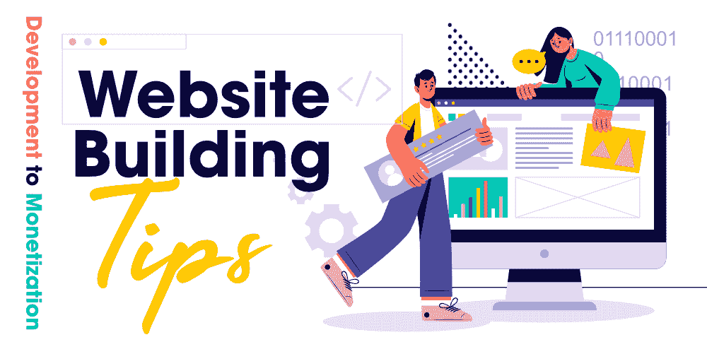

# 网站建设提示——从开发到货币化阶段

> 原文:[https://www . geesforgeks . org/tips-for-site-building-从开发到货币化-阶段/](https://www.geeksforgeeks.org/tips-for-website-building-from-development-to-monetization-phase/)

当我们谈论网络开发时，我们通常会涉及大量的主题，包括我们需要使用什么技术堆栈来构建端到端网站，如何以及在哪里托管网站，如何维护它并定期更新它，各种搜索引擎优化(SEO)技术来提高网站在搜索引擎中的排名，如何将其货币化并使其成为兼职甚至全职的收入来源。

在本文中，让我们从头开始讨论网站构建、托管、维护和货币化的所有上述方面。

### 1.确定合适的技术堆栈

在开始建立网站之前，你需要弄清楚你将使用什么框架和工具来建立网站。您需要考虑编程语言、客户端和服务器端脚本的框架、要使用的数据库、网站的架构以及如何处理网站上的动态变化。这个问题的答案可能会因你对编程语言的经验而异。如果你不是编程出身，那你就得走另一条路去建网站。让我们讨论一下建立网站的不同方法。

**对网站进行硬编码**–如果你是编程出身，这将对你有用。您可以根据自己的需要轻松选择想要的堆栈。最流行的一种是使用 MERN 堆栈开发方法。您可以使用一种叫做 JavaScript 的编程语言来构建网站的所有层。你可以使用 ReactJS，它是一个前端 UI 框架，可以非常容易地处理动态变化，NodeJS 可以用来开发服务器端脚本，MongoDB 是一个 NoSQL 数据库&像 JSON 对象一样以键值对的形式存储记录。您可以使用 Express.js 作为 NodeJS 模块的模板。

**使用网站构建器**–如果你没有编程背景，可以很容易地使用几个网站构建器中的一个来构建你的网站。它们提供了优秀的功能，如拖放工具、内置的搜索引擎优化功能等。这很容易让你在几个小时内建立一个网站。他们也有几个预建的模板。最受欢迎的网站建设者是 WordPress、Wix、GoDaddy 等。

### 2.托管网站

下一步是决定在哪里以及如何托管一个网站。您需要从几个域名提供商之一购买域名，然后使用任何托管服务来托管您的网站。几个提供商，如 GoDaddy 等。帮助您购买一个域并在同一个地方托管您的代码。如果你正在使用 WordPress 建立一个网站，他们会根据你的计划为你提供一个免费域名，你可以在 WordPress 上托管这个网站，也可以使用 Bluehost 或其他类似的网站来托管你的网站，因为它们提供了与 WordPress 的出色集成功能。

### 3.维护网站

到目前为止，如果你已经建立并托管了一个网站，你已经完成了繁琐的部分。然而，定期维护一个网站和建立一个美丽迷人的网站一样重要。你需要定期更新和发布新的文章和内容。此外，你必须使用搜索引擎优化(SEO)技术，以确保您的网站在搜索引擎中排名更高。你需要在你的域名中搜索排名更高的关键词，并在你的网站上更频繁地使用这些关键词。事实上，定期的内容生成，使用搜索引擎优化技术，有一个好的和可读的网站设计将对你的搜索引擎排名产生更大的影响。

### 4.网站货币化

在你建立了一个网站并开始每天获得大量访问者后，你可以考虑将网站货币化，以赚取兼职甚至全职收入。首先，要跟踪浏览量和用户统计数据，你可以使用谷歌分析，或者如果你正在使用 WordPress，你可以选择 WordPress 计划。此外，还有几种方法来赚钱的网站。举几个例子，你可以放各种广告网络的广告，你可以做会员制营销，你可以销售自己的产品，比如电子书或教程，你可以为付费用户发布优质内容等。其中最受欢迎的是在你的网站上展示广告。有几个广告网络可以让你做到这一点。最受欢迎的包括谷歌广告、信息链接、media.net 等。他们有各种模式，如 CPC、CPM、CPA 等。他们根据点击次数(每次点击的成本)或印象次数(每英里印象的成本)等向您付费。要使用广告网络赚取可观的收入，您需要确保每天有足够数量的访问者访问您的网站，并且大多数访问者来自一级国家。此外，这些广告平台有他们的审批程序，以确保您不会在您的网站上发布非法和抄袭的内容。

我们已经讨论了如何构建、托管、维护网站并将其货币化的总体描述。你需要确保你使用了正确的工具来建立网站，这样从长远来看，你就不需要改变或调整你的网站，以防万一，你在你的网站上获得足够的牵引力&你的网站可以承担负荷。此外，如果你正在考虑货币化你的网站，你需要确保你定期发布真实和高质量的内容。