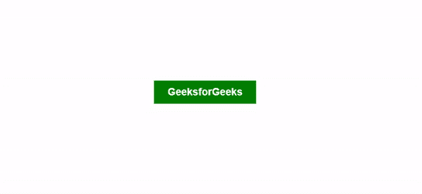

# 点击元素时添加类名切换类，点击外部时移除

> 原文:[https://www . geesforgeks . org/通过单击元素时添加类名和单击时移除外部来切换类/](https://www.geeksforgeeks.org/toggle-class-by-adding-the-class-name-when-element-is-clicked-and-remove-when-clicked-outside/)

在本文中，任务是在单击该元素时切换一个 CSS 类，并在单击该元素之外(即 HTML 文档中的任何其他位置)时移除该特定类。

**方法:**这可以通过遵循以下步骤在 JavaScript 的帮助下轻松完成:

*   我们将首先使用 querySelector()方法选择要切换类的元素和整个 HTML 文档。
*   接下来，我们需要将“click”事件侦听器添加到两个选定的元素中。
*   在要单击的元素的事件侦听器中，我们将使用 classList.add()方法添加所需的 CSS 类。
*   在 HTML 文档的事件侦听器中，我们将首先检查被单击的目标是否是上面必需的元素，然后使用 classList.remove()方法移除该类，从而在被单击到上面的元素之外时切换该类。

**示例:**在此示例中，在 HTML 文档中定义了一个按钮，一旦单击该按钮，就会在其上添加“活动”CSS 类。一旦我们单击了 HTML 文档中的任何地方，这个“活动”类也将从按钮中删除。

## 超文本标记语言

```html
<!DOCTYPE html>
<html>

<head>
    <style>
        button {
            background-color: green;
            color: white;
            padding: 10px 24px;
            font-size: 18px;
            border: none;
            font-weight: bold;
            transition: all 0.4s;
            margin: 300px;
        }

        .active {
            background-color: black;
        }
    </style>
</head>

<body>
    <button>GeeksforGeeks</button>

    <script>
        // Select the button on which the
        // class has to be toggled
        const btn = document.querySelector("button");

        // Select the entire HTML document
        const html = document.querySelector("html");

        // Add an event listener for 
        // a click to the button
        btn.addEventListener("click", function (e) {

            // Add the required class
            btn.classList.add("active");
        });

        // Add an event listener for a
        // click to the html document
        html.addEventListener("click", function (e) {

            // If the element that is clicked on is
            // not the button itself, then remove
            // the class that was added earlier
            if (e.target !== btn)
                btn.classList.remove("active");
        });
    </script>
</body>

</html>
```

**输出:**

