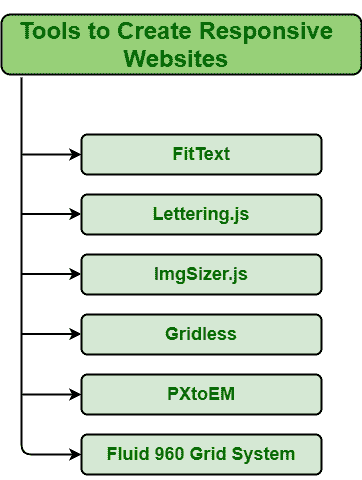

# 响应性网页设计工具

> 原文:[https://www . geeksforgeeks . org/tools-for-responsive-web-design/](https://www.geeksforgeeks.org/tools-for-responsive-web-design/)

如今，响应迅速的网站对于业务增长至关重要。这些网站的创建是为了确保网站在所有设备上看起来都很好，如台式机、笔记本电脑、智能手机、平板电脑等。它通常在每台设备上包含相同的内容、图像和其他元素，只是页面大小和组织方式会根据屏幕大小发生变化。这些网站是专门设计的，以适应每一种屏幕类型，无论大小。这反过来改善了用户体验，增加了受众。响应式网站通常会在每台设备上提供一致且良好的体验。

**创建响应性网页设计的工具:**大家都知道创建一个响应性的网站是非常必要的。创建一个响应迅速的网站并不容易。目前，可以使用不同的工具来创建响应性网站。工具通常充当助手，为响应性网页设计的一些任务提供快捷方式。创建网页设计所需的一些重要工具分为以下三类:

**1。响应性排版:**排版只是指内容或文本的样式或外观。它为品牌创造视觉效果，吸引更多的顾客，从而确立品牌的价值。设置整体业务并确保出色的用户体验非常重要。因此，创造一个美丽和有吸引力的排版很重要。创建此类版式所需的一些工具如下:

**FitText:** 是制作字体大小灵活所需的工具。它允许文本行的字体大小完全适合屏幕的宽度。它基本上是一个 jQuery 插件，用于适应文本的字体大小。最好有助于使标题在其他设备上看起来更好。其特点包括:

*   它使字体大小灵活。
*   它可以添加到 js 网站文件夹中。
*   它提供了可扩展的标题。
*   它使文本适合一行。
*   它调整文本大小以适应父元素。

**Lettering.js:** 这是一个允许一个人单独管理每个字母的工具。Lettering.js 也是一个 jQuery 插件，可以帮助控制网页的外观和排版的特点，比如间距、单个字母的颜色等等。其特点包括:

*   它使标记易于管理。
*   它控制单个字母的字距。

**2。柔性图像:**柔性图像简单来说就是根据尺寸和显示分辨率来塑造自身的图像。这些图像会自动调整到最适合的屏幕尺寸，并提供更好的用户体验。创建灵活图像的工具如下:

**ImgSizer.js:** 这是一个工具，一般用来创建与原始图像不同大小的图像。它根据用户用来查看网站的屏幕大小创建不同大小的图像。其特点包括:

*   它确保图像在窗口上清晰呈现。
*   它管理网站上所有与图像相关的工作。

**3。响应式网页布局:**响应式网页设计一般会让网页在笔记本电脑、智能手机、平板电脑等各种设备上看起来都不错。它通常包括灵活的布局，可以根据用户的屏幕大小和网络浏览器的功能进行调整。创建灵活布局的工具如下:

**Gridless:** 它是一个工具，一般提供两个选项，即 HTML5 和 CSS3。这是最好的工具，可以用来创建一个未来证明响应网站与轻松和美丽的排版。其特点包括:

*   它简单而直接。
*   提高光谱效率。
*   它有助于组织内容。

**PXtoEM:** 它是一个工具，用于在开发 web 元素时将绝对单位转换为相对单位，即像素转换为 EM。它是最好的工具，用来解决复杂的数学方程容易得多。其特点包括:

*   它将固定宽度的设计工作转化为流畅的布局。
*   它有助于将绝对测量单位转换为相对单位。
*   它允许我们很容易地改变图层的基本字体大小。

**Fluid 960 网格系统:**在设计响应性网站时，网页支出非常重要。该工具无需使用，用于满足特定需求。此工具重新调整网页布局以适应页面宽度。它被认为是在 CSS 框架的帮助下开发网格系统的一种快速简单的方法的最佳工具。其特点包括:

*   它简化了网络开发工作流程。
*   它是一个轻量级的 CSS 网格框架。