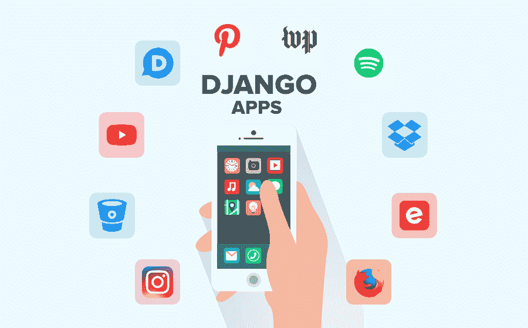

# 十大 Django 应用以及公司为什么使用它？

> 原文:[https://www . geesforgeks . org/top-10-django-apps-和-为什么-公司-正在使用-it/](https://www.geeksforgeeks.org/top-10-django-apps-and-why-companies-are-using-it/)

作为初学者说到学习一门新的语言大家最喜欢的就是 **[Python](https://www.geeksforgeeks.org/python-tutorial/)** 。许多从事不同类型的应用程序并与数百万用户打交道的公司都希望有一个快速、可扩展和动态的网站。在市场上，编程语言和框架的选择是非常多的，但是选择满足大多数需求的最佳语言和框架对于组织来说是一项艰巨的任务。如今，信息技术行业对 Python 语言的流行已经很熟悉了。学习这种语言有多容易，这种语言如何解决了组织运行不同类型应用程序的许多问题。Python 和这种语言的框架确实值得在市场上大肆宣传。

为了构建具有不断增长的受众的高度可伸缩的网络应用程序(例如基于内容的网站或新闻网站)， [Django](https://www.geeksforgeeks.org/django-tutorial/) 是 Python 最流行的网络框架之一。框架清晰简单，快速可靠，灵活可扩展。Django 有一个巨大的忠实贡献社区，这个框架帮助你用更少的代码就能完成你的工作。据 [SimilarTech，](https://www.similartech.com/technologies/django)截至 2019 年 5 月，与 Django 共建的网站有 **77，278 个**。如果你想知道为什么姜戈如此受欢迎，那么你应该看看一些著名的网站，它们是使用这种技术发展起来的。让我们仔细看看最好的姜戈网站。

### 1.光盘

Disqus 是迄今为止在 Django 框架上从头开始构建的最大项目。该网站允许您在网站上实施评论和讨论选项。它提供了一个易于使用的评论插件，可以分析受众活动、广告和访问客户参与工具。该社区每月在 **191 个国家**拥有超过**1700 万**月浏览量的近 **5 亿**独特访客。约有 75 万**个**网站使用 Disqus，约有**3500 万**用户参与这些社区。网站每月处理超过**5000 万条**评论。这是一个运行在幕后的 Django 框架，帮助 Disqus 扩展其应用程序，以处理数百万用户，并获得更好的性能。

Disqus 团队还使用这个框架构建了一个内部工具 [Sentry](https://sentry.io/welcome/) ，用于错误报告、调试和修复应用崩溃。如今，Sentry 在开发者中相当受欢迎，它已经成为一个开源软件，被包括 Instagram、Reddit、Doordash、Datadog 和 Prezi 在内的 **30，000+** 组织使用。Disqus 现在也在使用其他框架，但是团队仍然在 Django 上工作，因为有巨大的社区支持和广泛的现成解决方案可供选择。

### 2. [YouTube](https://www.youtube.com/)

这个“视频分享平台”无需介绍。早些时候，这个网站是建立在 Php 上的，但是 youtube 团队觉得有必要提高它的性能，并在其中增加新的功能。持续快速的观众增长迫使 youtube 团队选择了 Django 框架，这一选择完全合理。姜戈帮助了 YouTube 开发团队，让他们能够完美地快速行动&。他们使用这个框架来实现新的功能，并保持网站的速度。

### 3.insta gram

同样，这个网站不需要介绍。Instagram 是增长最快的照片和视频分享应用，在世界上相当受欢迎。Instagram 的联合创始人 Kevin 和 Mike 使用 Django 开发了这款应用的第一个版本。和姜戈一起工作非常容易，不需要很多决定和设置。每天，Instagram 用户在图片和视频下添加**9500 万张**照片，给予**42 亿**点赞。Django 帮助 Instagram 扩展了应用程序，处理了大量数据，并在每一秒钟管理用户之间更多的交互。Django 中可用的准备实施解决方案使团队能够专注于应用程序的用户界面和 UX，而不用担心让它们工作的后端技术。根据 Instagram 前工程主管**丁辉**的说法

> “我们已经能够通过 Python/Django 堆栈获得几亿用户，所以我们决定继续。同样重要的是，我们的工程师喜欢 Python。这是人们想来为我们工作的原因。”

Instagram 使用 **Sentry** 工具(由 Disqus 开发)实时监控和检测整个系统的错误。

### 4.[可携性](https://www.spotify.com/in/)

这款音乐流媒体应用改变了人们听、分享和购买音乐的方式。这个应用程序的庞大库可以在任何地方和任何设备上访问。它包含大量数据，为了处理这些数据，应用程序使用 Python 和 Django。选择这个框架主要有两个原因…

*   快速后端。
*   机器学习选项。

为了给用户提供定制的自动生成播放列表，Spotify 得益于 Python 的[机器学习](https://www.geeksforgeeks.org/machine-learning/)。Django 提供了完整的 Python 特性来处理网络应用程序。

### 5\. [Bitbucket](https://bitbucket.org/)

忘记你的源代码只在你的机器上的那一天。如今，Github 和 Bitbucket 在市场上非常流行，它们可以在线托管您的存储库。Bitbucket 是一个基于云的 Git 存储库托管服务，于 2008 年推出。如今，这个平台在一年内处理了 1700 万的**请求和 600 万的**存储库，处理了大量的用户。这个平台背后的核心技术是与 Django 配对的 Python。Bitbucket 使用 Django 有几个原因。第一个是数以千计的广泛而充满活力的开发者社区。第二个原因是 Django 提供了很多现成的解决方案，为开发人员节省了大量时间。这样，他们就不必担心从头开始构建每一个特性。****

### 6. [DropBox](https://www.dropbox.com/?landing=dbv2)

Dropbox 是最流行的基于云的文档、视频、图片、图形等存储平台。该应用程序允许用户随时随地从任何设备访问文件。从一开始，Dropbox 就将 Python 作为其技术堆栈中的主要技术，该公司还雇佣了创建 Python 的人**吉多·范·罗苏姆**。该团队能够使用 Python 为服务器和桌面客户端软件相对快速地开发产品。Dropbox 开发者选择 Django 添加用户**历史选项，跨不同设备同步一个账号，并添加各种类型的文件共享选项**。

### 7. [Mozilla](https://www.mozilla.org/en-US/)

Mozilla 是世界上第二受欢迎的浏览器，所以没有必要说有多少人使用它。最初，Php 和 CakePHP 是 Mozilla 的核心技术堆栈，但后来当用户数量开始增加时，该平台开始增长，每天必须处理数百万次搜索。为了管理高流量和提高效率，团队必须采用新技术。所以团队决定从 **PHP+CakePHP** 继续前进到 Python+Django。他们从中受益，平台变得更有能力处理每月数亿次浏览，甚至每天更多的应用编程接口点击。今天，所有的 Mozilla **支持网站**和**插件**都是由 Django 提供动力的。

### 8.[油漆](https://in.pinterest.com/)

Pinterest 是另一个受欢迎的社交媒体平台，它允许用户找到像食谱、家庭和风格灵感这样的想法。Pinterest 拥有**2.5 亿**月活跃用户，因此网站不得不应对繁重的用户负荷。为了确保出色的性能，网站使用了 Django。Django 提供了在不影响速度的情况下有效扩展的能力。是幕后的 Django 帮助开发者管理网站，让它的用户可以互相跟踪，分享图板和图钉。

### 9.[华盛顿邮报](https://www.washingtonpost.com/)

你可能会惊讶于一个有趣的事实，Django 最初是为了支持劳伦斯日报-世界报纸出版商的内容网络应用而创建的。嗯，这个框架在新闻应用程序中仍然很受欢迎，世界上最有影响力的报纸《华盛顿邮报》也在使用它。这个流行的新闻应用程序利用了这个框架，并以快速高效的性能很好地处理了巨大的流量。仅在姜戈撰写的《华盛顿邮报》网站在 2019 年 3 月的月访问量达到了 1.72 亿**。其他类似的应用，如《T4》《卫报》《讽刺报纸》《洋葱》《纽约时报》也使用姜戈框架来扩展他们的网站，并处理日常观众产生的大量数据。**

### **10.事件名人**

**Eventbrite 是姜戈的另一个成功故事。该网站于 2006 年推出，提供活动管理和票务服务。Eventbrite 最初是基于 Python 和内部框架构建的，但由于受众的快速增长，该平台开始面临可扩展性问题。2010 年，开发团队决定转向 Django 框架。它帮助开发人员扩展他们的网站，并处理尽可能多的点击每秒。Django 成为整个 Eventbrite 网站未来发展壮大的坚实基础。**

**名单到此为止。仍然有一些流行的网站在其技术堆栈中使用了 Django，并受益于使用该框架。其他一些受欢迎的网站有… **Prezi、NASA、国家地理、Quora、The Onion、Reddit、Udemy、Robinhood** 等。**

**因此，Django 是创业公司和大公司的完美解决方案。可扩展性是 Django 的最佳特性之一，它使任何应用程序都能够高效地处理任何受众数量的增长。如果你的目标是快速、高效地交付产品，那么你应该考虑在下一个项目中使用这个框架。**