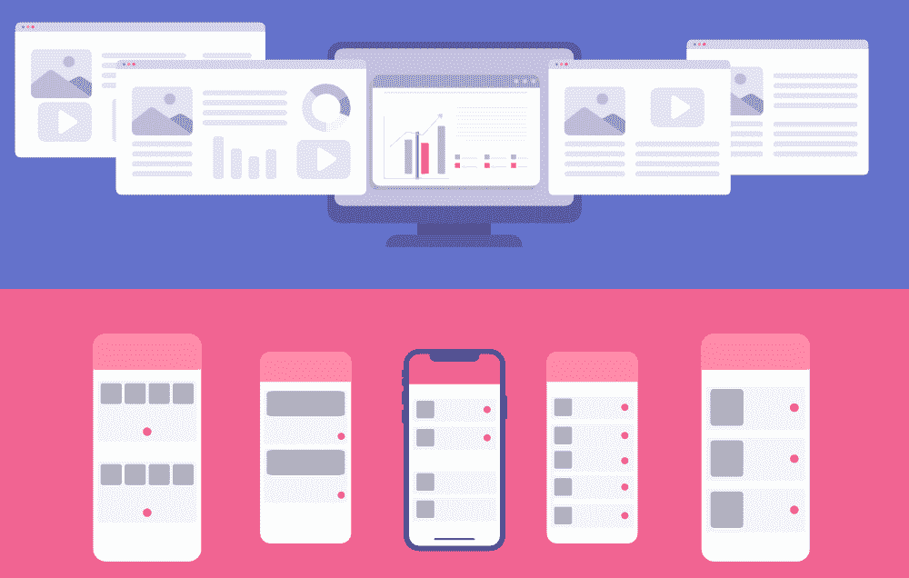

# 应用和网站主题的十大免费资源

> 原文:[https://www . geesforgeks . org/top-10-应用和网站主题免费资源/](https://www.geeksforgeeks.org/top-10-free-resources-for-app-and-website-themes/)

用户与任何网站的第一次互动始于其前端部分。如今，在网络开发中，大多数开发人员都不想花费数天或数周的时间来编写 [HTML](https://www.geeksforgeeks.org/html-tutorials/) 和 [CSS](https://www.geeksforgeeks.org/css-tutorials/) 代码来从头开始设计主题或模板，尤其是当客户有紧急需求时。现在，当您获得一些资源来下载模板或主题，然后用您的创造力对其进行定制，使其独特、美观并对用户有吸引力时，您的智能就在开发中发挥作用。使用这些模板不仅可以节省大量时间，还可以帮助您学习 web 开发中的前端。如果你是一个好的后端开发人员，那么使用模板或主题也是一个从前端开始的好方法。您也可以在项目中使用这些模板。

有很多网站可以免费获得模板，但并不是所有的模板和主题都是免费的。有时客户不想为此付费，所以探索一些可以获得免费主题或模板的资源是个好主意。我们将讨论一些免费资源。

### 1. [HTML5 向上](https://html5up.net/)

这个网站很受欢迎，在那里你可以找到很多优雅美丽的主题。这些模板是完全响应的(您可以在各种屏幕模式下查看设计)，并可在 HTML5 和 CSS3 上定制。大多数主题可以用于任何类型的应用程序的通用方法。你可以在多个设备上查看现场演示，并从那边提供的选项(你会看到下载按钮上的下载次数)下载主题。所有的主题都很简单，页面最少，当然 100%免费下载。

### 2. [Colorlib](https://colorlib.com/wp/templates/)

Colorlib 是为各种网站下载免费模板的热门网站之一。你可以为不同类型的网站找到许多独特的类别，比如房地产、酒店、摄影、旅游等等。他们收集了大量的 HTML5 和 WordPress 主题。你会发现很多多页的网站模板。您还可以在不同的设备上查看所选主题的实时预览。

### 3.[引导主题](https://bootstrapthemes.co/items/free-bootstrap-templates/)

这也是一个非常好的网站，在这里你可以找到很多免费的美丽的模板和主题，为不同类型的网站，如旅游，餐厅，代理，企业或商业。模板完全响应，因此您也可以在下载之前检查不同屏幕模式的实时预览。还有一个资源部分，让您可以选择下载导航菜单、按钮、定价表等等。

### 4.[作为模板](https://www.astemplates.com/free-websitetemplates)

该网站有免费和付费模板。对于免费模板，你需要访问“免费材料”标签，在那里你可以找到很多建立在 Joomla，WordPress，HTML 上的免费模板。你也可以找到要下载的图片。模板也有多个页面，有很多类别，如艺术文化、商业、教育、摄影、医疗等。您可以查看不同设备模板的演示预览。

### 5 .零主题

该网站还为您提供了选择免费或付费模板的选项。你可以从这里为你的网站下载免费的响应主题，并根据你的需要进行定制。有些模板是常规的响应 HTML5，有些是自举。他们有 120 多个免费主题。其中 87 个是 HTML，37 个是 Bootstrap 4。您还可以检查不同设备的实时预览。

### 6.[免费 HTML5](https://freehtml5.co/)

该网站还为您提供了为任何类型的应用程序下载免费主题的选项。你可以找到很多选择，比如商业、教育、健康/健身、旅游、酒店等等。你也可以选择高级主题。该网站有一个单一的网页，以及多页的主题可用。主题是建立在 HTML 和 Bootstrap 之上的。

### 7.[启动自举](https://startbootstrap.com/)

顾名思义，这里提供的所有模板都是基于 Bootstrap 构建的。这些模板可以很容易地定制，设计很酷。您还可以获得后端管理面板用户界面，您可以使用任何后端语言，如 PHP，Node 或 Express.js。除此之外，您还可以为不同类型的网站找到多个类别。像其他网站一样，您可以在下载主题之前检查多个设备的预览。您也可以在这里购买高级主题。

### 8.[泰晤士报](https://themewagon.com/)

该网站提供了许多基于 HTML 和 Bootstrap 的免费模板。它们还为您提供了各种选项来为任何类型的应用程序选择模板。这些网站还提供管理面板用户界面，您可以根据需要轻松定制。如果你正在寻找任何电子商务模板，那么这个网站有一些非常好的电子商务[模板](https://themewagon.com/theme-categories/e-commerce/)。模板是完全响应的，所以在你从这里下载主题之前检查预览。

### 9.[风格喊](https://www.styleshout.com/free-templates/)

像 HTML5 Up 这个网站提供了一些独特和简单的模板，你可以根据自己的需要定制。所有这些模板都具有响应性，因此您可以轻松检查不同设备的视图。你也可以找到类似“即将到来”或“404 错误”的页面。如果你浏览这个网站，你会发现大部分模板都添加了动态 JavaScript 功能，比如倒计时和滑块。对于非开发者，他们提供定制网站的服务。所以你可以支付费用，并根据你的需要准备好网站。

### 10.[模板化](https://templated.co/)

该网站有 867 个免费响应模板可供下载。您也可以在这里找到高级主题。你会发现很多有淡入效果的模板。所有这些模板都很简单，用于一般目的。对于图像共享应用程序，他们也有一些不错的网格图库类型的主题集合。很多模板都有一个很大的展示区，然后是下面有图标的优雅盒子。他们也可以选择在你下载前检查实时预览。

**其他资源:**

*   html 5 xcss 3
*   [管理用户界面主题](https://athemes.com/collections/free-bootstrap-admin-templates/)
*   [免费 CSS](https://www.free-css.com/free-css-templates)
*   [主题扫描](https://www.themevault.net/)
*   [船模](https://bootstrapmade.com/)