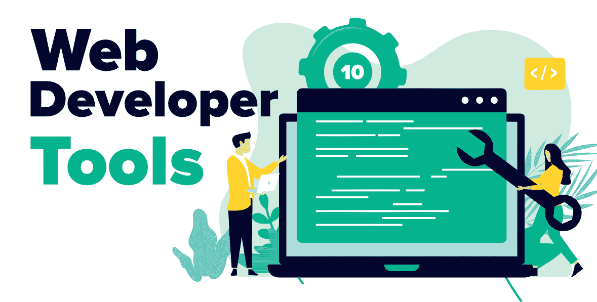

# 每个网络开发者必须尝试一次的十大工具

> 原文:[https://www . geesforgeks . org/top-10-每一个网络开发者都必须尝试一次的工具/](https://www.geeksforgeeks.org/top-10-tools-that-every-web-developer-must-try-once/)

如果你想轻松、有效、高效地完成任何任务，那么你应该使用一些工具。尽管有许多不同的软件开发工具可用。你必须根据你的需求和技术选择最有用的工具。

一个好的程序员应该知道哪些工具比其他人更好，也应该使用最强大和先进的工具。大多数公司推荐了自己的一套工具，但许多新公司允许他们选择自己的工具。

### **1。LINUX**

它提供了一种强大且最快的方式来构建和托管定制后端应用程序和 web 服务。它只不过是一个低代码的 IDE 和服务器。在 LINUX 的帮助下，我们可以构建和自动化后端应用程序和 web 服务。LINUX 是一个很好的工具，可以自动从多个来源收集数据，对其进行转换，并将结果交付给多个目标系统。

**特征:**

*   **可视化构建:**使用拖放编程功能和服务。
*   **高速:**通过在几分钟内组合大块功能，实现快速迭代开发
*   **随处托管:**您可以部署和托管您的应用程序
*   **即时设置:**提供简单的一步安装，占地面积小，让您立即开始工作。

### [2。巴迪](http://Buddy.works)

对于网络开发人员来说，这是最快的 CI/CD 工具，是更快构建更好应用的最有效方法。它使 DevOps 对开发人员来说很容易，设置起来很快，运行起来也很快。在并行性和全面优化的帮助下，使用 Buddy 创建最复杂的 CI/CD 工作流需要几分钟时间。

**特征:**

*   **速度:**闪电般的部署(平均部署时间:12 秒)。
*   **支持:** Buddy 支持所有流行语言、框架&任务管理器。
*   **即时结果:**应用程序&网站的构建、测试和部署速度非常快。
*   **故障率更低:**非常容易从故障中恢复。
*   **监控:**监控实时进度和日志，维护无限历史。
*   **一级集成:**集成 Github、Bitbucket、Gitlab、AWS、Shopify、WordPress 等众多。

### [3。AWS Cloud9](https://aws.amazon.com/cloud9)

它是一个基于云的集成开发环境(IDE)，让您只需一个浏览器就可以编写、运行和调试各种流行的编程语言，如 [C、](https://www.geeksforgeeks.org/c-language-set-1-introduction/)[Python](https://www.geeksforgeeks.org/python-programming-language/)[JavaScript](https://www.geeksforgeeks.org/javascript-tutorial/)[PHP](https://www.geeksforgeeks.org/php/)等。最初在 2010 年，Cloud 9 是一个开源软件，后来在 2016 年，亚马逊网络服务(AWS)收购了它。

**特征:**

*   无需安装或维护本地 IDE，只需使用浏览器即可编写、运行和调试代码。
*   只需点击几下鼠标，您就可以与团队实时共享您的开发环境和代码。
*   它使使用无服务器应用程序变得容易，并允许您直接迭代代码。
*   它预先打包了 40 多种编程语言，因此节省了您的时间并提高了代码质量。
*   一些最有用的功能是代码完成建议，调试，文件拖动，这使它成为一个强大的工具。

### [4.原子](https://atom.io)

这是一个完全免费的开源代码编辑器。它在开发人员中非常受欢迎，可以根据您的需要进行定制以满足您的需求，而无需编辑配置文件。

**特征:**

*   一个支持跨平台编辑的可黑客攻击的文本编辑器。
*   Atom 可以跨各种操作系统工作，如 OS X、视窗或 Linux。
*   它通过智能灵活的自动完成功能帮助您更快地编写代码。
*   您可以轻松浏览文件，并根据您的需求在一个窗口中打开单个文件、整个项目或多个项目。
*   Atom 的一个重要特性是其内置的包管理器。

### [5。github〔t1〕](https://github.com/)

GitHub 是最近几天广泛使用的工具。GitHub 提供了无限的私有存储库和免费的 GitHub 帐户，大量用于托管开源项目。2020 年，GitHub 成为世界上最大的源代码主机，拥有超过 4000 万用户和 1 亿个存储库，包括至少 2800 万个公共存储库。对于任何程序员或软件开发人员来说，良好的源代码管理库知识都是必需的，因为您每天都需要签入和签出代码。

**特征:**

*   托管软件开发版本控制。
*   具有分布式版本控制的 Git 源代码管理功能。
*   提供访问控制。
*   各种协作特性，如错误跟踪、特性请求等。
*   用于任务管理，维基用于每个项目。

### [6。netbeans](https://netbeans.org/)

NetBeans 是一个流行的用 Java 编写的软件开发工具，可以用 Java、JavaScript、HTML5、PHP、C/C++等轻松快速地开发世界一流的 web、移动和桌面应用程序。它是免费和开源的，由 Apache 软件基金会管理。

**特征:**

*   通过在语法和语义上突出显示源代码，有助于快速智能编辑。
*   让您使用一系列方便而强大的工具智能地重构代码。
*   支持跨平台(写一次，运行在任何地方，适用)，并在任何操作系统上工作，如 Linux，Mac 或 Windows 等。
*   提供编辑器、向导和模板，帮助您轻松创建应用程序。
*   有助于轻松高效的项目管理流程和快速的用户界面开发。

### [7。自举](https://getbootstrap.com/)

它是最受欢迎的前端开源工具包，一个用于快速设计的开源免费框架，并使用 CSS、HTML 和 JS 定制响应性和移动网站项目。

**特征:**

*   允许利用现成的代码块。
*   通过智能拖放功能，使用内置组件，在几秒钟内即可创建响应迅速的网站。
*   你可以根据他们项目的要求进行定制。
*   它有许多有用的开源 SVG 图标库可以工作。
*   提供了广泛的组件列表。
*   保证所有开发人员或用户之间的一致性，不管谁在做这个项目。

### [8。代码龙虾](http://www.codelobster.com/)

IDE 龙虾是一个免费、方便、跨平台的 IDE，用于开发功能齐全的 web 应用程序。它简化了 PHP/HTML/CSS/JavaScript 的开发。

**特征:**

*   它是一个强大的 PHP 调试器。
*   使用它，您不需要记住函数、参数、标签或它们的属性的名称。
*   它允许您在本地验证代码。
*   自动检测当前服务器设置并配置相应的文件。
*   支持 Bootstrap、Nodejs、CodeIgniter、phalcon 等框架。

### [9。Node.js](https://nodejs.org)

这是一个开源、跨平台和 JavaScript 运行时环境，旨在构建可扩展的网络应用程序和各种网络应用程序，以创建网络服务器和网络工具。

**特征:**

*   它是跨平台的，因此可以在任何操作系统上运行，如视窗、Linux、苹果操作系统、Unix 等。
*   它非常高效，而且超级轻便。
*   允许开发人员使用 JavaScript 编写服务器端应用程序。
*   为开发后端平台提供快速且组织良好的解决方案。
*   使用事件驱动架构优化 web 应用程序的吞吐量和可扩展性。

### [10。代码加载工作室〔t1〕](http://www.codecharge.com/products/index.php)

它是最具创造性和领先性的 IDE 和 RAD(快速应用程序开发)，用于以最少的编码直观地创建支持 Ajax 和数据库驱动的 Web 应用程序。它支持所有数据库、网络服务器和网络技术，使代码收费独一无二。它是一个完整的网络开发工具箱。

**特征:**

*   它通过使用代码生成器和模板引擎将表示层和编码层分开。
*   无需编程，它使用点击式向导来创建记录、搜索表单和网格。
*   为创建 web 应用程序提供交互式用户界面。
*   使用命名约定和注释，它会自动构建代码。
*   它支持任何具有网络连接的数据库，如 MySQL、MS SQL Server、MS Access、PostgreSQL 和 Oracle 等。

也有许多开发工具，但是这个开发工具列表主要用于现代项目的开发。让自己保持更新，并尝试学习新的工具，以提高您的生产力。