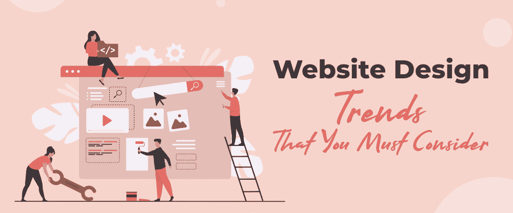

# 你必须考虑的十大网站设计趋势

> 原文:[https://www . geesforgeks . org/top-10-网站-设计-趋势-你必须考虑的/](https://www.geeksforgeeks.org/top-10-website-design-trends-that-you-must-consider/)

网站设计趋势为你提供了一个直接的行动方案，给你网站的访问者留下深刻的印象。最重要的是，这些趋势告诉你，你可以让你的访问者在你网站的不同页面上停留多长时间，以便这些访问者以后可以成为合格的潜在客户。怀疑这是否可能发生！！是的，这肯定会发生，不管访问者与哪个行业相关，也不管你的网站。这一奇迹将改变你的企业的游戏规则，充分利用数万亿人每天或每周访问免费互联网资源的信息，没有任何混乱。

尽管如此，网站设计所面临的趋势数量众多。但是，我们需要确定并实施那些吸引更多客户关注的服务，作为回报，更好地参与他们对我们的网络服务的期望？这也将有助于其他商业网站将他们的思维过程融合到现实主义的新高度，这些新高度令人惊讶地通过这些趋势提供了解决方案。当用户导航到网站的其他页面时，这些趋势将使设计/布局更加直观、令人信服和流畅！！让我们了解您应该考虑的所有可能的网站设计趋势:

### 1.图形和动画的优雅使用

网站的图形和动画非常重要，因为有时上传的视频会降低网站的速度。原因很容易理解，那就是视频的大小更大(比如 40、86、183 兆字节等等)，因此网站的速度会变慢。因此，转化率和点击量肯定会降低。另一方面，动画和图形的正确使用可能会捕捉，然后，通过显示我们日常生活中正在发生或可能发生的事情的无休止的流，通过其运动原理来留住您的目标受众。从今以后，如果你正在计划一个大脑警报网站设计，在那里你周围的人比周围的东西更关注它，你最好选择那些优雅的图形和动画而不是视频带来的意想不到的快乐。

### 2.理解用户需求的简单性

简单就是你可以说一种更新的方式来呈现你网站上所有的东西整洁。这是因为现在有了简单性，所有不必要的和整洁的元素(如断开的链接、外部网站内容的链接、发布前未过滤的垃圾评论以及网站上以旧内容形式提供的未更新信息)都将与负空格一起被删除。此外，传统布局的传统现在将停止与两个或三个配色方案提供的这种更新的方式，保持一切简单和清醒的平台包括一组相关的网页，这显然是你的网站。逐行，这种类型的设计将让用户更快地浏览你的网站，因为简单性增加了加载时间。当你更快地设计和编辑简单的视觉惊艳设计，能够可靠地提高客户的满意度时，你现在还需要什么来提高你的网站在搜索引擎上的排名？

### 3.视障人士的语音支持

语音支持包括一个语音用户界面，可以让用户进行交互，然后通过语音命令连接到您的网站。从控制你的音乐到查找关于天气、新闻或酒店预订的信息(如果你的网站提供这样的服务)，所有这些都是可行的，即使是那些在世界上被称为视障人士的人。这听起来是不是既疯狂又有帮助？赞成..，为什么不呢！！这种以语音形式提供的面向搜索的命令将迫使每个商业网站采用这种语音支持，作为其所有当前和未来在线或离线商业活动的趋势。这可以从 RingCentral 的研究中得到验证，根据该研究，超过 55%的人舒适地使用语音识别从该电子商务网站购买了他们想要的产品，这就是为什么它是语音支持的另一个同义词。此外，视力受损的人也被添加到您的客户名单中，因此您可能会期望更高的利润率和更好的客户参与度，同时将您现有的网站修改为电子商务网站的样子。

### 4.专注于创造增强现实体验

增强现实(或增强现实)将让你的用户在与你的或任何其他商业网站互动的方式上经历惊人的转变。在增强现实的帮助下，他们会实时看到网页对象直到 Z 轴的样子(就像现实生活中你眼睛看着一个对象的 360 度体验)？我在想，网页设计师们是否能够创造出如此令人惊叹的体验，以数字化的方式回应现实！！有了面向增强现实的网页设计，就有可能让你和网站用户的思想超越基本层面的界限。因此，用户对像 SolAR 和 ARTE 这样的密集型增强现实平台的好奇心将会增加，从而吸引更高的转化率和更高的客户参与度，而无需担心客户流失。因此，您现在可能会期望在客户的购买过程中有更多的授权，集中关注于通过这些强大的增强现实体验来增强市场现实。

### 5.制作引人入胜的故事的动态滚动讲述

滚动讲述是滚动和讲故事的结合。这可以被称为一种通过各种 Scrollytelling 元素向您的观众讲述故事或故事的动态方法，例如以文本形式排列的故事逻辑序列、图形精彩绝伦的吸引人的视觉效果，以及让用户控制呈现您的故事实际格言的视觉效果的回放控制。在这里，你不应该错过的是使用微妙和美丽的视觉效果，让你很好地连接到故事的叙事部分。连接到叙事部分的好处是，您现在将了解观众通过动态讲故事过程中包含的叙事的真实性而被说服的程度。因此，你网站设计的绝妙工具，即 Scrollytelling，是传达包含不同视角的故事的真正含义，适用于影响读者，使他们可以将这些故事与他们经历的各种情况联系起来，无论是闲逛还是闲坐。

### 6.减少眼睛疲劳的黑暗模式

黑暗模式是最佳网站设计的流行趋势，因为它为您的网站提供了弱光环境。这将有助于用户浏览您的企业或个人网站，而不会出现无法控制的眼睛疲劳。事实上，这种节省电池的趋势将强烈突出任何网页内容的许多重要内容，如仪表板、统计数据、配置文件和设置(在这种模式下，有两种颜色会积极响应——白色代表当前加载的网页的重要内容&不可否认，黑色是背景)。根据 NIGHT EYE 的统计，64.6%的受访者预计他们正在访问的网站会自动为他们应用黑暗模式。这说明在线用户是多么热衷于采用他们更喜欢打开的网站的暗模式环境。现在还需要什么来更多地与黑暗模式联系起来，提供凉爽的现代外观，对你的身体特别是眼睛有益！！

### 7.激发网站用户界面的新形态

Neumorphism，材料设计和 skuomorphism 的致命结合(这是一种设计用户界面的方式，界面对象实时模拟其对应对象的反应，skuomorphism 的一个例子是回收站)。这是因为这种组合没有材料设计和 Skeuomorphism 的任何缺点，因为这些缺点可以通过纽 morphism 的压花(让对象看起来像是在背景中升起)和去凹(让对象看起来像是在背景中下沉)技术来补偿。好奇地想象这是如何实现的！！从将真实感设计到搜索栏、按钮，到恢复平面网页设计中没有的触觉体验，所有这些都可以选择性地可视化，从而提高用户与他/她当前正在交互的特定网页或网页的设计的连接性。现在，不需要任何灵感来通过这种新技术设计网页的按钮、文本框。

### 8.一些复古字体，形成醒目的对比

你可能会说，复古字体是我们几十年前使用的复古字体的更新版本。还记得那些老式墨镜吗？它们总是在旧时代的道路上疯狂地驾驶着你感兴趣的车。！你期待这些复古字体有同样的感觉吗？事实上，这种感觉比复古的感觉强烈 10 倍，令人难忘，因为它有凝视的对比，反过来，许多网站的设计也有更新的外观。你可以开始像邪恶的心复古衬线，太平洋，Java 遗产+额外的东西，等等！！这种字体的使用将通过其大胆和明确的信息吸引你的观众的注意力，并大声喊出备忘录的风格和吸引力。现在，设计者、开发人员或担心用这些字体书写的文本是否容易被他们阅读和理解的普通用户，可以在 RETRO TREND 实时显示的笔记本电脑、智能手机等所有设备上看到各种各样的对比。因此，他们可能会感到放松，因为用复古书写的内容的搜索量很大，这表明用户倾向于这些持久的字体的魅力。

### 9.创造创新空间的设计系统

设计系统是那些功能强大的内容管理系统，用于以快速移动的方式创建重复设计的网站。担心由原色和中性颜色区分的设计模板！！你最好不要，因为这样的任务是在更大的控制下管理的，无论选择设计模板的挑战有多大！！这一切听起来难道不是真正的创新吗？是的，由 Joomla、Magento、Wix 和 WordPress 等优秀的内容管理系统整合的样式指南不会让您在创建自己的创新空间时失败，这些系统的设计元素将有效地设计您网页的视觉外观，而不会影响加载到这些页面上的内容的质量和数量的真实性。您只需要记住它的可扩展性和 omnichannel 支持，以保持一致性和创新性，同时生成可重复的布局或继承其属性的网站集合。

### 10.用于更平滑导航的几何网格

几何网格只是根据行和列的顺序对齐页面元素的另一种选择。网站设计中一个众所周知的灵活几何网格是 960 几何网格，允许您选择 12、24 或 16 列。此外，这些网格能够使你的网站设计的任何布局呈现出干净和大胆的外观，这样你就可以流畅地浏览网站的其他重要元素，充满乐趣和不对称性。渴望为您的网站设计创建高效和导航友好的几何网格！！你需要记住的是这些网格视觉设计的直观性，以及线条和其他形状与内容的适当交互，以便更好地与配色方案和其他引人入胜的行动号召进行交互。通过这种方式，用户对其他网页的导航将不会有太大的挑战，从而吸引设计的即时结构化。