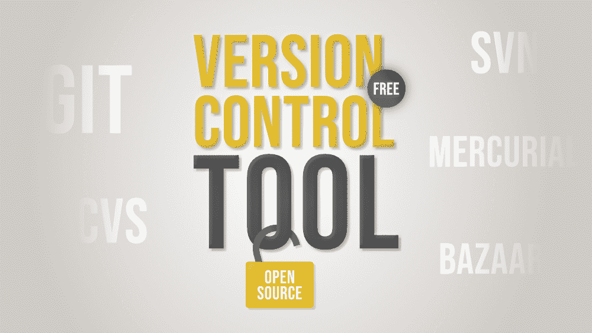

# 2020 年免费开源版本控制工具前 5 名

> 原文:[https://www . geesforgeks . org/top-5-免费开放源码-版本-控制-工具-in-2020/](https://www.geeksforgeeks.org/top-5-free-and-open-source-version-control-tools-in-2020/)

如果你想从事一个需要不同团队成员协作并且在开发过程中也需要频繁变更的大型软件开发项目，那么你必须使用 [**版本控制系统**](https://www.geeksforgeeks.org/version-control-systems/) 。版本控制帮助我们跟踪我们在代码中所做的更改，这样如果出现问题，我们就可以恢复到我们想要的任何以前的版本。如果没有 VCS，跟踪我们源代码中的变化将是一项非常繁忙的工作，因为多个开发人员在持续地处理同一个代码。

VCS 的主要优势包括简化开发过程和在代码中保留所有变更的历史。因此，如果开发人员犯了一个错误，那么可以通过将新代码与以前的版本进行比较来撤销和修复它。版本控制软件(VCS)也被称为源代码管理(SCM)工具或修订控制系统(RCS)，非常适合全球任何一家网络开发公司。

### [1。去](https://git-scm.com/)

Git 是当今可用的免费、跨平台和开源的分布式版本控制工具，它为非线性开发提供了强有力的支持，能够以速度和效率高效地处理从小型到超大型的所有项目。本地分支、方便的临时区域和多个工作流是 git 的一些重要特性。它还提供了各种各样的工具来帮助我们浏览历史，并且源代码的每个实例都包含整个历史树，这在开发过程中有很大帮助，即使没有互联网。

*   超快，跨平台。
*   离线完整历史树
*   分布式对等模型
*   轻松清晰地跟踪代码更改
*   廉价的分支机构和稳健的运营。
*   git bash 的惊人命令行。
*   对于单个开发人员来说，复杂且更大的历史日志变得非常繁忙
*   不是 optima，因为它不支持关键字扩展和时间戳保存
*   与 Linux 相比，提供有限的 Windows 支持

### [**2。**](http://savannah.nongnu.org/projects/cvs)
并发版本系统

CVS 是另一个最流行的版本控制系统，它是源配置管理的重要组成部分，自 80 年代以来一直是许多开发人员的首选工具。借助 CVS，您可以非常轻松地记录源文件和文档的历史。它扮演了类似于自由软件 RCS、PRCS 和宙斯盾包的角色，并且通过只允许最新版本的代码被处理和更新来处理两个程序员之间的冲突。它排除了符号链接以避免安全风险，并使用增量压缩技术来提高存储利用率。

*   跨平台支持的成熟技术，
*   来自广大 CVS 社区的即时帮助和支持
*   强大且功能齐全的强大命令行
*   多个开发人员可能并行处理同一个项目。
*   由于缺乏对原子签出和提交的支持而导致的源损坏，
*   没有源代码的完整性检查，
*   对分布式源代码管理的支持很差
*   昂贵的分支运营，因为它不是为长期分支设计的

### **3。Apache subversion(SVN):**

**它是一个免费的开源软件，是广泛使用的 CVS 工具的最佳匹配继承者，在修复了 CVS 系统的缺陷和缺点，同时保持了与它的高度兼容性后，它被创建为 CVS 的替代品，这就是为什么许多开发人员为了 CVS 的最佳和改进的特性而转向 SVN。**

**SVN 使用原子操作的概念来防止数据库中的损坏，这是 CVS 的一个主要缺点。在原子操作中，对源所做的所有更改或没有任何更改都会被应用，因此不会有部分更改会破坏原始源。虽然 CVS 的分支操作很昂贵，但 SVN 的分支操作很便宜，并且不依赖于文件大小，这使得它更适合具有多个方向的大型分叉项目。**

*   **支持原子操作以防止损坏**
*   **自由形式的版本化元数据**
*   **支持空目录和更便宜的分支操作**
*   **与 Git 相比，有更好的窗口支持**
*   **领先的集成开发环境和敏捷工具的各种插件。**
*   **存储库管理命令不足，不支持已签名的修订，**
*   **与 git 相比，速度慢得多**
*   **包含与文件名规范化和目录相关的错误**

### **[**4。**水银](https://www.mercurial-scm.org/)**

**它是一个免费的、开源的和分布式的源代码管理工具，可以有效地处理任何规模的项目，并提供一个简单直观的界面。它是用 python 编程语言编写的 git 的主要竞争对手，并且在各种操作系统中得到支持，如 Mac、Windows、Linux 等。众所周知，它具有高性能、健壮性和可扩展性。它拥有一个集成的网络界面，能够进行高级分支和合并。**

*   **快速而强大**
*   **这很容易学，**
*   **轻巧便携。**
*   **比其他复杂的风投要简单得多。**
*   **没有部分退房**
*   **仅支持用 Python 编写的附加组件**
*   **因此，基于扩展的附加扩展很成问题**

### **[**5。**集市](http://bazaar.canonical.com/en/)**

**它是一个版本控制系统，可以帮助您跟踪开发历史，并与其他开发人员轻松协作，这些开发人员可以是单一开发人员、同地办公的团队或全球的开发人员社区。它可以扩展和调整以满足您的需求。这是一个免费的、开源的、分布式版本控制软件，它提供了一个很好的用户友好的体验，由 Canonical 赞助，与 Git 和 Mercurial 非常相似。它是最通用的版本控制系统，支持各种不同形式的工作流，从集中式到分散式，允许您在有或没有中央服务器的情况下工作，其中有许多不同的变体。**

*   **强大的跨平台**
*   **高速高效的存储利用率**
*   **重命名跟踪和智能合并**
*   **它的插件系统非常容易使用**
*   **在其设置中访问非常详细的控制级别**
*   **不支持部分签出和克隆，**
*   **不提供时间戳保存**