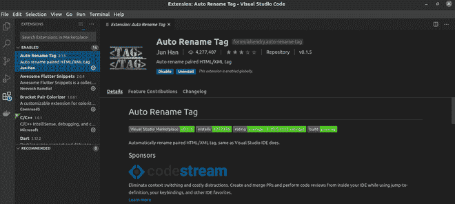
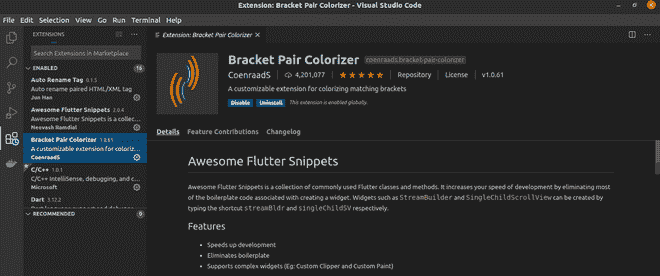
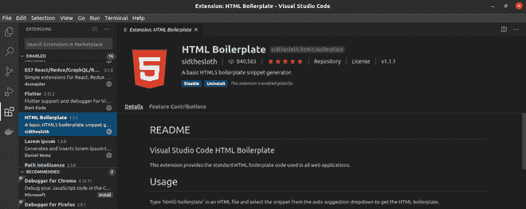
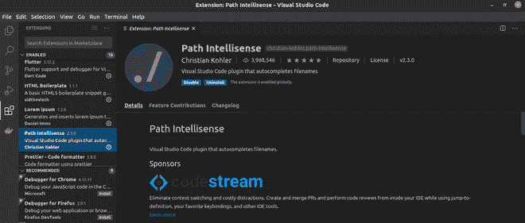
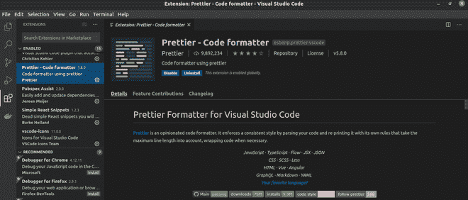
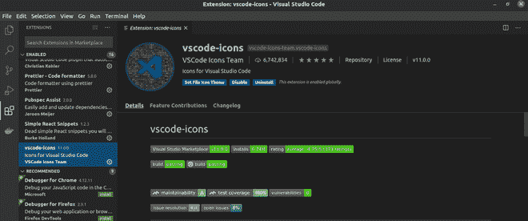

# VSCode 中 Web 开发人员的 6 大扩展

> 原文:[https://www . geeksforgeeks . org/top-6-面向网络开发者的扩展-in-vscode/](https://www.geeksforgeeks.org/top-6-extensions-for-web-developers-in-vscode/)

Visual Studio Code 是目前开发人员最常用的代码编辑器。我们知道 VSCode 为我们提供了许多很酷的特性，可以增强我们的代码，并且在编写代码时非常有帮助。实现这一点的方法之一是使用可以直接安装在编辑器中的扩展。本文列出了一些很酷的 VSCode 扩展，对 web 开发很有帮助。

**1。自动重命名标签:**我们都知道，HTML 中的大多数标签也需要一个结束标签，在编写包含数千行的专业代码时，标签会在数百行后关闭。因此，如果我们必须重命名标签，就会变得非常困难。我们必须找到标签被关闭的地方，然后只有我们可以重命名它。**自动重命名标签**为我们提供了一个功能，当我们更改开始标签时，它也会自动更改结束标签，使标签的重命名更加容易。

Vs 代码扩展–自动重命名标签

**2。括号对着色程序:**在使用 C/C++、Java、JavaScript 等语言时。我们必须使用许多括号，随着代码库的增长，我们管理它们变得非常困难。**括号对着色**扩展使每个括号具有不同的颜色，从而帮助我们轻松管理多个嵌套的括号。

Vs 代码扩展–括号对着色

**3。HTML 样板:**在使用 HTML 时，编写所有的开始标签可能会变得繁琐，比如< HTML >、< body >、< head >，以及元标签。VSCode 扩展 **HTML 样板**为我们提供了一个处理所有样板代码的扩展。我们只需要写一行代码，整个 HTML 样板就会被导入到我们的文件中。它包括所有必要的标签以及通常需要的元标签。

Vs 代码扩展–HTML 样板

**4。Path Intellisense:** 每当使用 JavaScript 或其一些库或框架时，我们必须将一些文件导入到另一个文件中。如果此时我们写错了路径，文件就不会被导入，也很难找到问题。但是如果您安装了这个扩展，它将为您提供当前位置的所有文件和文件夹。所以现在你可以正确选择所需的文件或文件夹&将防止任何路径问题的发生。

Vs 代码扩展–路径智能感知

**5。更漂亮–代码格式化程序:**该扩展通过根据使用的语言添加所需的缩进，使代码更有条理。这有助于作者和新手轻松理解代码。

Vs 代码扩展–更漂亮的代码格式化程序

**6。VsCode 图标:** **VsCode 图标**是一个很酷的扩展，它在 Explorer 视图中为每个文件和文件夹添加了一组图标，从而使编辑器看起来更加丰富多彩，也有助于轻松快速地查看所有不同的文件。

Vs 代码扩展–VS 代码图标