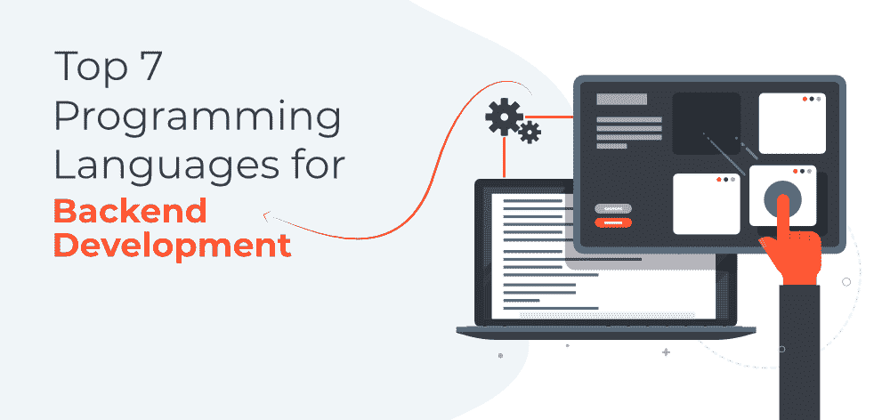

# 后端 Web 开发的 7 大编程语言

> 原文:[https://www . geesforgeks . org/top-7-编程语言-用于后端-web-开发/](https://www.geeksforgeeks.org/top-7-programming-languages-for-backend-web-development/)

即使你是一个初学者，至少你应该知道网络开发主要分为两个方面:前端开发和后端开发。显然，它们都有各自的一套工具和技术。例如，当我们谈论前端开发时，总是首先出现 3 个名字——HTML、CSS 和 JavaScript。

同样，在后端网络开发方面，我们主要需要一种后端(或者你可以说服务器端)编程语言来使网站与各种其他工具和技术(如数据库、框架、网络服务器等)一起工作。

***但是既然有数百种编程语言，你应该选择哪种语言进行后端 web 开发……？？**T3】*

好吧，让我们告诉你——你需要通过考虑各种参数来挑选一种编程语言，比如项目需求、它的学习曲线、性能、可靠性等等。此外，你还需要考虑特定编程语言在科技领域的需求和受欢迎程度，尤其是如果你希望从职业角度学习编程语言，因为学习已经过时或市场上没有需求的编程语言是没有意义的。

在本文中，我们为您提供了一个顶级编程语言的列表，您可以考虑学习这些语言来**开始网络开发:**

### 1. [JavaScript](https://www.geeksforgeeks.org/javascript-tutorial/)

每当有关于网络开发的讨论时——最有可能的是，十之八九的 JavaScript 的名字都会出现在讨论中。根据各种流行平台(如堆栈溢出和十进制)的年度报告，JavaScript 是科技界最受欢迎和最领先的编程语言之一。其背后的一个主要原因是特定的语言可以用于两者——前端网络开发和后端网络开发。看看过去的几个趋势和统计数据，可以说 Node.js 的流行在某种程度上增加了 JavaScript 作为 web 开发后端语言的使用。同时，该语言为后端开发提供了几个显著的特性，例如轻量级脚本语言、动态类型、解释、面向对象编程支持、客户端验证、庞大的社区支持等等。

*   ***后端 Web 开发的 JavaScript 框架:** Next.js、Express、流星等。*
*   ***使用 JavaScript 的热门网站:**脸书、谷歌、易贝等。*

### 2.[蟒蛇](https://www.geeksforgeeks.org/python-programming-language/)

虽然 Python 因其与机器学习、物联网、数据科学等先进技术的兼容性而在个人中相当出名。–让我们告诉您，这种丰富的编程语言被广泛使用，非常适合后端 web 开发。即使是当今领先的 IT 巨头之一，谷歌也明显依赖 Python，它是谷歌使用的 3 种主要语言之一(另外两种是 Java 和 C++)。使用 Python 进行 web 开发的一个主要优势是它拥有大量的标准库，这使得开发人员的工作相对来说更加容易和高效。Python 额外的突出和独特的特性，例如更好的代码可读性。更容易与其他语言集成、GUI 编程支持、可移植性和众多其他特性使它成为 web 开发人员更喜欢的语言。

*   ***后端 Web 开发的 Python 框架:** Django、Flask、金字塔等。*
*   ***使用 Python 的热门网站:** Spotify、Pinterest、Instacart 等。*

### 3.PHP

PHP(或者你可以说超文本预处理器)是网络开发领域的老手。这种开源服务器端脚本语言创建于 1994 年，专门用于 web 开发。因为它是一种解释语言——它也不需要编译器，而且它可以在几乎所有主要的操作系统上运行，如视窗、Linux、macOS、Unix 等。说到 PHP 的丰富特性，有很多，比如易学性、跨平台兼容性、OOPs 特性、对 MySQL、SQLite 等各种标准数据库的支持等等。巨大的社区支持和许多其他支持。除此之外，作为一种服务器端脚本语言，PHP 非常安全，因为 PHP 中有许多散列函数可用于用户数据的加密。特别是，如果你是一个初学者，你可以选择使用 PHP 进行后端网络开发。

*   ***后端 Web 开发的 PHP 框架:** Laravel、CodeIgniter、Symfony 等。*
*   ***使用 PHP 的热门网站:** WordPress、MailChimp、Flickr 等。*

### 4. [Java](https://www.geeksforgeeks.org/java/)

Java 是后端 web 开发的另一种示例性编程语言。随着安卓应用、桌面应用、科学应用等的发展，面向对象编程语言被广泛用于开发企业级 web 应用。使用 Java 的主要优点是它基于“一次写入，随处运行”的原则，即编译后的 Java 代码可以在任何支持 Java 的平台上执行，而不需要重新编译。更具体地说，Java 代码首先被编译成独立于机器的字节码，然后这个字节码在 JVM 上运行，而不考虑底层架构。此外，Java 支持多线程，允许两个或更多线程的并发执行，以最大限度地利用 CPU。Java 的其他附加特性是独立于平台的，遵循面向对象的概念，丰富的开源库，自动内存分配和垃圾收集，可移植性等。

*   后端网络开发的 Java 框架: Spring，Struts，Grails
*   ***使用 Java 的热门网站:** LinkedIn、IRCTC、雅虎等。*

### 5.[红宝石](https://www.geeksforgeeks.org/ruby-programming-language/)

Ruby 是一种通用的解释编程语言，它支持各种编程范例，如过程式、函数式和面向对象编程。这种语言在世界范围内被广泛用于 web 开发，非常推荐初学者开始使用后端 web 开发，因为它相对来说更容易学习。与 Python 一样，Ruby 也专注于提高开发人员的生产力，最终加快网络开发过程。这种特殊的语言几乎支持所有主要的平台，比如 Windows、Mac 和 Linux，让我们也告诉你，Ruby 高度基于许多其他编程语言，比如 Perl、Lisp、Eiffel、Ada 等。动态类型化和 Duck 类型化、自动垃圾收集、大型标准库、定制调度行为、灵活性和可扩展性、通过 RubyGems 进行集中包管理等。是 Ruby 的一些突出特性。

*   ***后端 Web 开发的 Ruby 框架:**Rails 上的 Ruby、Sinatra、Grape 等。*
*   ***使用 Ruby 的热门网站:** Airbnb、Shopify、Slideshare 等。*

### 6\. [戈朗](https://www.geeksforgeeks.org/golang/)

如果你认为 Go 在开发人员中并不那么受欢迎，那么让我们根据去年的堆栈溢出报告告诉你——它是全世界开发人员最喜欢的 5 种编程语言之一。Go 是一种静态类型的编程语言，在谷歌设计，语法与 C 语言非常相似。该语言允许开发人员更高效地构建可扩展的安全 web 应用程序。使用 Go 的一个主要优点是，它为多线程提供了出色的支持，并且还具有自动内存管理的垃圾收集功能。Go 语言的其他一些重要特性是——易于学习、可读的代码、谷歌支持、编译语言、包管理、强大的标准库、并发支持、高性能等等。

*   ***后端 Web 开发的 Go 框架:** beego、echo、revel 等。*
*   ***使用 Go 的热门网站:** Dropbox、SoundCloud、Dailymotion 等。*

### 7. [C#](https://www.geeksforgeeks.org/csharp-programming-language/)

在过去的几年里，C#是少数几个在各种标准指数中不断排名前 5 的编程语言之一。但是，您需要知道，这种通用语言最初是由微软开发的，主要是为了。Net 框架。与后端 web 开发一起，现在 C#被广泛应用于多个领域，如 Windows 应用程序开发、游戏开发等。该语言为您提供了各种丰富的功能，例如更快的编译、互操作性、可扩展和可更新、面向组件和结构化语言以及许多其他功能。此外，C#提供了一套丰富的库，帮助开发人员实现更快、更高效的开发过程。因此，如果你正在为一个后端 web 开发人员寻找一种编程语言——你也可以试试 C#语言。

*   后端网络开发的 C#框架:。NET
*   ***使用 C#的热门网站:** GoDaddy、Marketwatch、Stack Overflow 等。*

因此，我们提到了最值得推荐的后端 web 开发编程语言，您可以考虑学习。然而，让我们再次提醒您，在从上述语言中挑选任何特定语言之前，您需要考虑各种个人方面，如您的目标、项目要求、学习曲线等。