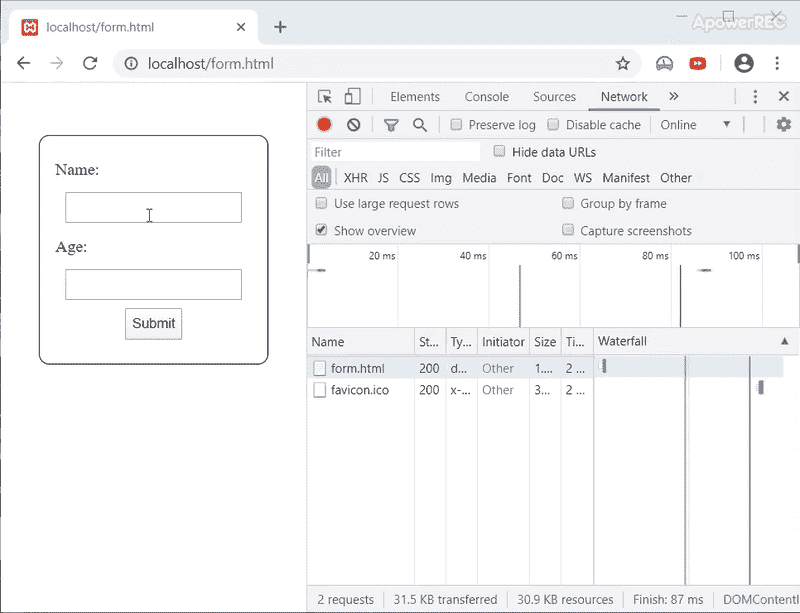
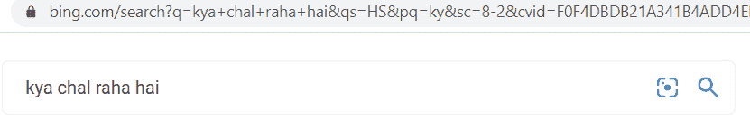

# 网络开发中最容易被误解的两个术语 GET 和 POST

> 原文:[https://www . geeksforgeeks . org/两个最容易被误解的术语-网络开发中的获取和发布/](https://www.geeksforgeeks.org/two-most-misunderstood-terms-get-and-post-in-web-development/)

如果你做过任何一种网络开发，那么你一定遇到过这两个术语 **GET** & **POST** 。这些术语是针对表单标签引入的。解释是这样的:

> “在表单标签中，有一个名为方法的属性。在这里，您可以指定希望以何种方式将数据发送到后端。该属性有两个值，即 GET 和 POST。”

**GET:** 如果您使用此方法，那么您在表单中写入的数据将被追加到 URL 中并被发送。由于用户输入在 URL 中清晰可见，因此这种方法不安全，并且您可以发送的内容和发送的数量都有限制。

**开机自检:**如果使用开机自检，那么数据将在 HTTP 请求正文中发送。它在网址中不可见。你可以发送多少数据没有限制。开机自检还支持发送任何类型的数据。

我到处都观察过，这很大程度上是 GET 和 POST 是如何介绍给学生的。尽管如此多的解释足以让人们在表单的上下文中使用 GET 和 POST，但是它们并没有给出对这两种方法的清晰理解。
以下是举例说明。我们将使用示例的 PHP 代码。(我们使用了 **$_REQUEST** 来捕获数据，以便同一文件可以用于两者)。

**语法:**

```html
<?php
    echo "Hello ".$_REQUEST['name']."!!";
?>
```

**GET:** 下面是 GET 形式的代码。

```html
<!-- Write HTML code here -->
<form action="target.php" method='get'>
    <label>Name:</label>
    <input type="text" name="name"/>
    <label>Age:</label>
    <input type="text" name="age"/>
    <input type="submit"/>
</form>
```

**输出**T2】

不出所料，参数值出现在网址中。但是如果我们使用 chrome inspect 工具进行更多的分析，我们可以看到在“**查询字符串参数**部分下存在的值。

**POST:** 这里是 POST 表单的代码。如果您注意到，除了方法属性的值之外，它与我们的 GET 形式相同。

```html
<!-- Write HTML code here -->
<form action="target.php" method='post'>
    <label>Name:</label>
    <input type="text" name="name"/>
    <label>Age:</label>
    <input type="text" name="age"/>
    <input type="submit"/>
</form>
```

**输出:**


数据被发送。但是现在如果我们用 Chrome 工具检查，参数会出现在“**表单数据**一节下。GET 和 POST 属于一个叫做 HTTP Methods 的家族(属性方法的名字就来自这里)。HTTP 的方法有 **GET** 、 **PUT** 、 **POST** 、 **DELETE** 、 **HEAD** 、 **PATCH** 、 **OPTIONS** 、 **TRACE** 等。

它们都为 HTTP 协议提供了多种用途。我们将主要关注本文的前四部分。

**CRUD 操作:**如果你在使用数据库，那么你一定遇到过这些术语。通俗地说，我可以将 CRUD 解释为必须通过 API 向最终用户提供的基本功能，以便能够正确地利用任何数据库管理系统(在您的 web 开发环境中，它将是您与服务器代码一起使用的 DBMS，比如 MySql、Hibernate 等)。CRUD 代表**创建**、**读取**、**更新**和**删除**。正如我前面提到的，四个 HTTP 方法对应于这些操作之一。

*   **创建:**将使用 SQL 命令在数据库中创建一条记录。对应于此操作的 HTTP 方法是 POST，因为您将在请求正文中“发布”要添加到数据库中的值)。

    ```html
    INSERT INTO *tablename* VALUES (*value1_for_column1*, *value2_for_column2*, . . );
    ```

*   **READ:** It is used to read a record that is already present in the DB. One can specifically ask for the records he/she wants to read using the WHERE clause. The SQL command will be:

    ```html
    SELECT * from  WHERE columnX = valueX AND columnY > valueY . . . ;
    ```

    这个操作对应的 HTTP 方法是 GET。试着将它与 GET 请求后生成的 URL 进行比较，即“？”后的部分用 WHERE 子句后的表达式标记 URL。他们两个很相似，不是吗？
    

*   **更新:**用于更新数据库中的记录。对应的 HTTP 方法是 PUT。在 SQL 中，我们可以通过 UPDATE 语句来实现这一点。
*   **DELETE:** 这有点不言自明。有人想删除一条记录。HTTP 方法和 SQL 命令都将是 DELETE。

现在，如果你想一想我们之前的输出，它就更有意义了。对于**获取**，请求正文为空，值在查询字符串参数下。因为表单字段被视为查询的参数，该查询被请求到网址“ **localhost/target.php** ”。

在 POST 方法中，表单中输入的数据与请求正文一致。所以它出现在表格数据部分。它被视为用户想要发送的一些数据，而不是查询的一些参数。

**GET 和 POST:** 现在让我们往回拨一点，从 HTTP 协议的设计者的角度来思考一下。我们知道 GET 被设计用于用户请求记录列表的情况。用户进行搜索的字段通常很小，并且是文本。因此，对于 GET 请求，除了文本和超过 30kb 的任何内容，不需要允许任何内容。相反，如果我们保持较小，那么处理延迟将会降低。
现在记住这些事情，试着想想你日常使用的一些应用程序，你认为 GET 正在被使用。没错。搜索引擎。现在打开搜索引擎，尝试搜索一些东西。观察出现的网址。

*   **冰搜:**
    
*   **谷歌搜索:**
    

我们再从 HTTP 的开发者角度来思考一下。通过开机自检，用户将创建需要传递大量数据的新记录。这么多数据不能通过 URL 传递，不如以 HTTP 数据包的形式发送。此外，记录可能包含一些个人数据，因此开机自检方法必须是安全的。因此，POST 用于处理用户数据的表单(就像谷歌表单一样，当你在 GfG 上创建一个新账户时)。

从现在开始，我谈到了创建一个帐户，你可能会想，“登录怎么样？在那里，没有人创造任何新的记录！那为什么那里不用 GET 呢？”尽管人们可以简单地通过说 GET 不安全来抛弃这个问题，但是我们不使用它来登录。但是，让我们在目前讨论的背景下考虑一下这个问题。登录时，您实际上并没有请求/搜索您的记录。让我们从搜索的角度来考虑登录。然后，您传递用户名和密码，并询问系统是否有任何帐户拥有这些凭据。这将是非常错误的，相反，当我们登录时，我们请求系统允许我们与我们的数据进行交互。以银行为例，登录将要求经理提供打开我们储物柜的钥匙，而搜索将询问 X 是否在这家银行有储物柜，这又是非常错误的，违背了隐私的全部目的。所以，如果你提供了正确的签名，经理就会给你打开储物柜的钥匙。在 web 开发中，服务器将为您提供 sessionId。

让我们把它包起来。登录时，如果凭据正确，后端将为您创建一个会话，并提供一个会话 ID。现在使用 sessionId 你可以搜索你的数据。所以，POST 适合这种情况。并且，一旦您登录，您就可以使用 GET 请求来检索您的数据。

**结论:**总结一下，GET 用于读取/访问一些资源，POST 用于创建。我建议你不要在数据库管理系统方面限制自己的思维资源，而是从更广泛的意义上考虑它。资源可以是任何东西，从数据库中的一行开始到像图像或文本这样的文件，有时甚至是完整的 HTML 页面。如果您想阅读/搜索资源，请使用 GET 如果您想创建/添加/上传资源，请使用 POST。