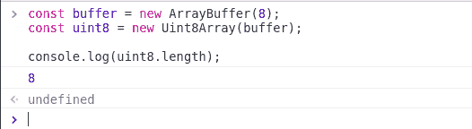
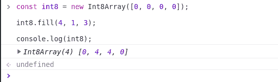
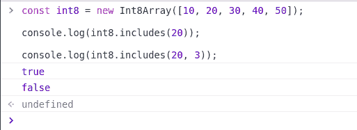

# TypedArray 简介

> 原文:[https://www.geeksforgeeks.org/typedarray-introduction/](https://www.geeksforgeeks.org/typedarray-introduction/)

TypedArray 演示了二进制数据缓冲区的类似数组的视图。它们是在 ECMAScript 版本 6 中引入的，用于处理二进制数据。没有保留关键字‘TypedArray’，也没有直接可见的 TypedArray 构造器。

类型有几种类型，如下图所示，有范围、大小、网页 IDL 类型、 等效 C 类型:

<figure class="table">T48

1

t228

8

| **类型** | **范围值**

 | **大小(字节)** | **Web IDL 类型** | **等价 C 类型** |
| T41】int 8 数组 | T45-128 to 127 | T53] bytes | uint 8 clampedarray | 0 至 255 | 1 | 八位字节 | uint 8 _ t

 |
| T109】int16 数组 | uint 16 _ t |
| int 32 array | -2147483648 至 2147483647 | 4 | t165 | 4 | 无限制浮动 | 浮动 |
| T221] Floating 64 array | T25] 5.0× 10-324 to 1.8× 10 308 |
| bigint 64 array | 0 至 2^64-1 | 8 | 比吉斯本 | uint64 _ t(无符号长) |

</figure>

**构造函数:** 该对象不能直接实例化。相反，您必须创建一个特定类型的数组实例，例如一个 U Int8Array 或 BigInt64Array 。
创建 TypedArray 的实例时(例如 Int8Array )，也会在内存内部创建一个数组缓冲区实例，或者，如果一个 ArrayBuffer 对象作为一个构造函数参数给出，那么就用那个参数代替。
我们可以通过在各自的构造函数中使用‘new’关键字来创建 TypedArray 的实例。

**语法:**

```
new TypedArray();
// Or
new TypedArray(length);
// Or
new TypedArray(typedArray);
// Or
new TypedArray(object);
// Or
new TypedArray(buffer [, byteOffset [, length]]);

```

类型可以是上面提到任何类型。

**参数:**以下是 TypedArray 可以采用的参数:

*   **长度:**要创建的数组缓冲区的大小。
*   **typedArray:** 要创建的数组类型。
*   **对象:** W 当用对象参数调用时，会创建一个新的类型化数组实例。
*   **缓冲区** **、** **字节集合** **、** **长度:** 当用缓冲区、字节集合、和一个长度参数调用时，会创建一个新的类型化数组视图，用于查看指定的数组缓冲区。

**实例化一个 TypedArray:** 下面是一些展示如何实例化 TypedArray 的例子。

**例 1:**

## java 描述语言

```
const buffer = new ArrayBuffer(8);

// Initiating using the constructor
const uint8 = new Uint8Array(buffer);

// Output is 8 as we initiated the length with 8
console.log(uint8.length);
```

**输出:**



**例 2:**

## java 描述语言

```
const int8 = new Int8Array([0, 0, 0, 0]);

int8.fill(4, 1, 3);

console.log(int8);
```

**输出:**



**示例 3:** 检查值是否包含在 TypedArray 中。

## java 描述语言

```
const int8 = new Int8Array([10, 20, 30, 40, 50]);

console.log(int8.includes(20));

console.log(int8.includes(20, 3));
```

**输出:**

