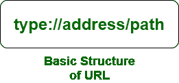

# 网址类型

> 原文:[https://www.geeksforgeeks.org/types-of-url/](https://www.geeksforgeeks.org/types-of-url/)

**URL** 代表统一资源定位符。服务器上任何可用的互联网位置都称为网址、网址或网站。每个网站或网页都有一个唯一的地址，称为网址。例如，**极客网站**有一个名为[https://www.geeksforgeeks.org/](https://www.geeksforgeeks.org/)的地址或网址



**类型:**指定文件所在服务器的类型。

**地址:**指定互联网服务器的地址或位置。

**路径:**指定文件在互联网服务器上的位置。

**网址类型:**网址给出了为网页或其他文档创建的文件的地址，如图像、文档文件的 pdf 等。

有两种类型的网址:

*   绝对 URL
*   相对 URL

**绝对 URL:** 这种类型的 URL 包含域名和目录/页面路径。绝对网址提供完整的位置信息。它以“http://”这样的协议开始，然后继续，包括每一个细节。绝对网址通常带有以下语法。

```htmlhtml
protocol://domain/path
```

对于网页浏览，绝对网址是网页浏览器地址栏中的类型。例如，如果它与我们的 **geeksforgeeks** 网站的项目页面链接相关，则该网址应被称为[https://www.geeksforgeeks.org/computer-science-projects/](https://www.geeksforgeeks.org/computer-science-projects/)，这给出了关于文件位置路径的完整信息。

**注意:**协议可以是以下类型。

```htmlhtml
http://, https://, ftp://, gopher://, etc.
```

**相对 URL:** 此类 URL 包含除域名外的路径。相对的意思是“相对于”，一个相对的网址根据当前的位置告诉一个网址的位置。相对路径用于引用同一域中文件的给定链接。

让我们假设一个 web 开发人员设置了一个网页，并且想要链接一个名为“geeksforgeeks.jpg”的图像。

```htmlhtml

```

内部解释如下。

```htmlhtml

```

点(。)在 *src* 属性中的“/”之前是一个“特殊字符”。这意味着应该从当前目录开始查找文件位置。