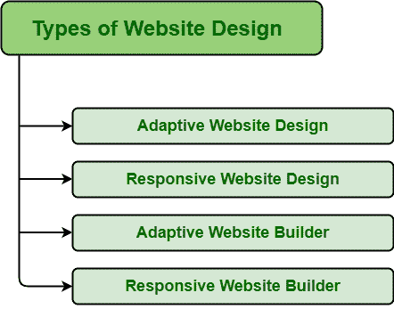

# 网站设计类型

> 原文:[https://www.geeksforgeeks.org/types-of-website-design/](https://www.geeksforgeeks.org/types-of-website-design/)

网站设计基本上是创建、设计和实现网站或网页的过程。它通常涉及与网站的设计和功能相关的一切。在设计网站时，设计师和开发人员必须牢记视觉和功能设计，即网站如何工作。

**不同类型的网站设计:**现在有不同类型的网站设计。开发不同类型的网站设计是为了最好地利用新的开发技术，从而可以创建有吸引力、有效和吸引眼球的网站。网站设计有两种类型，即适应性和响应性。在选择它们中的任何一个之前，首先，了解它们的好处，然后决定哪个网站设计最有效，最适合网站设计要求。不同类型的网站设计如下:

**1。自适应网站设计:**自适应网页设计只需要针对不同的屏幕尺寸进行不同的设计，因为它针对特定的屏幕尺寸创建了固定的网页设计。它通常使用两个或两个以上的网站设计，这些设计是专门为特定的屏幕尺寸定制的。它使加载页面变得容易，海关设计更快，也更容易在没有代码的情况下创建。

**2。响应式网站设计:**响应式网页设计根本不需要网站的多个网页设计。它很灵活，适应屏幕尺寸。简单来说，响应式网站设计会根据屏幕大小不断变化。它允许在笔记本电脑、手机、平板电脑等不同设备上打开或显示网站。它提供了很多模板来开始。

**3。自适应网站构建器:**自适应网站构建器使开发任何东西都变得容易，而无需编写任何单行代码。一些自适应网站构建者提供可定制的体验，一些使其变得容易，并且没有任何设计经验、与开发人员合作的能力等。网站构建者使用适应性方法来创建网站。

**4。响应网站构建器:**网站构建器使网站变得灵活，即它可以在不同的屏幕上使用，但创建一个流畅的响应网站并不是一件容易的事情。它需要有效的编码技能，因为没有任何编码知识，根本不可能使用响应性网站构建器创建网站。但是这样的网站构建者有能力创建响应迅速的网站，而不需要编写任何代码。