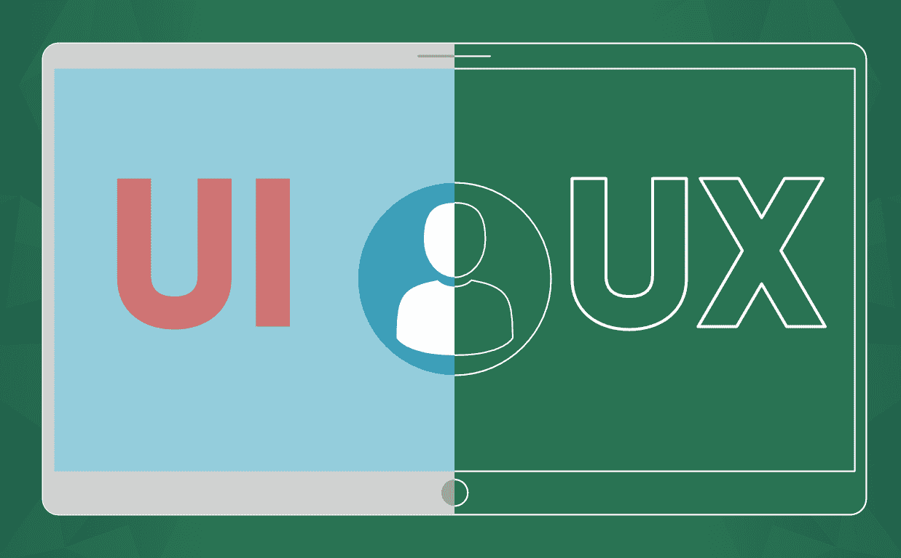
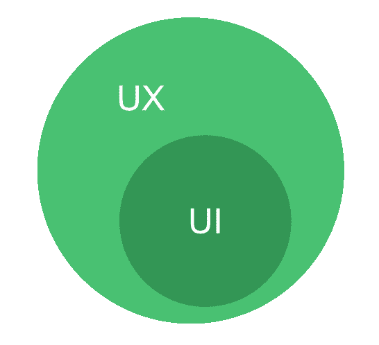

# UI vs UX 设计:你该选择哪个职业选项？

> 原文:[https://www . geesforgeks . org/ui-vs-UX-design-哪个-职业-选项-你应该选择/](https://www.geeksforgeeks.org/ui-vs-ux-design-which-career-option-should-you-choose/)

对于 UI 和 UX 设计的区别，设计师之间一直存在困惑。哪个角色大，两个角色都需要做什么样的工作？他们有的认为两者相同，有的认为两者不同。现实是 **UI 设计和 UX 设计都是完全不同的**。用户界面设计代表用户界面，它是关于网站的展示或外观和感觉的一部分。另一方面，UX 设计关注的是产品的用户体验，或者用户完成预期任务的难易程度。

我们用一个非常基本的例子来理解这一点。当你参加婚礼和去吃饭时，你会看到那里有很多摊位，摆着不同的食物。每样东西都有不同的勺子，你也可以在那里找到食物标签。这样你就很容易找到你最喜欢的菜。所以你对那里的展示很满意。这被认为是一种用户界面设计，是关于外观和感觉或设计部分。现在当你试着端上你盘子里最喜欢的菜时，你会发现摊位上有很多人，或者你正在找服务员端上你的盘子，但是服务员不在或者水柜台离所有的摊位太远。所以你使用服务的体验太差了，这些都属于你对服务或产品的用户体验。

现在让我们从技术术语和工作角色两个方面来讨论这两个关键的设计部分。

### UX 设计

**UX 设计**或**用户体验**设计是关于用户与产品、网页或应用程序的交互或整体体验。当客户使用服务时，他/她对产品的感觉如何，他/她在与产品或应用程序交互时是否面临任何问题，以及用户执行某项任务来使用产品有多容易。UX 可以拥有从实物产品到数字体验的一切。它考虑用户解决问题的过程。想想电子商务、在线食品配送或在线旅游公司网站，在这些网站上，用户付款有多容易，完成付款需要多长时间被认为是 UX 设计。同理心是 UX 设计的重要组成部分。UX 设计师需要设身处地为顾客着想。所以这都是关于用户对产品的整体体验。

**UX 设计师工作角色:**

*   通常情况下，UX 设计总是首先完成，从市场调查开始，以建立一个产品。一个 UX 设计师会先找出所有的目标用户。
*   UX 设计师会进行面对面的采访或在线提问，以了解人们为什么使用特定的产品，顾客对产品的需求或期望是什么，顾客喜欢或不喜欢什么。
*   UX 设计师也做市场竞争分析。它意味着市场上所有类似的产品，产品的价格，产品的附加功能，人们为什么使用该产品，产品的方案，经过研究，他们分析自己的产品中可以添加哪些附加的东西。
*   UX 的设计师们在研究之后准备了所有的文档，其中提到了其他应用和他们自己的应用的所有内容。为什么他们自己的应用程序比其他应用程序好，他们会在自己的应用程序中添加哪些附加功能。
*   UX 设计师也制作线框，包括基本设计，或者我们可以说产品的结构。将有基本的线条画，它包括页面上的应用布局。所以他们通过[线框准备设计页面。](https://www.experienceux.co.uk/faqs/what-is-wireframing/)
*   UX 设计师负责制作交互式或纸质原型。
*   UX 设计师也做用户测试。这意味着 UX 设计师通过原型让用户了解产品的流程，并告诉他完成某项任务，接受用户的反馈，如用户面临的问题和其他方面。
*   UX 设计师还准备交互设计，如产品流程图，其中的东西或信息应该对齐，页面重定向等。
*   一旦产品被用户界面设计师和开发人员实现，UX 设计师就会进行可用性测试。在这个过程中，UX 设计师将再次要求用户执行某项任务，并记录下他或她所面临的用户体验或问题的所有内容。根据用户反馈，所有的修改都会完成。

### 用户界面设计

**UI 设计**或**用户界面**设计是用来与产品进行交互的，它注重用户的视觉体验。无论我们通过按钮、布局、滑块、使用颜色等在屏幕上设计什么来呈现产品供用户交互，都属于用户界面设计。它还包括客户是否能够通过设计部分理解产品。如果我们打开一个网页，那么它看起来怎么样，按钮在哪里，点击一个按钮，向下滚动一页，不同元素的对齐，在图像中滑动，所有在用户界面设计中考虑的东西都在哪里？我们可以以任何社交媒体网站布局、评论区、个人资料页面区为例，像按钮、菜单、最新新闻提要等都在用户界面部分。所以网站的外观和感觉，用户友好部分或展示部分都在用户界面设计之下。

**UI 设计师的工作角色:**

*   在 UX 设计师的用户测试角色后，用户界面设计师从 UX 设计师那里获取所有细节、线框，并制作高保真线框，或将使用 photoshop 一类的软件来制作模型设计。
*   现在，用户界面设计师将决定产品的品牌、颜色、按钮、滚动条、元素之间的间距、大小或形状，并考虑视觉设计原则。在不同的移动设备中，有哪些事情是可以完成的。标志，排版，多少页应该是他们的反应，链接等。
*   用户界面设计者也建立风格指南。
*   整体 UI 设计师的职责包括视觉传达和图形设计。

**结论:**从上面的解释我们可以通过下图总结或者理解 UI 和 UX 设计。用户界面设计基本上是 UX 设计中的一个小角色，这两者对于制造一个好产品都很重要。

**最后结论:**

*   一位 UX 设计师为用户设计了一条可以遵循的路径，因为他/她认为这是用户体验网站应用的最愉快的路径。用户界面设计者实际上是按照 UX 设计者为用户选择的路径创建页面的。
*   UX 设计师必须牢记用户的目标。UX 是一个高度分析性和逻辑性的东西。UX 设计师需要从用户的角度思考，更多的是了解用户。用户界面设计师需要有创造力来设计产品或网页。
*   UX 说的都是让产品功能化、有用化，另一方面 UI 说的是让产品美观化、互动化。
*   现在如果你搞不清楚哪个职业适合你，那就看你喜欢什么了。如果你有同理心，喜欢了解用户或顾客对产品的需求，如果你喜欢解决他们的问题，那么 UX 设计是一个更好的选择。如果你喜欢设计产品，喜欢决定整体布局、尺寸、颜色动画部分，并以你的创意思维过程呈现出来，那么 UI 对你来说更好。大多数公司都会为 UX 和用户界面这两个职位雇佣一个人，所以你也可以两者都选。