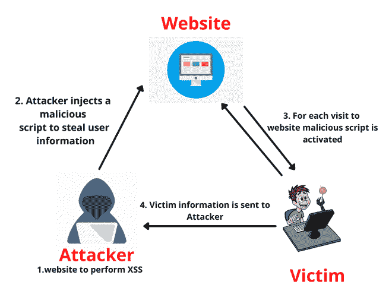

# 理解盲 XSS 进行虫子赏金猎人

> 原文:[https://www . geesforgeks . org/understand-blind-XSS-for-bug-赏金猎人/](https://www.geeksforgeeks.org/understanding-blind-xss-for-bug-bounty-hunting/)

#### **盲 XSS 漏洞**

盲 XSS 非常类似于存储的跨站点脚本攻击，其中攻击者提供的输入由网络服务器保存或存储，并且该存储的输入反映在彼此链接的各种其他应用程序中。只有当攻击者的输入被 web 服务器存储在数据库中，并作为恶意脚本在应用程序的另一部分或另一个应用程序中执行时，它才会触发。

攻击者或黑客将恶意脚本或有效负载“盲目”地注入到某些网页上，而无法保证它会执行。可能将有效载荷保存到数据库中的网页是盲 XSS 攻击的最重要载体。

如果联系人表单是网页的一部分，并且必须将其数据存储到 web 服务器或数据库中，那么攻击者就会发起攻击。攻击者在联系人表单中注入代码，并等待服务器端用户或团队成员打开或触发恶意代码或负载来执行。

盲 XSS 是一种持续的(存储的)跨站点脚本攻击。这是一个不同的挑战。这不像《盲 SQLI》，你可以得到快速的反馈。你不知道你的恶意脚本会在哪里结束。说真的，你甚至不知道你的恶意脚本或负载是否会执行，或者何时执行。

#### **盲 XSS 的图示:**

盲人 XSS 的脚步

#### 影响

通过使用跨站点脚本可以利用许多不同的攻击，包括:

1.  劫持用户的活动会话。
2.  越来越多的钓鱼攻击。
3.  拦截数据并执行中间人攻击。

#### **盲 XSS 攻击可以发生在:**

1.  联系/反馈页面
2.  日志查看器
3.  异常处理程序
4.  聊天应用程序/论坛
5.  客票申请
6.  网络应用防火墙
7.  任何需要用户审核的应用程序
8.  客户服务应用

### 示例:

**输入字段:**

例如，假设您有一个内部应用程序来管理在线商店的库存。在此应用程序中，经销商输入存储在数据库服务器中的不同产品的信息。在线商店应用程序也使用相同的数据库，该应用程序面向所有客户，并需要从初始数据库中读取产品信息。如果用户向内部应用程序中注入恶意字符串，那么网店是否正确实现了输入验证控制并不重要，因为商店中的信息是从同一个数据库中读取的，所以网店会显示攻击。

**反馈表:**

例如，在反馈表单中，攻击者可以使用表单提交恶意负载，一旦应用程序的后端用户/管理员通过后端应用程序打开攻击者提交的表单，攻击者的负载就会被执行。盲跨站点脚本在现实场景中很难确认，但是最好的工具之一是 XSS·亨特。

**异常处理程序**:

盲 XSS 攻击的另一个例子是日志解决方案，如异常处理程序。攻击者可以使用记录器的应用编程接口来记录一些恶意代码，而不是错误。在异常处理解决方案的仪表板中，显示记录的错误，恶意代码将被呈现和执行。

聊天论坛:

攻击者可以将恶意脚本放在论坛或聊天论坛板的主题标题中。同样，最常见的是，服务器会将他们的帖子保存到数据库中，并且存储的信息会在一段时间内作为版主暴露给其他观众。在这种情况下，脚本在交付给普通用户时可能会变得干净，这将禁用恶意代码。然而，当论坛的主持人将加载论坛管理网页时，例如像线程流行度报告，恶意主题标题可能被加载，因此，攻击者的脚本将被执行，用窃取的信息回叫，重定向用户或通过例如调用管理界面内的代码来导致拒绝服务攻击，从而停止论坛。典型的用户目标是论坛或聊天论坛版块的版主，他们从管理网络会话加载论坛内容来执行管理任务，目标也是安全相关的。

#### **在网页应用程序中检测盲 XSS** **进行 Bug 赏金猎人:**

有一些工具可以让这种情况更容易发现和处理。XSS·亨特是在任何基于网络的应用中检测盲 XSS 的绝佳工具。

它的工作方式是将有效负载作为外部 JavaScript 标记注入:

> ()

当应用程序中存在 XSS 漏洞时，该脚本将由客户端执行，脚本有效负载将执行。有效载荷将拍摄页面的快照，以及 HTML 源、cookies(没有设置 HttpOnly)和其他有用的基本信息。现在，每当用户触发 XSS 漏洞时，我们都可以缩小其范围。该工具的另一个优点是它是开源的，因此您也可以设置一个私有实例。

互联网上还有一些检测工具:

1.  打嗝合作者
2.  努斯
3.  巴斯亨特

#### **防止盲目 XSS 攻击:**

和进攻端一样，防守端在安全方面也很重要。
所以这里有一些防御方或预防步骤来拯救你的网络应用程序从盲目的 XSS。

1.  实现这一点的最常见和最有效的方法是由 web 开发人员审查代码，并确保任何用户输入都被正确过滤。
2.  您需要一个专门的工具来执行无害的渗透测试，除了检测容易检测的 XSS 漏洞。
3.  如果您的网站是使用最新的技术(如 HTML 5)实现的，或者您确保您的网络服务器已安装了完整的补丁，则网络应用程序可能仍然容易受到 XSS 病毒的攻击。
4.  从不信任用户提供的数据是一种很好的编码实践。