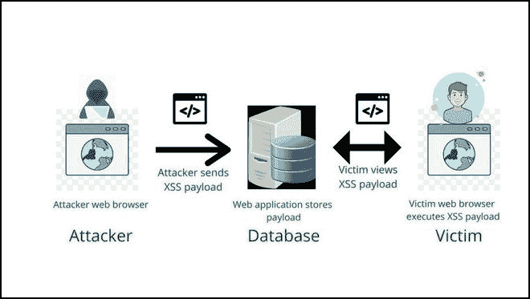

# 深入了解存储的 XSS

> 原文:[https://www . geesforgeks . org/understand-stored-XSS-in-deep/](https://www.geeksforgeeks.org/understanding-stored-xss-in-depth/)

在本文中，我们将深入了解跨站点脚本的一种类型，即存储 XSS。

**什么是存储跨站点脚本？**

*   存储跨站点脚本漏洞在基于网络的应用程序中很常见，这些应用程序支持最终用户或管理人员在同一应用程序中访问用户记录和数据之间的交互。当一个用户提交的数据存储在应用程序中(通常在后端数据库中)并显示给其他用户而没有经过适当的过滤或清理时，就会出现此漏洞。
*   针对存储的 XSS 漏洞的攻击通常涉及对应用程序的至少两个请求。在第一个请求中，攻击者发布一些精心制作的数据，其中包含应用程序持有的恶意代码。在第二个请求中，受害者查看包含攻击者数据的页面，当脚本在受害者的浏览器中执行时，恶意代码就会被执行。

**图解说明:**

存储 XSS 的步骤

从上图可以看出

*   攻击者以文件的形式发送恶意脚本。
*   如果 web 应用程序中的元素没有被清理，它就会存储在网站数据库中
*   普通用户或受害者试图使用 web 应用程序的功能，但是恶意脚本被执行，因为它已经存储在数据库中，并且 cookies 或会话被攻击者窃取。

**影响和风险:**存储的跨站点脚本可能会对网络应用程序及其用户产生巨大影响。

1.  攻击者可以劫持用户帐户。
2.  攻击者可以窃取凭据。
3.  攻击者可以泄露敏感数据。
4.  攻击者可以访问您客户端的计算机。

**储存的 XSS 攻击示例:**

*   在浏览拍卖网站时，攻击者发现了一个漏洞，该漏洞允许在网站的评论部分嵌入 HTML 标签。假设一个攻击者可以发布一个包含嵌入的 JavaScript 的注释，并且应用程序没有对此进行过滤或净化。在这种情况下，攻击者可以发布精心制作的评论，导致任何查看该评论的人(包括卖家和其他潜在买家)的浏览器中执行任意脚本。
*   由于在注释框中输入的数据保存在数据库中，如果另一个用户请求注释数据，恶意脚本将作为响应返回给用户。

> 攻击者添加以下评论:伟大的拍卖网站！在这里阅读我的评论
> 
> 。

*   由此，每次访问页面时，评论中的 HTML 标记都会激活另一个网站上托管的 JavaScript 文件，并窃取访问者的会话数据。
*   利用会话 cookie，攻击者可以很容易地破坏受害者的敏感数据，并接管受害者的帐户，或者从访问者的理解中窃取一些宝贵的资产。
*   在反射攻击中，点击链接后激活脚本，存储攻击只要求受害者访问受损的网页或网页元素。存储的 XSS 增加了影响的严重性，因为它直接将 XSS 有效负载保存在数据库中。

**预防:**

*   到达时过滤输入。当用户输入恶意脚本并向服务器请求时，此时，请尝试过滤和净化输入。
*   网络应用防火墙是保护网络应用免受跨站点脚本攻击的最有效和最好的解决方案。
*   转义—转义数据意味着获取应用程序收到的数据，并在将其呈现给最终用户之前确保其安全。
*   验证输入-验证输入是确保应用程序呈现正确数据并防止恶意数据损害站点、数据库和用户的过程。