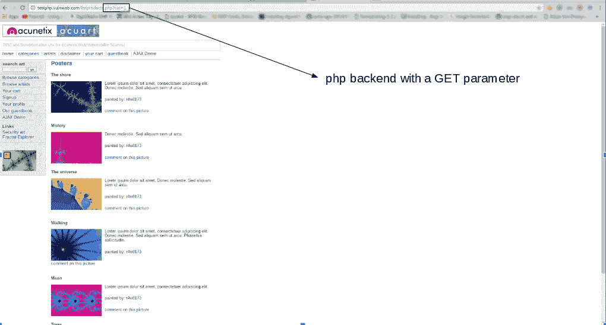
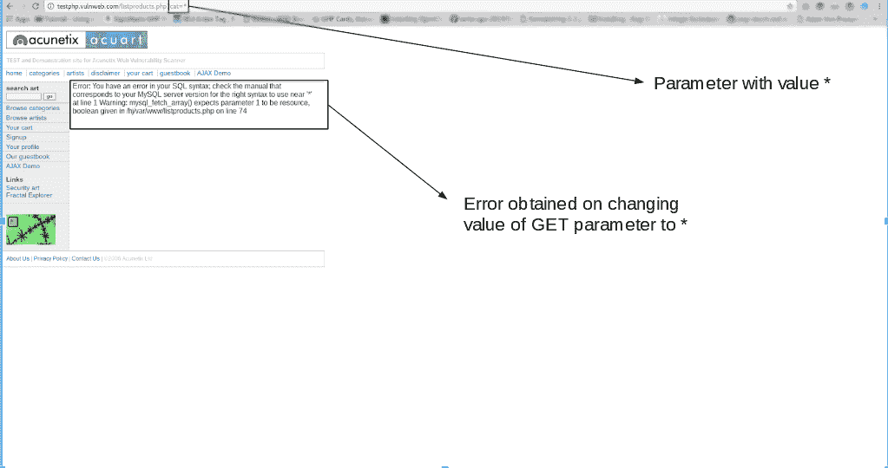
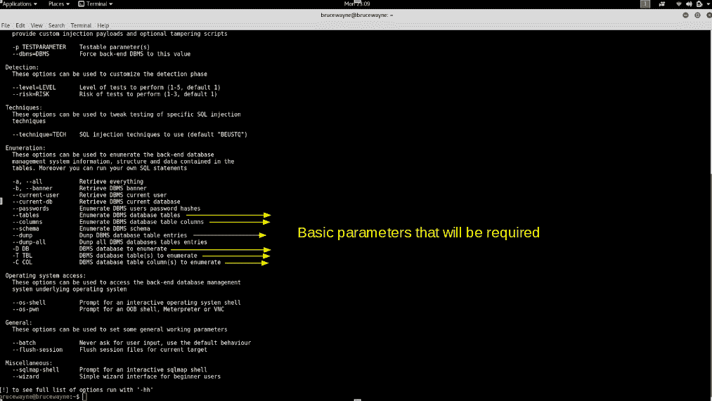
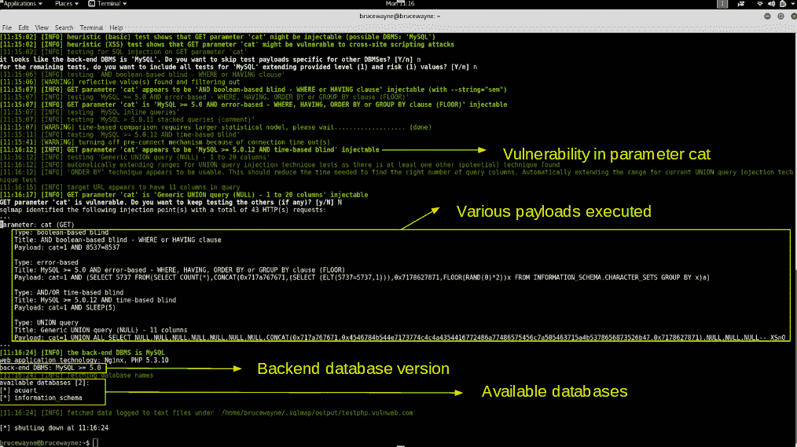
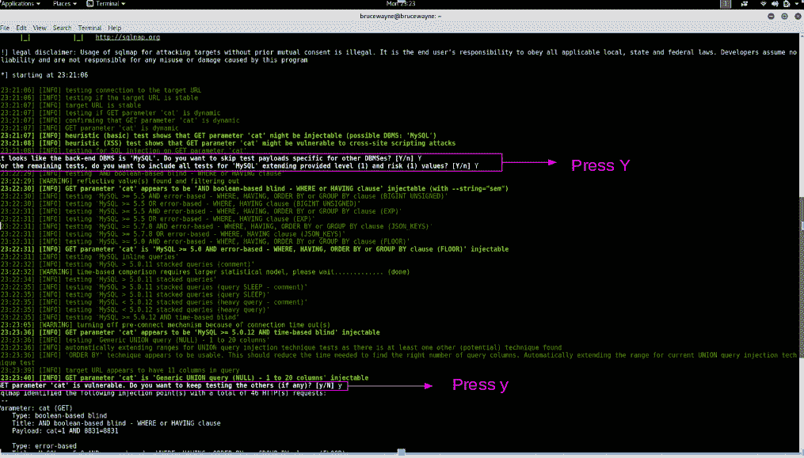
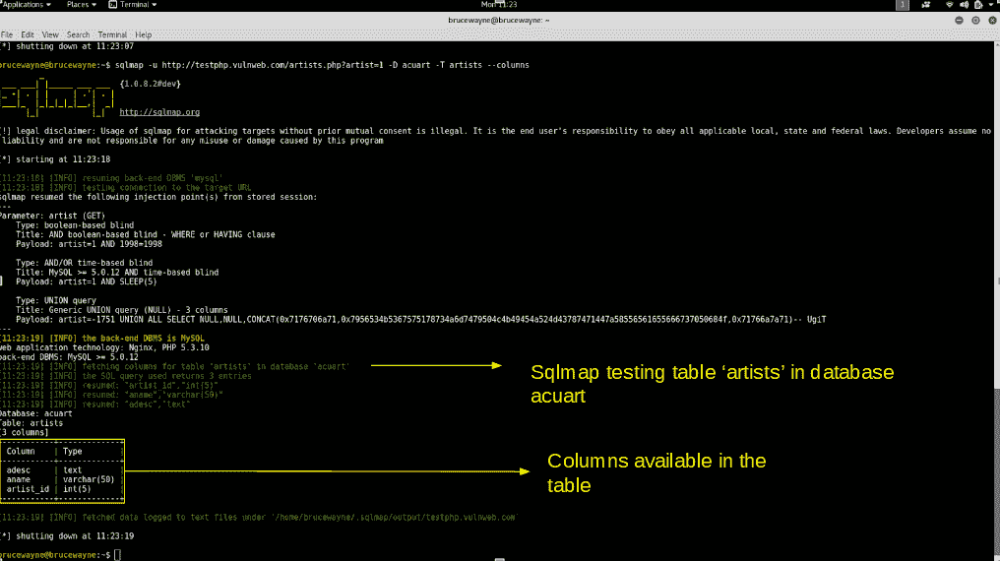
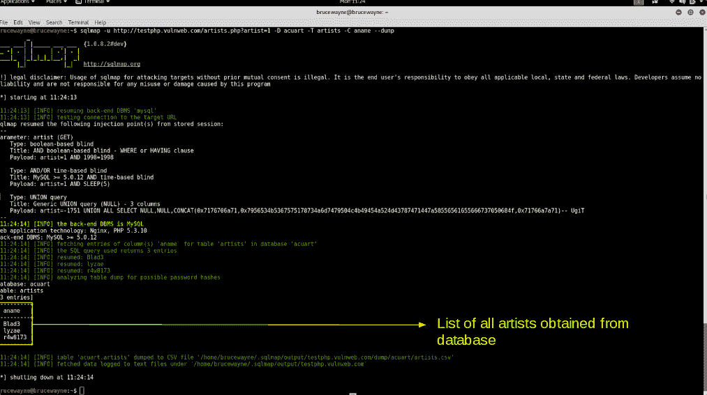

# 如何使用 SQLMAP 测试网站的 SQL 注入漏洞

> 原文:[https://www . geesforgeks . org/use-sqlmap-test-网站-SQL-注入-漏洞/](https://www.geeksforgeeks.org/use-sqlmap-test-website-sql-injection-vulnerability/)

本文解释了如何使用 SQLMAP 渗透测试工具测试网站在 SQL 注入是否安全。

**什么是 SQL 注入？**

SQL 注入是一种代码注入技术，攻击者执行恶意的 SQL 查询来控制 web 应用程序的数据库。通过正确的查询集，用户可以访问存储在数据库中的信息。SQLMAP 测试“GET”参数是否容易受到 SQL 注入的攻击。
例如，考虑下面的 php 代码段:

```
$variable = $_POST['input'];
mysql_query("INSERT INTO `table` (`column`) VALUES ('$variable')");
```

如果用户输入“值”)；删除表格表格；–”作为输入，查询变成

```
INSERT INTO `table` (`column`) VALUES('value'); DROP TABLE table;--')
```

这对我们来说是不可取的，因为这里用户输入是与预先编写的 sql 查询一起直接编译的。因此，用户将能够输入操作数据库所需的 sql 查询。

**哪里可以使用 SQLMAP？**

如果您观察到 http://testphp.vulnweb.com/listproducts.php?**cat = 1**形式的 web url，其中“GET”参数为粗体，则该网站可能容易受到这种 SQL 注入模式的攻击，攻击者可能能够访问数据库中的信息。此外，SQLMAP 在基于 php 的情况下也能工作。



检查您的网站是否易受攻击的一个简单测试是用星号(*)替换 get request 参数中的值。例如

```
http://testphp.vulnweb.com/listproducts.php?cat=* 
```



如果这导致了一个错误，比如上面给出的错误，那么我们可以肯定地说，该网站是脆弱的。

**安装 sqlmap**

SQLMAP 预装了 kali linux，这是大多数渗透测试人员的首选。但是，您可以使用命令
在其他基于 debian 的 linux 系统上安装 sqlmap

```
 sudo apt-get install sqlmap 
```

用法

在本文中，我们将利用一个设计有漏洞的网站进行演示:

```
 http://testphp.vulnweb.com/listproducts.php?cat=1 
```

如您所见，用户可以通过修改 cat 的值来更改 GET 请求参数(cat = 1)。所以这个网站可能容易受到这种 SQL 注入的攻击。
为了对此进行测试，我们使用 SQLMAP。要查看可以传递的参数集，请在终端中键入

```
 sqlmap -h 
```



我们将用于基本 SQL 注入的参数如上图所示。除此之外，我们还将使用–DBS 和-u 参数，其用法已在步骤 1 中解释过。
**使用 SQLMAP 测试网站 SQL 注入漏洞:**

1.  **第一步:列出现有数据库的信息**
    因此，首先，我们必须输入我们想要检查的网址以及-u 参数。如果我们希望使用代理测试网站，我们也可以使用–tor 参数。现在，我们通常想要测试是否有可能获得对数据库的访问。所以我们使用–DBS 选项来实现。–DBS 列出了所有可用的数据库。

```
 sqlmap -u http://testphp.vulnweb.com/listproducts.php?cat=1 --dbs 
```



1.  我们得到以下输出，显示有两个可用的数据库。有时，应用程序会告诉您它已经识别了数据库，并询问您是否要测试其他数据库类型。你可以继续输入“是”。此外，它可能会询问您是否想要测试漏洞的其他参数，请在这里键入“Y”，因为我们想要彻底测试 web 应用程序。



1.  We observe that their are two databases, acuart and information_schema 
2.  **步骤 2:列出特定数据库**
    中存在的表的信息要尝试访问任何数据库，我们必须稍微修改我们的命令。我们现在使用-D 来指定我们希望访问的数据库的名称，一旦我们访问了数据库，我们就想知道我们是否可以访问这些表。为此，我们使用–tables 查询。让我们访问 acuart 数据库。

```
 sqlmap -u http://testphp.vulnweb.com/listproducts.php?cat=1 
-D acuart --tables 
```


桌子

1.  在上图中，我们看到已经检索了 8 个表。所以现在我们肯定知道网站易受攻击。

2.  **Step 3: List information about the columns of a particular table** 

    如果我们想要查看特定表的列，我们可以使用以下命令，其中我们使用-T 来指定表名，使用–columns 来查询列名。我们将尝试访问“艺术家”表。

```
 sqlmap -u http://testphp.vulnweb.com/listproducts.php?cat=1 
-D acuart -T artists --columns 
```



列

2.  **第四步:从**
    列转储数据同样，我们可以使用以下命令访问特定列中的信息，其中-C 可以用来指定多个用逗号分隔的列名，–Dump 查询检索数据

```
 sqlmap -u http://testphp.vulnweb.com/listproducts.php?cat=1
-D acuart -T artists -C aname --dump 
```



1.  从上图中，我们可以看到我们已经从数据库中访问了数据。同样的，在这种易受攻击的网站中，我们可以随便通过数据库探索提取信息

**防止 SQL 注入**

SQL 注入一般可以通过使用**准备报表**来预防。当我们使用准备好的语句时，我们基本上是为代码使用一个模板，并分别分析代码和用户输入。它不混合用户输入的查询和代码。在本文开头给出的示例中，用户输入的输入被直接插入到代码中，它们被一起编译，因此我们能够执行恶意代码。对于准备好的语句，我们基本上发送带有用户输入占位符的 sql 查询，然后作为单独的命令发送实际的用户输入。
考虑下面的 php 代码段。

```
$db = new PDO('connection details');
$stmt = db->prepare("Select name from users where id = :id");
$stmt->execute(array(':id', $data));
```

在这段代码中，用户输入不与准备好的语句相结合。它们是分开编译的。因此，即使输入恶意代码作为用户输入，程序也会简单地将代码的恶意部分视为字符串，而不是命令。

**注意:本申请仅用于测试目的**
**相关文章**
[基本 SQL 注入和缓解](https://www.geeksforgeeks.org/basic-sql-injection-mitigation-example/)

**参考:**stackoverflow.com

本文由 **Deepak Srivatsav** 供稿。如果你喜欢 GeeksforGeeks 并想投稿，你也可以使用[write.geeksforgeeks.org](https://write.geeksforgeeks.org)写一篇文章或者把你的文章邮寄到 review-team@geeksforgeeks.org。看到你的文章出现在极客博客主页上，帮助其他极客。

如果你发现任何不正确的地方，或者你想分享更多关于上面讨论的话题的信息，请写评论。