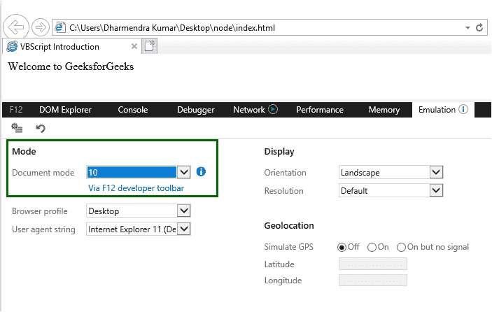

# VBScript |简介

> 原文:[https://www.geeksforgeeks.org/vbscript-introduction/](https://www.geeksforgeeks.org/vbscript-introduction/)


**VBScript** 代表**视觉基础脚本语言**。基本上是 **Visual Basic** 编程语言和 **JavaScript** 语言的结合。VBScript 是由微软发明和维护的。它用于开发动态网页。与 Visual Basic 编程语言相比，它要轻得多，但可以作为像 JavaScript 这样的脚本语言工作。要在客户端运行 VBScript，客户端必须使用 Internet Explorer，因为 VBScript 仍然不支持其他浏览器。

**VBScript 目前在以下提到的环境中运行:**

*   互联网信息服务器——这是一个微软的网络服务器。
*   视窗脚本主机(WSH)–这是一个本机托管环境的视窗操作系统。
*   internet Explorer(IE)–这是我们可以运行 VBScript 代码的最简单的托管环境。

**先决条件:**要在本地运行 VBScript 脚本，我们只需要两件事:

*   文本编辑器(任何 VBScript 编辑器，如记事本++、文本鹰、编辑 Plus 等。)
*   微软公司出品的 web 浏览器

**注意:**所有的 VBScript 编辑器其实都是支持 VBScript 的 HTML 编辑器。

【VBScript 设置:

*   **第一步:**打开你的文本编辑器，创建一个基本的 HTML 文件(例如:index.html)，并将下面的代码粘贴到该文件中。

    ```
    <!DOCTYPE html>
    <html>
        <head>
            <title>VBScript Introduction</title>
        </head>
        <body>

             <!-- Paste VBScript Here -->
        </body>
    </html>
    ```

*   **第二步:**把下面的代码粘贴到你的 HTML 代码的主体标签里面，也可以粘贴到头部标签里面。与您使用 JavaScript 所做的完全相同。

    ```
    <script type="text/vbscript">
        document.write("Hello geeks, greeting from GeeksforGeeks")
    </script>
    ```

*   **Step 3:** Combine both the code and run it on Internet Explorer and you will get the below output in the console.

    ```
    <!DOCTYPE html>
    <html>
    <head>
        <title>VBScript Introduction</title>
    </head>

    <body>
        <script type="text/vbscript">
            document.write("Welcome to GeeksforGeeks")
        </script>
    </body>
    </html>
    ```

    **输出:**

    ```
    Welcome to GeeksforGeeks 
    ```

**注意:**要在客户端使用，客户端必须使用 Internet Explorer。

**故障排除:**如果您的 VBScript 代码不工作，请使用以下步骤:

*   按 F12 键或使用右键打开检查元素。
*   单击“仿真”打开仿真设置。
*   将文档模式从默认更改为 10。



**缺点:**

*   VBScript 代码将仅由 Internet Explorer 处理。除了 Internet Explorer 之外的其他浏览器(如 Chrome、Firefox、Safari、Opera 等)不会处理 VBScript 代码。
*   VBScript 代码将只在 Windows 操作系统平台上运行。其他操作系统(如 Linux、Mac 等)将无法运行。
*   VBScript 代码用作 ASP 的默认脚本语言。