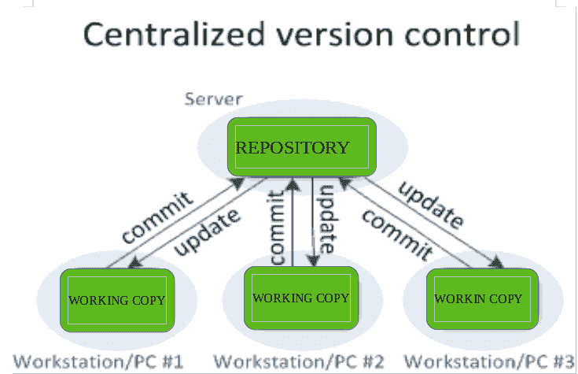
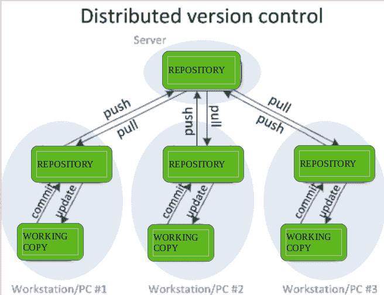

# 版本控制系统

> 原文:[https://www.geeksforgeeks.org/version-control-systems/](https://www.geeksforgeeks.org/version-control-systems/)

**什么是“版本控制系统”？**

版本控制系统是一类软件工具，通过跟踪对代码所做的修改来帮助记录对文件所做的更改。

**为什么版本控制系统如此重要？**

我们知道，一个软件产品是由一群开发人员合作开发的，他们可能位于不同的位置，每个人都贡献了某种特定的功能/特性。因此，为了对产品做出贡献，他们对源代码进行了修改(通过添加或删除)。版本控制系统是一种软件，它帮助开发人员团队有效地沟通和管理(跟踪)对源代码所做的所有更改，以及像谁做了什么更改这样的信息。为每个做出更改的贡献者创建一个单独的分支，并且这些更改不会合并到原始源代码中，除非一旦更改被绿色信号通知它们合并到主源代码中，就对所有更改进行分析。它不仅保持了源代码的组织性，而且通过使开发过程变得流畅来提高生产率。

**版本控制系统的优势:**

**a)** 通过提供高效的协作提高项目开发速度，

**b)** 通过更好的沟通和协助，利用员工的生产力、加速产品交付和技能，

**c)** 通过对每一个微小变化的可追溯性，减少项目开发过程中出现错误和冲突的可能性，

**d)** 项目的员工或贡献者可以通过此**【VCS】**
**e)**从任何地方贡献，对于项目的每个不同贡献者，都会维护一个不同的工作副本，除非工作副本经过验证，否则不会合并到主文件中。最受欢迎的例子是 **Git，Helix core，微软 TFS，**

**f)** 在任何灾难或突发情况下帮助恢复，

**g)** 告诉我们谁、什么、什么时候、为什么发生了变化。

**版本控制系统的使用:**

*   **一个存储库:**可以认为是一个变化的数据库。它包含项目的所有编辑和历史版本(快照)。
*   **工作副本(有时称为签出):**它是项目中所有文件的个人副本。您可以编辑此副本，而不会影响其他人的工作，并且在完成更改后，您最终可以将更改提交到存储库。

**版本控制系统的类型:**

*   本地版本控制系统
*   集中式版本控制系统
*   分布式版本控制系统

**本地版本控制系统:**它是最简单的形式之一，并且有一个数据库，将文件的所有更改保存在修订控制之下。RCS 是最常见的 VCS 工具之一。它将修补程序集(文件之间的差异)以特殊格式保存在磁盘上。通过添加所有的补丁，它可以重新创建任何文件在任何时间点的样子。

**集中式版本控制系统:**集中式版本控制系统只包含一个存储库，每个用户都有自己的工作副本。您需要承诺在存储库中反映您的更改。其他人可以通过更新看到您的更改。

要让别人看到你的改变，需要两件事:

*   你承诺
*   它们会更新

CVCS 的**优势**(集中式版本控制系统)使得开发人员之间能够协作，并在一定程度上提供了对其他人在项目中所做工作的洞察。它允许管理员对谁能做什么进行精细的控制。

它也有一些导致 DVS 发展的缺点。最显而易见的是，如果集中式存储库在此期间停止运行，则代表单点故障，无法进行协作和保存版本化更改。如果中央数据库的硬盘损坏，并且没有保存正确的备份，该怎么办？你失去了一切。

**分布式版本控制系统:**分布式版本控制系统包含多个存储库。每个用户都有自己的存储库和工作副本。仅仅提交您的更改不会让其他人访问您的更改。这是因为提交将反映本地存储库中的那些更改，并且您需要推送它们，以便使它们在中央存储库中可见。同样，当您更新时，您不会得到其他人的更改，除非您已经首先将这些更改拉进了您的存储库。

要让别人看到你的改变，需要 4 件事:

*   你承诺
*   你推
*   他们拉
*   它们会更新

最流行的分布式版本控制系统是 Git，Mercurial。它们帮助我们克服单点故障的问题。

**版本控制目的:**

*   多人可以同时在一个项目上工作。每个人都在处理和编辑他们自己的文件副本，当他们希望与团队的其他成员分享他们所做的更改时，这取决于他们。
*   它还使一个人能够使用多台计算机来完成一个项目，因此即使您独自工作，它也是有价值的。
*   它整合了团队中不同成员同时完成的工作。在一些罕见的情况下，当两个人对文件的同一行进行冲突编辑时，版本控制系统会请求人工协助来决定应该做什么。
*   版本控制提供对项目历史版本的访问。这是防止计算机崩溃或数据丢失的保险。如果出现任何错误，您可以轻松回滚到以前的版本。也有可能撤销特定的编辑，同时不丢失已完成的工作。很容易知道文件的任何部分是何时、为何以及由谁编辑的。