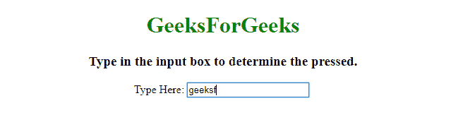
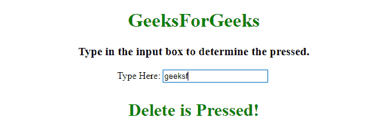
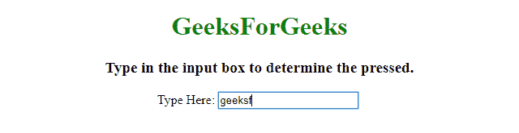
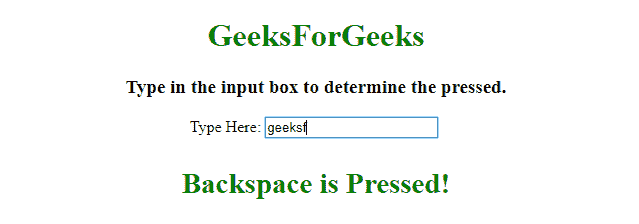

# 在 onkeydown 事件中捕捉退格和删除的方法

> 原文:[https://www . geeksforgeeks . org/在 onkeydown 事件上捕获退格并删除的方法/](https://www.geeksforgeeks.org/ways-to-capture-the-backspace-and-delete-on-the-onkeydown-event/)

给定 HTML 文档。任务是检测在按键事件中何时按下退格键和删除键。这里讨论了两种方法，一种使用 event.key，另一种在 JavaScript 的帮助下使用 event.keyCode。

**方法 1:**

*   从输入元素获取输入，并使用 **onkeydown 事件**上的 **el.addEventListener()方法**向输入元素添加一个事件侦听器。
*   使用 addeventlistener 方法中调用的匿名函数内的 **event.key** 获取按键。
*   检查按下的键是退格还是删除。

**示例 1:** 该示例实现了上述方法。

```html
<!DOCTYPE HTML>
<html>

<head>
    <title>
        Capture the backspace and delete on the onkeydown event.
    </title>
    <script src=
"https://ajax.googleapis.com/ajax/libs/jquery/3.4.0/jquery.min.js">
    </script>
</head>

<body style="text-align:center;">
    <h1 style="color:green;">  
            GeeksForGeeks  
        </h1>
    <p id="GFG_UP">
    </p>
    Type Here:
    <input id="inp" />
    <br>
    <p id="GFG_DOWN" style="color: green;">
    </p>
    <script>
        var up = document.getElementById('GFG_UP');
        var down = document.getElementById('GFG_DOWN');
        var el = document.getElementById('inp');
        up.innerHTML = "Type in the input box to determine the pressed.";
        el.addEventListener('keydown', function(event) {
            const key = event.key;
            if (key === "Backspace" || key === "Delete") {
                $('#GFG_DOWN').html(key + ' is Pressed!');
            }
        });
    </script>
</body>

</html>
```

**输出:**

*   **点击按钮前:**
    
*   **点击按钮后:**
    

**方法 2:**

*   从输入元素获取输入，并使用 **onkeydown 事件**上的 **el.addEventListener()方法**向输入元素添加一个事件侦听器。
*   在 addeventlistener 方法中调用的匿名函数中使用 **event.keyCode** 来获得按键。
*   检查按键代码是否与退格键或删除按钮的按键代码匹配。

**示例 2:** 该示例实现了上述方法。

```html
<!DOCTYPE HTML>
<html>

<head>
    <title>
        Capture the backspace and delete on the onkeydown event.
    </title>
    <script src=
"https://ajax.googleapis.com/ajax/libs/jquery/3.4.0/jquery.min.js">
    </script>
</head>

<body style="text-align:center;">
    <h1 style="color:green;">  
            GeeksForGeeks  
        </h1>
    <p id="GFG_UP">
    </p>
    Type Here:
    <input id="inp" />
    <br>
    <p id="GFG_DOWN" style="color: green;">
    </p>
    <script>
        var up = document.getElementById('GFG_UP');
        var down = document.getElementById('GFG_DOWN');
        var el = document.getElementById('inp');
        up.innerHTML = "Type in the input box to determine the pressed.";
        el.addEventListener('keydown', function(event) {
            // Checking for Backspace.
            if (event.keyCode == 8) {
                $('#GFG_DOWN').html('Backspace is Pressed!');
            }
            // Checking for Delete.
            if (event.keyCode == 46) {
                $('#GFG_DOWN').html('Delete is Pressed!');
            }
        });
    </script>
</body>

</html>
```

**输出:**

*   **点击按钮前:**
    
*   **点击按钮后:**
    