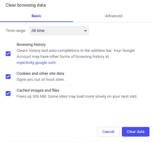
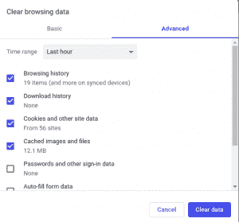

# 追踪网站的方法

> 原文:[https://www.geeksforgeeks.org/ways-to-track-a-website/](https://www.geeksforgeeks.org/ways-to-track-a-website/)

每当我们访问任何网站时，我们的网络浏览器都会显示我们的位置、搜索和浏览历史等。这些数据还可能被第三方使用。各种网络通常使用跟踪来建立详细的档案，用于各种目的，例如实现政治选择。

有许多方法可以跟踪网站，包括:

1.  **Ip 地址:**是我们连接互联网时设备的唯一地址。这个地址与我们家中或办公室的其他联网设备共享。利用这个，网站可以确定我们大致的地理位置。该 IP 地址可以改变，因此通过长时间使用该 IP 地址来跟踪特定用户是困难的。通过 IP 地址网站不能追踪用户的 pin-drop 位置，但可以很容易地追踪地区或城市。这个过程基本上是通过垃圾广告进行的。
2.  **HTTP Referrer:** Whenever we click any link in our browser, it loads the web page linked to it. The website will get opened and internally information like *IP address, location, web browser, machine type* etc will be provided to the linked website. This is known as the **HTTP referrer**. If you click a link outside of the webpage then that web page will get the information about you. Suppose you click a link “How to track”(outside of the webpage) then the link will see where you are coming from this is known as HTTP refer header.

    一个网页可以包括一个跟踪脚本，它会告诉广告商你正在寻找的网页。
    网络 bug 是这里最不可追踪的程序那些包含在图像中的非常小的 bug，它被用在邮件中，假设你打开一封包含图像的邮件，那么广告商可以追踪你。

3.  **Cookies and Tracking Scripts:** Cookies are small text files on your computer storing a small piece of information related to your online habits. Cookies can also identify you and track your activity across a website. Tracking Scripts sends the information on which page you are viewing at that time.
    Cookies are generally of two types:
    *   **第一方 cookie:**这些存储了我们自己的登录 id、密码、自动填充信息等，供经常访问的网站使用。
    *   **第三方 cookie:**这些是存储我们的浏览数据，并根据我们的兴趣使用这些在我们的网页上放置广告的 cookie。这有时会导致我们的网页上出现许多不需要的广告。

    

    

4.  **Super Cookies:** These are also cookies (like *evercookie*) but are persistence. They stores data in multiple places (Flash cookies, Silver light storage, and HTML 5 local storage, etc). If you delete a part of it, the information will repopulate from the other location. Suppose you clear cookies from your browsers but not clear in Flash cookies then, the browsers will copy the cookies from Flash cookies and repopulate into your browsers, somehow the supercookie is like ever cookies that can not be vanished at all.

    supercookie 的目标是记住每一个用户，如果你清除了所有的 cookie，它将从其他存储中重新填充。supercookie 使用备份计划。

5.  **用户代理:**每次我们连接到一个网站时，我们的浏览器都会向该网站发送一个用户代理，该代理从我们这里收集浏览器类型、操作系统和重要数据等数据，广告商使用这些数据在我们的网页上定向广告我们喜欢看什么，我们想看什么。
6.  **浏览器指纹识别:**每个浏览器都是特别独特的，这告诉网站你安装的字体、插件以及你在浏览器中使用的所有东西。如果你禁用你的 cookies 来阻止这些事情，那么这将是另一种追踪你的方式，禁用选项将告诉网站你的信息。

上述所有事情都会将个人身份信息泄露给网站，并可能通过收集您的所有个人信息而被用来对付您。对此的解决方案是*私人浏览*、*匿名浏览*。