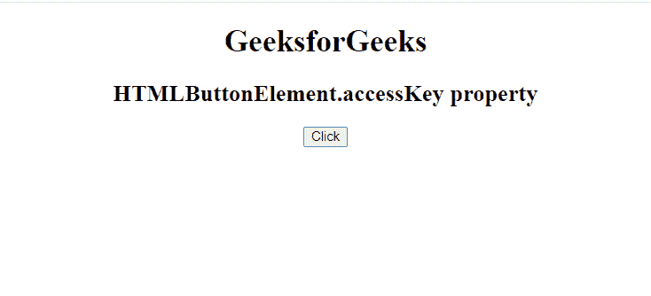
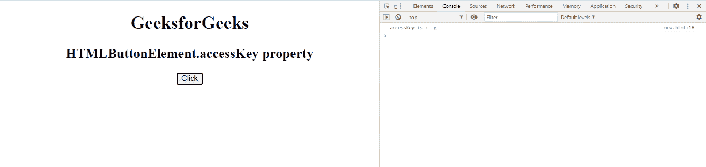
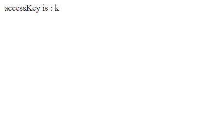

# 网页应用编程接口按钮元素访问键属性

> 原文:[https://www . geesforgeks . org/web-API-button element-access key-property/](https://www.geeksforgeeks.org/web-api-buttonelement-accesskey-property/)

属性用于返回一个多字符串，它是一个代表给定按钮的访问键的单个字符。

**语法:**

```html
ButtonElement.accessKey
```

**返回值:**该属性返回一个多字符串，它是一个代表给定按钮的访问键的单个字符。

**例 1:**

## 超文本标记语言

```html
<!DOCTYPE html> 
<html> 

<body style = "text-align:center"> 
    <h1>GeeksforGeeks</h1> 

    <h2>HTMLButtonElement.accessKey property</h2> 

    <button accessKey='g' onclick="gfg()">
        Click
    </button>

    <script type="text/javascript">
        function gfg() {
            var a = document.getElementsByTagName("button");
            console.log('accessKey is : ', a[0].accessKey);
        }
    </script>
</body> 

</html>
```

**输出:**

**点击按钮前:**



**点击按钮后:**



**例 2:**

## 超文本标记语言

```html
<!DOCTYPE html> 
<html> 

<body style = "text-align:center"> 
    <h1>GeeksforGeeks</h1> 

    <h2>HTMLButtonElement.accessKey property</h2> 

    <button accessKey='k' onclick="gfg()">
        Click
    </button>

    <script type="text/javascript">
        function gfg() {
            var a = document.getElementsByTagName("button");
            document.write('accessKey is : ', a[0].accessKey);
        }
    </script>
</body> 

</html>
```

**输出:**

**点击按钮前:**


**点击按钮后:**



**支持的浏览器:**

*   谷歌 Chrome
*   微软公司出品的 web 浏览器
*   火狐浏览器
*   旅行队
*   歌剧
*   边缘

**参考:**[https://developer . Mozilla . org/en-US/docs/Web/API/html buttonelement](https://developer.mozilla.org/en-US/docs/Web/API/HTMLButtonElement)