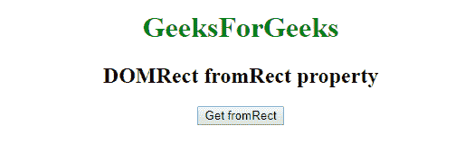
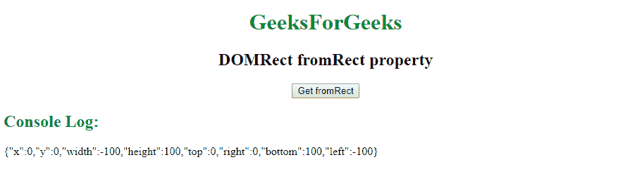

# 网络应用编程接口|直接从直接属性

> 原文:[https://www . geesforgeks . org/web-API-DOM rect-from rect-property/](https://www.geeksforgeeks.org/web-api-domrect-fromrect-property/)

在网络应用编程接口中，有一个多矩形接口，它有一个属性**(从矩形()**创建一个多矩形只读对象，该对象有给定的位置和尺寸。

**语法:**

```htmlhtml
var domRect = DOMRectReadOnly.fromRect(DOMRect object)
```

**返回值:**

```htmlhtml
It returns an instance of DOMRect
```

**示例:**使用 fromRect。

```htmlhtml
<!DOCTYPE html>
<html>

<head>
    <title>DOMRect fromRect property</title>
</head>

<body>
    <center>
        <h1 style="color:green;"> 
                GeeksForGeeks 
            </h1>

        <h2>DOMRect fromRect property</h2>
        <button onclick="getDOMRect ();">
            Get fromRect
        </button>
        <p id='DOMRect'></p>
    </center>

</body>

<script type="text/javascript">
    function getDOMRect() {
        var myDOMRect = new DOMRect(0, 0, -100, 100);
        var domRect = DOMRectReadOnly.fromRect(myDOMRect);
        console.log(domRect);

    }
</script>

</html>
```

**输出:**
**之前点击按钮:**


**点击按钮后:**


**支持的浏览器:**

*   谷歌 Chrome
*   Safari 10.1
*   火狐浏览器
*   歌剧