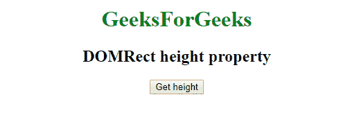
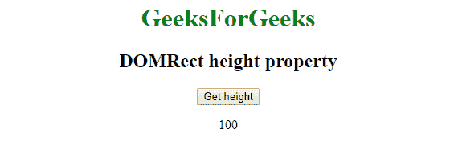

# 网页 API |多矩形高度属性

> 原文:[https://www . geesforgeks . org/web-API-DOM rect-height-property/](https://www.geeksforgeeks.org/web-api-domrect-height-property/)

在 Web API 中有一个 **DOMRect** 接口，它有一个属性 **height** ，这个属性给出了 DOMRect 对象的高度。

**语法:**

```html
var recX = DOMRect.height;
```

**返回类型:**

```html
Double value
```

**示例:**获取创建的多矩形对象的高度。

```html
<!DOCTYPE html>
<html>

<head>
    <title>DOMRect height property</title>
</head>

<body>
    <center>

        <h1 style="color:green;">  
                GeeksForGeeks  
            </h1>

        <h2>DOMRect height property</h2>
        <button onclick="getDOMRect ();">
          Get height
      </button>
        <p id='DOMRect'></p>
    </center>

</body>

<script type="text/javascript">
    function getDOMRect() {
        var myDOMRect = new DOMRect(0, 0, 100, 100);
        var recheight = myDOMRect.height;

        document.getElementById(
          'DOMRect').innerHTML = recheight;

    }
</script>

</html>
```

**输出:**
**点击按钮前:**


**点击按钮后:**


**支持的浏览器:****直高属性**支持的浏览器如下:

*   谷歌 Chrome
*   Safari 10.1
*   火狐浏览器
*   歌剧