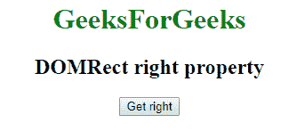
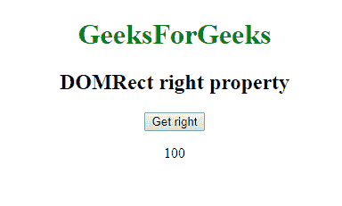
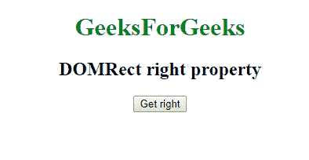
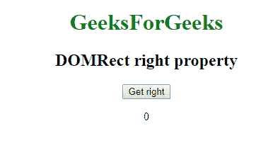

# Web API | dorect 产权

> 原文:[https://www . geesforgeks . org/web-API-DOM rect-right-property/](https://www.geeksforgeeks.org/web-api-domrect-right-property/)

在网络应用编程接口中，有一个 **DOMRect** 接口，它有一个属性 **right** ，赋予我们 DOMRect 对象的权利。返回 *x +宽度*坐标值，如果宽度为负，则返回 *x* 。

**语法:**

```htmlhtml
var recX = DOMRect.right;
```

**返回类型:**

```htmlhtml
Double value
```

**例 1:** 当宽度为正时

```htmlhtml
<!DOCTYPE html>
<html>

<head>
    <title>
        DOMRect right property
    </title>

</head>

<body>
    <center>

        <h1 style="color:green;"> 
                GeeksForGeeks 
            </h1>

        <h2>DOMRect right property</h2>
        <button onclick="getDOMRect ();">
          Get right
      </button>
        <p id='DOMRect'></p>
    </center>

</body>

<script type="text/javascript">
    function getDOMRect() {
        var myDOMRect = new DOMRect(0, 0, 100, 100);
        var recright = myDOMRect.right;

        document.getElementById(
          'DOMRect').innerHTML = recright;

    }
</script>

</html>
```

**输出:**
**点击按钮前:**


**点击按钮后:**


**例 2:** 当宽度为负时

```htmlhtml
<!DOCTYPE html>
<html>

<head>

    <title>
        DOMRect right property
    </title>

</head>

<body>
    <center>

        <h1 style="color:green;"> 
                GeeksForGeeks 
            </h1>

        <h2>DOMRect right property</h2>
        <button onclick="getDOMRect ();">
          Get right
      </button>
        <p id='DOMRect'></p>
    </center>

</body>

<script type="text/javascript">
    function getDOMRect() {
        var myDOMRect = new DOMRect(0, 0, -100, 100);
        var recright = myDOMRect.right;

        document.getElementById(
          'DOMRect').innerHTML = recright;

    }
</script>

</html>
```

**输出:**
**点击按钮前:**


**点击按钮后:**


**支持的浏览器:****直权属性**支持的浏览器如下:

*   谷歌 Chrome
*   Safari 10.1
*   火狐浏览器
*   歌剧