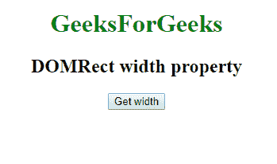
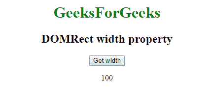

# 网页 API |多矩形宽度属性

> 原文:[https://www . geesforgeks . org/web-API-DOM rect-width-property/](https://www.geeksforgeeks.org/web-api-domrect-width-property/)

在网络应用编程接口中，有一个**多矩形只读**接口，该接口有一个属性**宽度**，它给出了多矩形对象的宽度。

**语法:**

```html
var recX = DOMRect.width;
```

**返回类型:**

```html
Double value
```

**示例:**获取创建的多矩形对象的宽度。

```html
<!DOCTYPE html>
<html>

<head>

    <title>
        DOMRect width property
    </title>

</head>

<body>
    <center>

        <h1 style="color:green;"> 
                GeeksForGeeks 
            </h1>

        <h2>DOMRect width property</h2>
        <button onclick="getDOMRect ();">
          Get width
      </button>
        <p id='DOMRect'></p>
    </center>

</body>

<script type="text/javascript">
    function getDOMRect() {
        var myDOMRect = new DOMRect(
          0, 0, 100, 100);
        var recwidth = myDOMRect.width;

        document.getElementById(
          'DOMRect').innerHTML = recwidth;

    }
</script>

</html>
```

**输出:**
**点击按钮前:**


**点击按钮后:**


**支持的浏览器:****矩形宽度属性**支持的浏览器如下:

*   谷歌 Chrome
*   Safari 10.1
*   火狐浏览器
*   歌剧