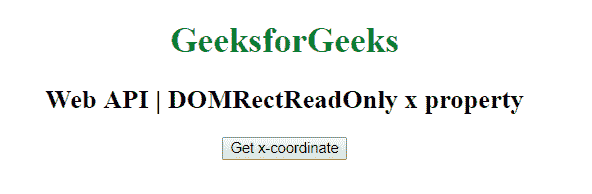
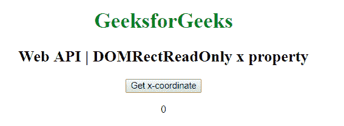

# 网页 API | DOMRectReadOnly x 属性

> 原文:[https://www . geeksforgeeks . org/web-API-domrectreadonly-x-property/](https://www.geeksforgeeks.org/web-api-domrectreadonly-x-property/)

DOMRectReadOnly API 接口中的 x 属性用于表示 x 坐标。它是只读属性。

**语法:**

```htmlhtml
var recX = DOMRect.x;
```

**返回值:**返回 DOMRectReadOnly API 的 x 坐标。

**示例:**本示例使用 DOMRect.x 属性获取 DOMRect 对象的 x 坐标。

```htmlhtml
<!DOCTYPE html> 
<html> 

<head>
    <title>
        Web API DOMRectReadOnly x property
    </title>
</head>

<body style="text-align:center;">

    <h1 style="color:green;"> 
        GeeksforGeeks 
    </h1> 

    <h2>Web API | DOMRectReadOnly x property</h2>

    <button onclick="getDOMRect ();">
        Get x-coordinate
    </button>

    <p id='DOMRect'></p>

    <script type="text/javascript">
        function getDOMRect () {
            var myDOMRect = new DOMRect(0, 0, 100, 100);
            var recX = myDOMRect.x;

            document.getElementById('DOMRect').innerHTML
                    = recX;
        }
    </script> 
<body>

</html>
```

**输出:**

*   **点击按钮前:**
    
*   **点击按钮后:**
    

**支持的浏览器:**下面列出了 DOMRectReadOnly x 属性支持的浏览器:

*   谷歌 Chrome
*   火狐浏览器
*   Safari 10.1
*   歌剧