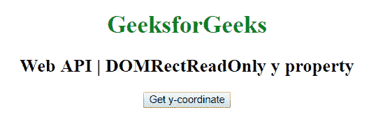

# web API | domrecreadonly 和 property

> 原文:[https://www . geeksforgeeks . org/web-API-domrectreadonly-y-property/](https://www.geeksforgeeks.org/web-api-domrectreadonly-y-property/)

DOMRectReadOnly 接口中的 y 属性用于表示 DOMRect 对象的 y 坐标。它是只读属性。

**语法:**

```html
var recX = DOMRect.y;
```

**返回值:**返回 DOMRectReadOnly 对象的 y 坐标。

**示例:**本示例使用 DOMRect.y 属性获取 DOMRect 对象的 y 坐标。

```html
<!DOCTYPE html> 
<html> 

<head>
    <title>
        Web API DOMRectReadOnly y property
    </title>
</head>

<body style="text-align:center;">

    <h1 style="color:green;"> 
        GeeksforGeeks 
    </h1> 

    <h2>Web API | DOMRectReadOnly y property</h2>

    <button onclick="getDOMRect ();">
        Get y-coordinate
    </button>

    <p id='DOMRect'></p>

    <script type="text/javascript">
        function getDOMRect () {
            var myDOMRect = new DOMRect(0, 0, 100, 100);
            var recY = myDOMRect.y;

            document.getElementById('DOMRect').innerHTML
                    = recY;
        }
    </script> 
</body>

</html>
```

**输出:**

*   **点击按钮前:**
    
*   **点击按钮后:**
    

**支持的浏览器:**下面列出了 DOMRectReadOnly 属性支持的浏览器:

*   谷歌 Chrome
*   火狐浏览器
*   Safari 10.1
*   歌剧