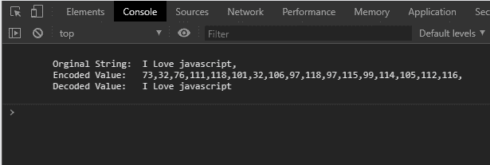
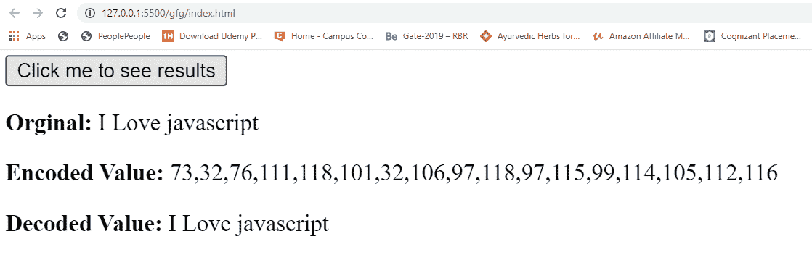

# 网页 API |文本解码器解码()方法

> 原文:[https://www . geesforgeks . org/web-API-text decoder-decode-method/](https://www.geeksforgeeks.org/web-api-textdecoder-decode-method/)

TextDecoder API 中的 **decode()** 方法用于以一个字节流作为输入，发出一个代码点流。TextEncoder decode()方法获取一个包含编码数据和选项对象的 ArrayBuffer，并返回原始字符串(即解码后的字符串)。

**语法:**

```htmlhtml
decoder.decode(buffer, options)
```

**参数:**

*   **缓冲区:**它是包含编码数据的 ArrayBuffer、Dataview 或 TypedArray 实例。
*   **选项:**它是一个可选参数，用于保存包含某些属性的对象。
    *   **stream:** 是布尔值。如果数据是分块处理的，则设置为 true 如果数据不是分块处理的，则设置为 false(默认情况下，其值设置为 false)

**返回值:**对缓冲区中的编码输入进行解码，返回解码后的字符串。

**例 1:**

## 超文本标记语言

```htmlhtml
<!DOCTYPE html>
<html lang="en">

<head>
    <title>
        TextEncoder Web API
        encodeInto() method
    </title>
</head>

<body>
    <p id='javascript'>I Love javascript</p>

    <script type="text/javascript">

        // Original string
        const original = document.querySelector(
                '#javascript').textContent

        // Instance of TextEncoder
        const encoder = new TextEncoder()

        // Instance of TextDecoder
        const decoder = new TextDecoder()

        // encode() is just an another method
        // defined in TextEncoder class
        // It specifies the encoded result
        // of strings
        const encodedResult = encoder.encode(original)

        // Decoding
        const decodedResult = decoder.decode(encodedResult)

        console.log(`
            Original String:  ${original},
            Encoded Value:   ${encodedResult},
            Decoded Value:   ${decodedResult}
        `)

    </script>
</body>

</html>
```

**输出:**



**例 2:**

## 超文本标记语言

```htmlhtml
<!DOCTYPE html>
<html lang="en">

<head>
    <title>GFG TextEncoder encodeInto() method</title>
</head>

<body>
    <p id='javascript' hidden>I Love javascript</p>
    <button id='btn'>Click me to see results</button>
    <div id='result'></div>

    <script type="text/javascript">

        // Original string
        const original = document.querySelector(
                '#javascript').textContent

        const btn = document.querySelector('#btn')
        const result = document.querySelector('#result')

        // Instance of TextEncoder
        const encoder = new TextEncoder()

        // Instance of TextDecoder
        const decoder = new TextDecoder()

        // encode() is just an another method
        // defined in TextEncoder class
        // It specifies the encoded result of strings
        const encodedResult = encoder.encode(original)

        // Decoding
        const decodedResult = decoder.decode(encodedResult)

        // Button listing for click event, when
        // click occurs shows original string and 
        // Encoded and Decode values

        btn.addEventListener('click', () => {
            result.innerHTML = `
           Original: ${original}
           Encoded Value: ${encodedResult}
           Decoded Value: ${decodedResult}`
        })
    </script>
</body>

</html>
```

**输出:**
**点击按钮前:**


**点击按钮后:**

