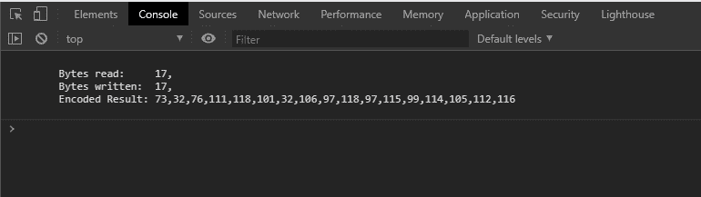
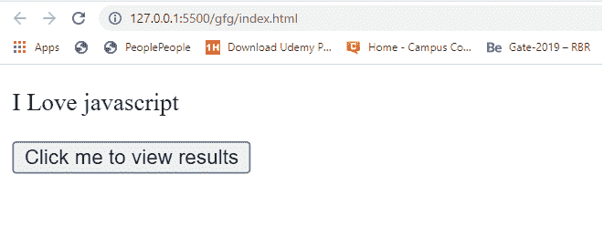
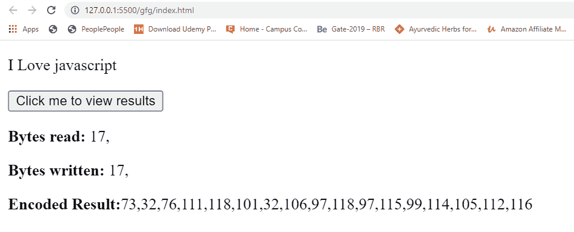

# Web API | TextEncoder encodeInto()方法

> 原文:[https://www . geesforgeks . org/web-API-text encoder-encodeinto-method/](https://www.geeksforgeeks.org/web-api-textencoder-encodeinto-method/)

TextEncoder API 中的 **encodeInto()** 方法用于取点流，发出 UTF-8 字节流。文本编码器的所有实例只支持 UTF-8 编码。TextEncoder.encodeInto()接受一个要编码的字符串和一个保存编码结果的数组，并返回一个对象。

**语法:**

```html
encoder.encodeInto(src, dest)
```

**参数:**

*   **src:** 是包含要编码的文本的源字符串。
*   **dest:** 存储编码结果的是 Uint8Array 对象实例。

**返回值:**返回一个包含两个读写属性的对象

*   **读作:**是一个数值，指定转换为 UTF-8 的字符串的个数。如果 uint8Array 没有足够的空间，这可能会小于 src.length(源字符串的长度)。
*   **dest:** 它也是一个数值，指定存储在目标 Uint8Array 对象 Array 中的 UTF-8 unicode 的数量。阅读总是平等的。

**例 1:**

```html
<!DOCTYPE html>
<html lang="en">

<head>
    <title>
        TextEncoder Web API
        encodeInto() method
    </title>
</head>

<body>
    <p id='javascript'>I love javascript</p>

    <script type="text/javascript">
        const parg1 = document.
            querySelector('#javascript')

        // Instance of TextEncoder
        const encoder = new TextEncoder()

        // Instance of Uint8Array
        const u8Array = new Uint8Array(30)

        const result = encoder.encodeInto(
                parg1.innerText, u8Array)

        // encode() is just an another method
        // defined in TextEncoder class
        // It specifies the encoded result
        //  of strings
        const encodedResult = encoder
                .encode(parg1.innerText)

        console.log(`
            Bytes read:     ${result.read},
            Bytes written:  ${result.written},
            Encoded Result: ${encodedResult}
        `)
    </script>
</body>

</html>
```

**输出:**


**例 2:**

```html
<!DOCTYPE html>
<html lang="en">

<head>
    <title>
        TextEncoder Web API
        encodeInto() method
    </title>
</head>

<body>
    <p id='javascript'>I Love javascript</p>

    <button id='btn'>
        Click me to view results
    </button>
    <p id='result'></p>

    <script type="text/javascript">

        const parg1 = document.querySelector('#javascript')
        const btn = document.querySelector('#btn')
        const result = document.querySelector('#result')

        // Instsnce of TextEncoder
        const encoder = new TextEncoder()

        // Instance of Uint8Array
        const u8Array = new Uint8Array(30)

        let resultObj = encoder.encodeInto(
                    parg1.innerText, u8Array)

        const encodedResult = 
            encoder.encode(parg1.innerText)

        btn.addEventListener('click', () => {
            result.innerHTML = `
        <p><strong>Bytes read:</strong>    
                    ${resultObj.read}, </p>
        <p><strong>Bytes written:</strong> 
                    ${resultObj.written}, </p>
        <p><strong>Encoded Result:</strong>
                    ${encodedResult}</p>
      `
        })
    </script>

</html>
```

**输出:**

**点击按钮前:**


**点击按钮后:**
