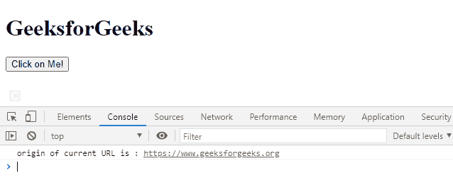

# 网页应用编程接口网址.原点属性

> 原文:[https://www.geeksforgeeks.org/web-api-url-origin-property/](https://www.geeksforgeeks.org/web-api-url-origin-property/)

属性返回一个包含网址来源的字符串。

**语法:**

```htmlhtml
var str = URL.origin

```

**返回值:**这个属性返回一个包含 URL 来源的 USVString。

**例 1:**

## 超文本标记语言

```htmlhtml
<!DOCTYPE html>
<html>

<body>
    <h1>GeeksforGeeks</h1>

    <div id="abc"></div>

    <button onclick="get()">
        Click on Me!
    </button>

    <script type="text/javascript">
        function get() {
            var url = new URL(
'https://www.geeksforgeeks.org/href#ExampleHash');

            a = document.getElementById("abc");

            a.innerHTML = 
                "origin of current URL is : " 
                + url.origin;
        }
    </script>
</body>

</html>
```

**输出:**


**例 2:**

## 超文本标记语言

```htmlhtml
<!DOCTYPE html>
<html>

<body>
    <h1>GeeksforGeeks</h1>

    <button onclick="get()">
        Click on Me!
    </button>

    <script type="text/javascript">
        function get() {
            var url = new URL(
'https://www.geeksforgeeks.org/href#ExampleHash');

            console.log("origin of current URL is :", 
                url.origin);
        }
    </script>
</body>

</html>
```

**输出:**



**支持的浏览器:**

*   旅行队
*   歌剧
*   铬
*   边缘
*   火狐浏览器