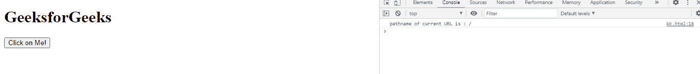
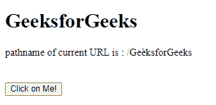

# 网络应用编程接口网址.路径名属性

> 原文:[https://www . geesforgeks . org/web-API-URL-pathname-property/](https://www.geeksforgeeks.org/web-api-url-pathname-property/)

**网络应用编程接口网址.路径名属性**用于获取包含以“/”开头，后跟网址路径的 USVString。

**语法:**

```htmlhtml
var str = URL.pathname

```

**返回值:**这个属性返回一个包含 URL 路径名的 USVString。

**注意:**如果这里的 t 没有为 URL 设置路径，那么它只会返回/。

**例 1:** 没有为 URL 设置路径，所以只会返回/

## 超文本标记语言

```htmlhtml
<!DOCTYPE html>
<html>

<body>
    <h1>GeeksforGeeks</h1>

    <button onclick="get()">
        Click on Me!
    </button>

    <script type="text/javascript">
        function get() {
            var url = new URL(
        'https://www.geeksforgeeks.org');

            // There is no path for the URL,
            // so it will return only /
            console.log("pathname of current URL is :",
                url.pathname);
        }
    </script>
</body>

</html>
```

**输出:**



**例 2:**

## 超文本标记语言

```htmlhtml
<!DOCTYPE html>
<html>

<body>
    <h1>GeeksforGeeks</h1>

    <div id="abc"></div>

    <br><br>
    <button onclick="get()">
        Click on Me!
    </button>

    <script type="text/javascript">
        function get() {
            var url = new URL(
    'https://www.geeksforgeeks.org/GeeksforGeeks');

            a = document.getElementById("abc");

            a.innerHTML = "pathname of current URL is : "
                + url.pathname;
        }
    </script>
</body>

</html>
```

**输出:**



**支持的浏览器:**

*   旅行队
*   歌剧
*   铬
*   边缘
*   火狐浏览器