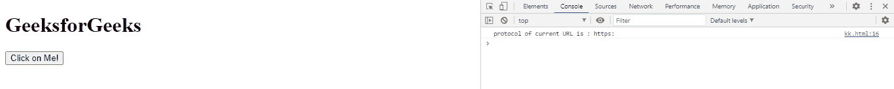
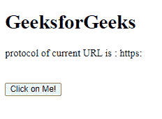

# 网络应用编程接口网址.协议属性

> 原文:[https://www . geesforgeks . org/web-API-URL-protocol-property/](https://www.geeksforgeeks.org/web-api-url-protocol-property/)

Web API URL . protocol 属性用于获取包含 URL 协议方案的 USVString。

**语法:**

```html
var str = URL.protocol

```

**返回值:**这个属性返回一个包含 URL 协议方案的 USVString。

**例 1:**

## 超文本标记语言

```html
<!DOCTYPE html>
<html>

<body>
    <h1>GeeksforGeeks</h1>

    <button onclick="get()">
        Click on Me!
    </button>

    <script type="text/javascript">
        function get() {
            var url = new URL(
'https://www.geeksforgeeks.org/GeeksforGeeks');

            console.log(
                "protocol of current URL is :",
                url.protocol);
        }
    </script>
</body>

</html>
```

**输出:**



**例 2:**

## 超文本标记语言

```html
<!DOCTYPE html>
<html>

<body>
    <h1>GeeksforGeeks</h1>

    <div id="abc"></div>

    <br><br>
    <button onclick="get()">
        Click on Me!
    </button>

    <script type="text/javascript">
        function get() {
            var url = new URL(
'https://www.geeksforgeeks.org/GeeksforGeeks');

            a = document.getElementById("abc");

            a.innerHTML = 
                "protocol of current URL is : " 
                + url.protocol;
        }
    </script>
</body>

</html>
```

**输出:**



**支持的浏览器:**

*   旅行队
*   歌剧
*   铬
*   边缘
*   火狐浏览器