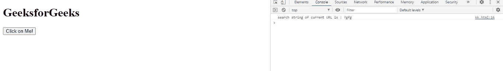
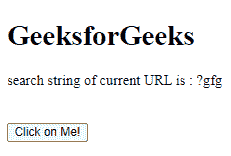

# 网络应用编程接口网址搜索属性

> 原文:[https://www.geeksforgeeks.org/web-api-url-search-property/](https://www.geeksforgeeks.org/web-api-url-search-property/)

Web API URL . search 属性用于获取 USVString，它是一个搜索字符串或查询字符串。该字符串包含“？”后跟网址的参数。

**语法:**

```htmlhtml
var str = URL.search

```

**返回值:**该属性返回一个 USVString 搜索字符串。

**例 1:**

## 超文本标记语言

```htmlhtml
<!DOCTYPE html>
<html>

<body>
    <h1>GeeksforGeeks</h1>

    <button onclick="get()" x='15' y='30'>
        Click on Me!
    </button>

    <script type="text/javascript">
        function get() {
            var url = new URL(
'https://www.geeksforgeeks.org/GeeksforGeeks/search?gfg');

            console.log(
                "search string of current URL is :", 
                url.search);
        }
    </script>
</body>

</html>
```

**输出:**



**例 2:**

## 超文本标记语言

```htmlhtml
<!DOCTYPE html>
<html>

<body>
    <h1>GeeksforGeeks</h1>

    <div id="abc"></div>

    <br><br>
    <button onclick="get()" x='15' y='30'>
        Click on Me!
    </button>

    <script type="text/javascript">
        function get() {
            var url = new URL(
'https://www.geeksforgeeks.org/GeeksforGeeks/search?gfg');

            a = document.getElementById("abc");

            a.innerHTML = 
                "search string of current URL is : "
                + url.search;
        }
    </script>
</body>

</html>
```

**输出:**



**支持的浏览器:**

*   旅行队
*   歌剧
*   铬
*   边缘
*   火狐浏览器