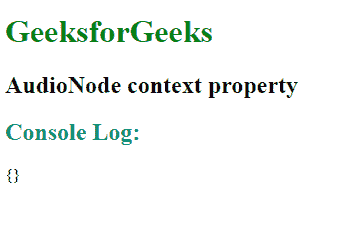
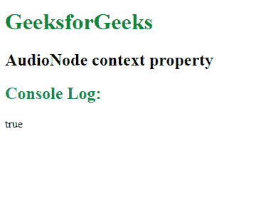

# 网络音频 API |音频节点上下文属性

> 原文:[https://www . geesforgeks . org/web-audio-API-audio node-context-property/](https://www.geeksforgeeks.org/web-audio-api-audionode-context-property/)

**音频节点**接口有一个**上下文**属性，该属性返回相关的*基本音频上下文*，该对象表示节点参与的流程图。

**语法:**

```
var ctx = anAudioNode.context;
```

**返回值:**返回一个*音频上下文*或*离线音频上下文*对象。

**例 1:**

```
<!DOCTYPE html>
<html>

<head>
    <title>
        AudioNode context property
    </title>
</head>

<body>

    <h1 style="color:green">
        GeeksforGeeks
    </h1>

    <h2>AudioNode context property</h2>

    <script>
        const AudioContext =
            window.AudioContext || window.webkitAudioContext;

        const audioCnt = new AudioContext();

        // Oscillator
        const osciltr = audioCnt.createOscillator();

        // Gain node
        const GainNode = audioCnt.createGain();
        osciltr.connect(GainNode).connect(audioCnt.destination);

        console.log(osciltr.context);
    </script>
</body>

</html>
```

**输出:**


**例 2:**

```
<!DOCTYPE html>
<html>

<head>
    <title>
        AudioNode context property
    </title>
</head>

<body>
    <h1 style="color:green">
        GeeksforGeeks
    </h1>

    <h2>AudioNode context property</h2>

    <script>
        const AudioContext =
            window.AudioContext || window.webkitAudioContext;

        const audioCnt = new AudioContext();

        // Oscillator
        const osciltr = audioCnt.createOscillator();

        // Gain_node
        const gNode = audioCnt.createGain();
        osciltr.connect(gNode).connect(audioCnt.destination);

        console.log(osciltr.context === audioCnt);
    </script>
</body>

</html>
```

**输出:**


**支持的浏览器:****音频节点上下文属性**支持的浏览器如下:

*   谷歌 Chrome 35.0
*   Firefox 25.0
*   苹果 Safari 6 -x-
*   Opera 22.0