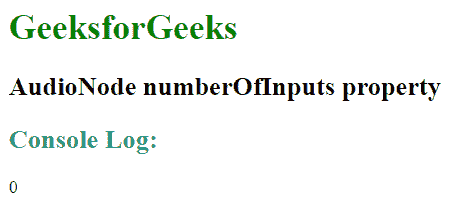
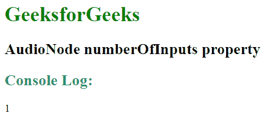

# 网络音频应用编程接口|音频节点号码输入属性

> 原文:[https://www . geesforgeks . org/web-audio-API-audio node-numberofinputs-property/](https://www.geeksforgeeks.org/web-audio-api-audionode-numberofinputs-property/)

**AudioNode.numberOfInputs 属性**用于返回输入节点的输入数量。源节点用于定义包含值为零的*数值输入*属性的节点。

**语法:**

```html
var numInputs = audioNode.numberOfInputs;
```

**返回值:**返回大于等于零的整数值。

**例 1:**

```html
<!DOCTYPE HTML> 
<html> 

<head> 
    <title> 
        Web Audio API | AudioNode numberOfInputs property
    </title>
</head> 

<body> 

    <h1 style = "color:green;" > 
        GeeksforGeeks
    </h1>

    <h2>
        AudioNode numberOfInputs property
    </h2>

    <script>

        // Create new Audio context
        const audioContext = new AudioContext();

        // Create an OscillatorNode 
        const oscillator = audioContext.createOscillator();

        // Create a gainNode
        const gainNode = audioContext.createGain();

        oscillator.connect(gainNode).connect(audioContext.destination);

        // Display the numberOfOutputs in console view
        console.log(oscillator.numberOfInputs);
    </script>
</body>

</html>                   
```

**输出:**


**例 2:**

```html
<!DOCTYPE HTML> 
<html> 

<head> 
    <title> 
        Web Audio API | AudioNode numberOfInputs property
    </title>
</head> 

<body> 

    <h1 style = "color:green;" > 
        GeeksforGeeks
    </h1>

    <h2>
        AudioNode numberOfInputs property
    </h2>

    <script>

        // Create new Audio context
        const audioContext = new AudioContext();

        // Create an OscillatorNode 
        const oscillator = audioContext.createOscillator();

        // Create a gainNode
        const gainNode = audioContext.createGain();

        oscillator.connect(gainNode).connect(audioContext.destination);

        // Display the numberOfOutputs in console view
        console.log(gainNode.numberOfInputs);
    </script>
</body>

</html>                   
```

**输出:**


**例 3:**

```html
<!DOCTYPE HTML> 
<html> 

<head> 
    <title> 
        Web Audio API | AudioNode numberOfInputs property
    </title>
</head> 

<body> 

    <h1 style = "color:green;" > 
        GeeksforGeeks
    </h1>

    <h2>
        AudioNode numberOfInputs property
    </h2>

    <script>

        // Create new Audio context
        const audioContext = new AudioContext();

        // Create an OscillatorNode 
        const oscillator = audioContext.createOscillator();

        // Create a gainNode
        const gainNode = audioContext.createGain();

        oscillator.connect(gainNode).connect(audioContext.destination);

        // Display the numberOfOutputs in console view
        console.log(audioContext.destination.numberOfInputs);
    </script>
</body>

</html>                   
```

**输出:**


**支持的浏览器:**下面列出了 *AudioNode.numberOfInputs 属性*支持的浏览器:

*   谷歌 Chrome 14.0
*   Edge 12.0
*   Firefox 25.0
*   Safari 6.0
*   Opera 15.0