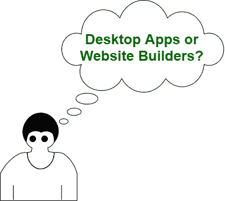

# 网页设计工具

> 原文:[https://www.geeksforgeeks.org/web-design-tools/](https://www.geeksforgeeks.org/web-design-tools/)

网页设计，顾名思义，就是指设计一个网站。这是一种在线展示网站的方式。网站应该有效地创建，不仅看起来不错，而且功能正常，并应在搜索引擎排名靠前。网页设计工具只是指通常用于开发有效、美观和响应迅速的网站的材料或软件程序。如今，有各种各样的网页设计工具可供开发人员或设计人员使用。选择最好的网页设计工具通常取决于它的主要目的和功能。最好的工具将使网站的开发变得简单和容易。人们必须根据团队规模、网站类型、预算、所有资源和技术要求来选择最合适的工具。基本上有两个主要工具可以用来设计网站，如下所示:

**1。桌面应用:**在设计网站时，有很多桌面应用可供选择。人们必须决定哪一个适合他们。这样的应用程序需要设计师开发他们的设计，然后将其转移到开发团队。开发团队必须面对所有的技术挑战，并将设计转化为代码。但是这个过程相当昂贵、耗时，并且需要更多的团队成员和开发人员等。使用的一些桌面应用有 Figma、WordPress、Bluefish、Envision Studio 等。但最受欢迎和使用最多的网页设计桌面应用是 Sketch 和 Photoshop。

*   **Photoshop:** Photoshop 是一款广泛使用的网页设计应用。它包括很多功能，如画板，字符样式，提供专业的工具来帮助创建和增强图片，使用网格系统，改进网页导出选项，控制图形的质量和文件大小，创建快速颜色填充等。因为如此惊人的功能，photoshop 大部分被设计师使用。它提供了富有创意和吸引力的标志，并提供了创建标志的灵活性和选项。
*   **Sketch:** Sketch 基本上是一个广泛用于 macOS 的矢量图形编辑器。它被认为是用户界面设计和响应性网页设计的最佳工具。对于想要一款经济高效的网页设计桌面应用的 Mac 用户来说，这是最好的选择。这也使设计过程变得流畅和容易。一些功能包括自动资产导出、使用 stark 插件分析颜色对比、使用**数学**功能定义测量、易用性、基于矢量的应用程序，包括许可系统等。

如果一个人不想涉及任何开发人员，那么他可以选择另一个设计网站，即网站建设者。开发一个技术要求较少的网站是一种更有效的方法。

**2。网站构建器:**网站构建器基本上是用来构建网站的工具，不需要任何手动的代码编辑。简而言之，它是一个平台或程序，帮助人们快速轻松地创建一个网站。对一个人来说，用一点点努力和编码技巧创建一个网站更容易。如今，市场上有不同的网站建设商，包括各种各样的功能和服务。一些网站建设者是主机，广场空间，Wix，网络流量等。网站构建器的各种功能包括易用性、博客工具、模板定制选项、电子商务解决方案等。一个人必须选择最有效的网站建设者。并不是所有的网站构建器都会提供你需要的功能，比如 WordPress。WordPress 被网站构建者广泛使用，但它只提供有限的定制选项，因此不受视觉设计师的欢迎。因此，在选择任何创建网站的网站构建者之前，必须确定网站的确切要求，如照片库、联系信息、如何更新网站等。相应地决定最合适的一个来满足需求。