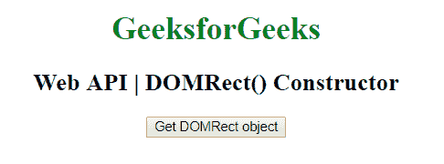

# Web DOMRect API | DOMRect()构造函数

> 原文:[https://www . geesforgeks . org/web-DOM rect-API-DOM rect-constructor/](https://www.geeksforgeeks.org/web-domrect-api-domrect-constructor/)

DOMRect API 中的 DOMRect()构造函数用于创建表示矩形的 DOMRect 对象。

**语法:**

```html
var myDOMRect = new DOMRect(x, y, width, height);
```

**参数:**该构造函数包含四个参数，如上所述，如下所述:

*   **x:** 设置矩形的 x 坐标。
*   **y:** 设置矩形的 y 坐标。
*   **宽度:**设置矩形的宽度。
*   **高度:**设置矩形的高度。

**示例:**本示例使用给定的参数创建了一个 DOMRect 对象。

```html
<!DOCTYPE html> 
<html> 

<head>
    <title>
        Web API | DOMRect() Constructor
    </title>
</head>

<body style="text-align:center;">

    <h1 style="color:green;"> 
        GeeksForGeeks 
    </h1> 

    <h2>Web API | DOMRect() Constructor</h2>

    <button onclick="getDOMRect ();">
        Get DOMRect object
    </button>

    <p id='DOMRect'></p>

    <script type="text/javascript">
        function getDOMRect () {
            var myDOMRect = new DOMRect(0, 0, 100, 100);
            console.log(myDOMRect);
        }
    </script> 
</body>

</html>
```

**输出:**

*   **之前点击按钮:**
    
*   **点击按钮后控制台视图:**
    

**支持的浏览器:**dorect()构造函数支持的浏览器如下:

*   谷歌 Chrome
*   火狐浏览器
*   歌剧
*   Safari 10.1