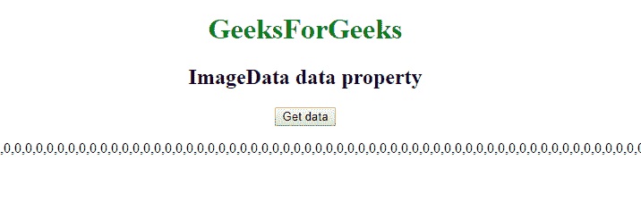
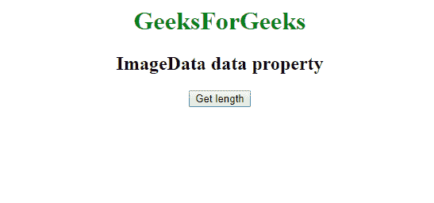
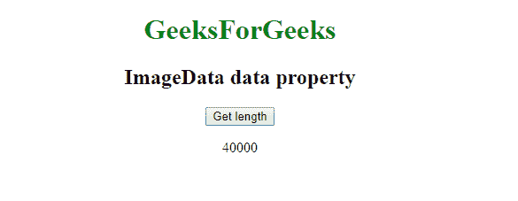

# Web ImageData API | ImageData . data 属性

> 原文:[https://www . geesforgeks . org/web-imagedata-API-imagedata-data-property/](https://www.geeksforgeeks.org/web-imagedata-api-imagedata-data-property/)

**ImageData.data 属性**用于返回一个 Uint8ClampedArray，其中包含以像素为单位的 ImageData 对象。ImageData 对象以 RGBA 顺序存储在一维数组中。RGBA 值介于 0 到 255 之间。

**语法:**

```html
imageData.data
```

**示例 1:** 本示例用零显示数组的 ImageData 像素值。

```html
<!DOCTYPE html> 
<html> 

<head>
    <title>
        Web ImageData API | ImageData.data property
    </title>

</head>

<body style="text-align:center;">

    <h1 style="color:green;"> 
        GeeksForGeeks 
    </h1> 

    <h2>ImageData data property</h2>

    <button onclick="getdata ();">Get data</button>

    <p id='data'></p>

    <script type="text/javascript">
        function getdata () {
        let imageData = new ImageData(100, 100);
            document.getElementById('data').innerHTML
                    = imageData.data;
        }
    </script> 
</body>

</html>
```

**输出:**

*   **点击按钮前:**
    
*   **点击按钮后:**
    

**示例 2:** 本示例显示 ImageData 数组对象的长度。

```html
<!DOCTYPE html> 
<html> 

<head>
    <title>
        Web ImageData API | ImageData.data property
    </title>

</head>

<body style="text-align:center;">

    <h1 style="color:green;"> 
        GeeksForGeeks 
    </h1> 

    <h2>ImageData data property</h2>

    <button onclick="getdata ();">
        Get length
    </button>

    <p id='data'></p>

    <script type="text/javascript">
        function getdata () {
        let imageData = new ImageData(100, 100);
            document.getElementById('data').innerHTML
                    = imageData.data.length;
        }
    </script> 
</body>

</html>
```

**输出:**

*   **点击按钮前:**
    
*   **点击按钮后:**
    

**支持的浏览器:**Web ImageData API | ImageData . data 属性支持的浏览器如下:

*   谷歌 Chrome
*   Internet Explorer 9
*   Firefox 14
*   Safari 3.1
*   歌剧 9