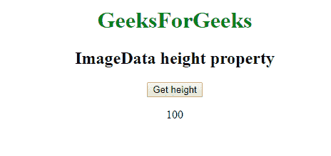

# Web ImageData API | ImageData . height 属性

> 原文:[https://www . geesforgeks . org/web-imagedata-API-imagedata-height-property/](https://www.geeksforgeeks.org/web-imagedata-api-imagedata-height-property/)

**ImageData.height 属性**用于返回 ImageData 对象的高度属性。ImageData()用于创建给定大小的对象。

**语法:**

```htmlhtml
imageData.height
```

**示例:**

```htmlhtml
<!DOCTYPE html> 
<html> 

<head>
    <title>
        Web ImageData API | ImageData.height property
    </title>

</head>

<body style="text-align:center;">

    <h1 style="color:green;"> 
        GeeksForGeeks 
    </h1> 

    <h2>ImageData height property</h2>

    <button onclick="getheight();">
        Get height
    </button>

    <p id='height'></p>

    <script type="text/javascript">
        function getheight () {
        let imageData = new ImageData(100, 100);
            document.getElementById('height').innerHTML
                    = imageData.height;
        }
    </script> 
</body>

</html>
```

**输出:**

*   **点击按钮前:**
    
*   **点击按钮后:**
    

**支持的浏览器:**Web API ImageData | ImageData . height 属性支持的浏览器如下:

*   谷歌 Chrome
*   Internet Explorer 9
*   Firefox 14
*   Safari 3.1
*   歌剧 9