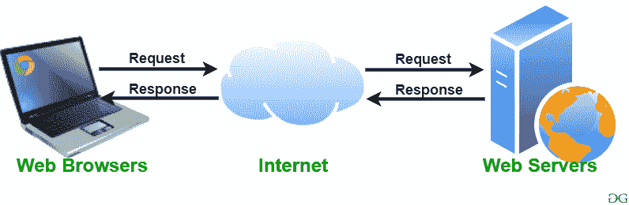

# 网络服务器及其类型

> 原文:[https://www.geeksforgeeks.org/web-server-and-its-type/](https://www.geeksforgeeks.org/web-server-and-its-type/)

**Web 服务器:** Web 服务器是一个处理用户网络请求的程序，为用户提供创建网页的文件。这种交换使用超文本传输协议进行。
基本上，网络服务器是用于存储创建网站的 HTTP 文件的计算机，当客户端请求某个网站时，它会将请求的网站传递给客户端。例如，您想在笔记本电脑上打开脸书，然后在谷歌的搜索栏中输入网址。现在，笔记本电脑将向另一台名为 webserver 的计算机发送一个 HTTP 请求，以查看 facebook 网页。这台计算机(网络服务器)包含构成网站的所有文件(通常是 HTTP 格式)，如文本、图像、gif 文件等。处理完请求后，web 服务器会将请求的网站相关文件发送到您的计算机，然后您就可以访问该网站了。
不同的网站可以存储在相同或不同的网络服务器上，但这不会影响您在计算机中看到的实际网站。网络服务器可以是任何软件或硬件，但通常是运行在计算机上的软件。一个网络服务器可以在任何给定时间处理多个用户，这是必要的，否则每个用户必须有一个网络服务器，考虑到当前的世界人口，这几乎是不可能的。网络服务器永远不会与互联网断开连接，因为如果是这样，它将无法接收任何请求，因此无法处理它们。

市场上有许多免费和付费的网络服务器。其中一些描述如下:

*   **Apache HTTP 服务器:**它是最受欢迎的 web 服务器，全球约 60%的 web 服务器机器运行这款 web 服务器。Apache HTTP 网络服务器是由 Apache 软件基金会开发的。它是一个开源软件，这意味着我们可以访问和修改它的代码，并根据我们的喜好塑造它。Apache 网络服务器可以在几乎所有操作系统上轻松安装和操作，如 Linux、MacOS、Windows 等。
    T3】
*   **微软互联网信息服务(IIS):** IIS(互联网信息服务)是微软开发的高性能 web 服务器。它与操作系统紧密结合，因此相对容易管理。它是由微软开发的，它有一个很好的客户支持系统，如果我们遇到服务器的任何问题，都很容易访问。它具有 Apache HTTP 服务器的所有功能，除了它不是开源软件，因此它的代码不可访问，这意味着我们不能对代码进行更改以满足我们的需求。它可以很容易地安装在任何视窗设备上。
    T3】
*   **Lighttpd:** Lighttpd 发音为“轻度”。它目前运行着全球约 0.1%的网站。Lighttpd 的 CPU 负载很小，因此相对来说更容易运行。它的内存占用量很低，因此与其他 web 服务器相比，需要更少的内存空间来运行，这始终是一个优势。它也有速度优化，这意味着我们可以根据我们的要求优化或改变它的速度。它是一个开源软件，这意味着我们可以访问它的代码，并根据我们的需要对其添加更改，然后上传我们自己的模块(更改后的代码)。
    T3】
*   **jigsawer:**Jigsaw 已经用 Java 语言编写，它可以运行 CGI(公共网关干扰)脚本以及 PHP 程序。它不是一个成熟的服务器，是作为一个实验性的服务器来演示新的网络协议而开发的。它是一个开源软件，这意味着我们可以访问它的代码，并根据我们的需要对其添加更改，然后上传我们自己的模块(更改后的代码)。它可以安装在任何设备上，只要该设备支持 Java 语言和 Java 修改。
    T3】
*   **Sun Java 系统:**Sun Java 系统支持 Web 2.0 所需的各种语言、脚本和技术，如 Python、PHP 等。它不是一个开源软件，因此它的代码是不可访问的，这意味着我们不能对代码进行更改来满足我们的需求。
    T3】