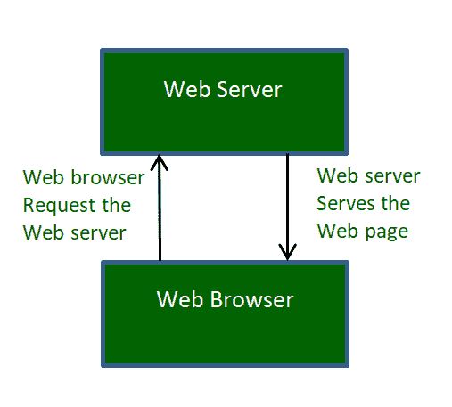

# 网络服务器是如何工作的？

> 原文:[https://www.geeksforgeeks.org/web-servers-work/](https://www.geeksforgeeks.org/web-servers-work/)

互联网为我们提供了大量的信息，如果我们想要任何信息，只需查询互联网，我们就会得到想要的回应。
但是谁向我们提供这些信息，如何提供？所有这些都是由所谓的网络服务器促成的。除此之外，还有浏览器作为我们使用的应用程序，如互联网浏览器、Mozilla Firefox、Chrome、Safari 等，用于与网络交互和浏览&检索网络服务器(称为网络客户端)上的文件。

网络服务器基本上是简单的计算机程序，当使用网络客户端请求时，它们分发网页。运行该程序的机器通常称为服务器，web 服务器和 server 这两个名称几乎可以互换使用。

一般很多人一想到 web 服务器，就会想到是一些高性能的电脑，虽然这在某种程度上是正确的，因为一些高性能的电脑也被称为 web 服务器，但是这些电脑的建造目的是为了进行 web 托管。在网络托管中，网络服务器使托管提供商能够在一台服务器上处理多个域(或多个网站)。但是，通常情况下，当有人提到网络服务器时，它指的是可以在计算机系统上下载的软件。

**什么时候需要 web 服务器？**

通常，网络服务器由网络托管公司和专业的网络应用程序开发人员使用。但是，实际上任何满足以下类别之一的人都可以使用它-

*   拥有一个网站的人(使他们系统上的本地拷贝与互联网上的相似)。
*   想要使用服务器端技术的人，如 PHP 或 ColdFusion，也可以使用网络服务器。

**Web 服务器如何工作？**

当浏览器向网络服务器请求网页，并且网络服务器用该网页进行响应时，就可以查看互联网上的网页。下图给出了一个简单的示意图:

简单过程由 4 个步骤组成，它们是:

1.  **从域名获取 IP 地址:**我们的网络浏览器首先获取域名解析到的 IP 地址(例如，对于此页面，域名为 www.geeksforgeeks.org)。它可以通过两种方式获取 IP 地址-
    *   通过在缓存中搜索。
    *   通过请求一个或多个域名系统服务器。
2.  **浏览器请求完整的 URL** :知道了 IP 地址之后，浏览器现在向 web 服务器请求完整的 URL。
3.  **Web server responds to request:** The web server responds to the browser by sending the desired pages, and in case, the pages do not exist or some other error occurs, it will send the appropriate error message. 
    **For example:** 

    你可能看到过**错误 404** ，在尝试打开一个网页的时候，是服务器在页面不存在的时候发送的消息。
    另一个常见的错误是**错误 401** 由于我们提供的不正确凭据(如用户名或密码)而拒绝我们访问。

4.  **浏览器显示网页:**浏览器最终获取网页并显示，或者显示错误信息。

**热门网络服务器**

有相当多的网络服务器可用，像，Apache，微软 IIS，Nginx 网络服务器，光速网络服务器。但是，最受欢迎的两个是-

1.  **Apache HTTP Server:** 它是目前最流行的 web 服务器，应用非常广泛。它由阿帕奇软件基金会开发和维护。该软件是根据阿帕奇许可证生产的，这使得它是免费和开源的。
    它可用于各种操作系统- Windows、Mac OS X、Unix、Linux、Solaris、Novell Netware 和 FreeBSD。

2.  **微软互联网信息服务:**微软 IIS (Internet Information Service)是第二大最常用的 web 服务器，其市场份额的增长相当迅速，在未来几年很可能会对 Apache 进行全面检修。
    IIS 服务器拥有像 Apache 一样的所有功能，但它不是开源的。它是由微软开发和维护的，因此它可以与所有的视窗操作系统平台一起工作。

综上所述，网络服务器可以由个人使用，也可以由网络托管提供商公司使用。如果个人这样做，他将只在自己的系统上本地托管网站(即网站内容只能在本地系统上访问，不能在任何其他系统上访问)，而当托管提供商公司托管网站时，全球任何人都可以查看该网站。一个人也可以用他的网络服务器公开托管他的网站，但为此他必须有一个租用线路的互联网连接(以获得一个专用的 IP 地址)和一个域名系统服务器来将其与网站的域连接(由于安全原因，通常不首选)。

本文由**姆里根德拉·辛格**供稿。如果你喜欢 GeeksforGeeks 并想投稿，你也可以使用[write.geeksforgeeks.org](https://write.geeksforgeeks.org)写一篇文章或者把你的文章邮寄到 review-team@geeksforgeeks.org。看到你的文章出现在极客博客主页上，帮助其他极客。

如果你发现任何不正确的地方，或者你想分享更多关于上面讨论的话题的信息，请写评论。