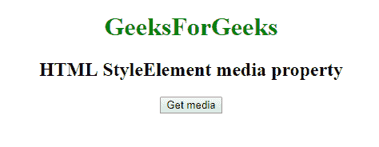
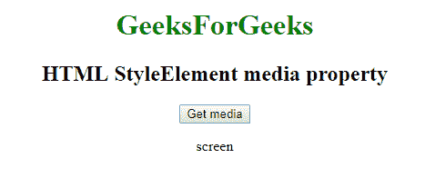

# Web style element API | style element 媒体属性

> 原文:[https://www . geesforgeks . org/web-style element-API-style element-media-property/](https://www.geeksforgeeks.org/web-styleelement-api-styleelement-media-property/)

在网络应用编程接口中，有一些带有媒体属性的样式元素。要获取这个媒体属性，我们使用 **HTMLStyleElement.media** 属性，该属性指定样式信息的目标媒体。

**语法:**

```
label = style.media
style.media = label
```

*标签*是描述单个介质或逗号分隔列表的字符串。

**示例:**获取媒体属性

```
<!DOCTYPE html>
<html>

<head>
    <title>
      StyleElement media property
  </title>
    <style>
        a:focus {
            background-color: magenta;
        }
    </style>
    <link id="Link" 
          rel="stylesheet"
          type="text/css"
          media="screen" />

    <script type="text/javascript">
        function getmedia() {
            var label = document.getElementById('Link');

            document.getElementById(
              'media').innerHTML = label.media;
        }
    </script>

</head>

<body>
    <center>

        <h1 style="color:green;">  
                GeeksForGeeks  
            </h1>

        <h2>HTML StyleElement media property</h2>
        <button onclick="getmedia();"
                id="btn">Get media</button>
        <p id='media'></p>
    </center>
</body>

</html>
```

**输出:**
**点击按钮:**


**点击按钮时:**


**支持的浏览器:**

*   谷歌 Chrome
*   边缘 12
*   微软公司出品的 web 浏览器
*   火狐浏览器
*   旅行队
*   歌剧